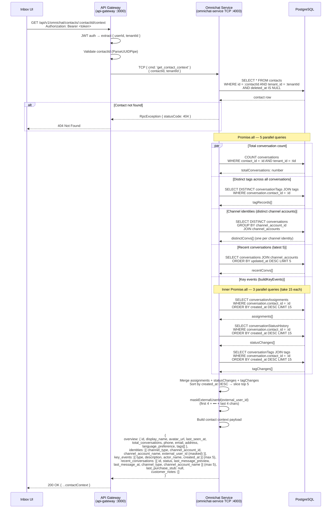
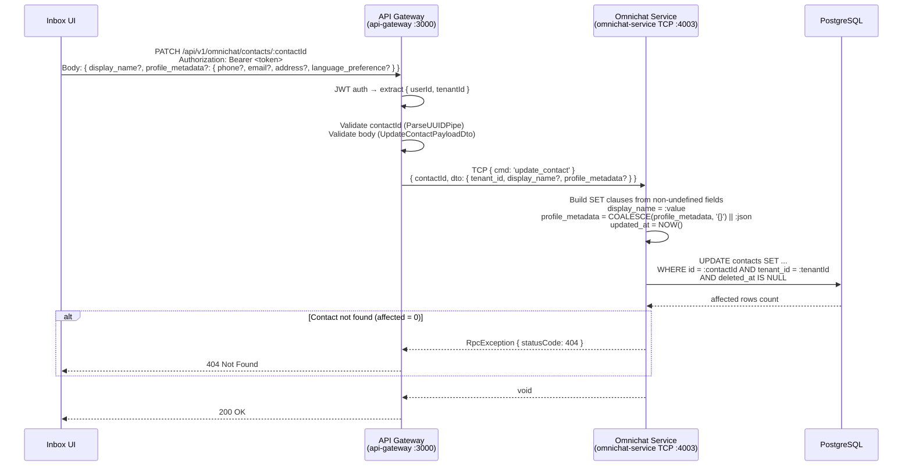

# ACE-1502: Contact Context API — Sequence Diagram

## Context

Contact Context API — exposes a single read endpoint for the Contact Profile panel and a patch endpoint for inline edits. Part of STORY-CTX-01 (ACE-1366).

### Source

| Story | Coverage |
|---|---|
| ACE-1366 (CTX-01) | Contact Profile: overview, identities, key events, recent conversations |
| ACE-1502 | Contact Context API implementation |

---

## Service Overview

| Service | App Name | Transport | Port |
|---|---|---|---|
| **API Gateway** | `api-gateway` | HTTP REST (entry point, auth) | :3000 |
| **Omnichat Service** | `omnichat-service` | TCP (microservice) | HTTP :3003 / TCP :4003 |
| **PostgreSQL** | — | Prisma ORM | — |

---

## 1. GET Contact Context

`GET /api/v1/omnichat/contacts/:contactId/context`

Returns the full contact profile panel payload: overview, identities, key events, recent conversations, last purchase stub, and customer notes.



### Key Events Types

| `type` | Source Table | Description Format |
|---|---|---|
| `assigned` | `conversationAssignment` | `"Assigned to {agent_name}"` or `"Unassigned"` |
| `status_change` | `conversationStatusHistory` | `"Status changed from {from} to {to}"` |
| `tag_change` | `conversationTag` | `"Tag "{name}" added"` |

---

## 2. PATCH Contact (Inline Edit)

`PATCH /api/v1/omnichat/contacts/:contactId`

Updates `display_name` and/or `profile_metadata` fields on a contact. Uses a raw SQL `UPDATE` with partial JSONB merge for metadata.



> **JSONB merge:** `profile_metadata` uses `COALESCE(profile_metadata, '{}') || :json` — partial patch, existing keys not in the request body are preserved.

---

## Service Communication Map

```
┌─────────────┐
│  Inbox UI   │
└──────┬──────┘
       │ HTTP REST
       ▼
┌──────────────────────────────────────────┐
│ API Gateway (api-gateway :3000)          │
│                                          │
│  ContactsController                      │
│   GET  /omnichat/contacts/:id/context    │
│   PATCH /omnichat/contacts/:id           │
│                                          │
│  ContactsService                         │
│   → omnichatClient.send(cmd, payload)    │
└──────────────────┬───────────────────────┘
                   │ TCP (NestJS microservice)
                   ▼
┌──────────────────────────────────────────┐
│ Omnichat Service (omnichat-service :4003)│
│                                          │
│  ContactsController (@MessagePattern)    │
│   cmd: get_contact_context               │
│   cmd: update_contact                    │
│                                          │
│  ContactsService                         │
│   getContactContext() → 6 DB queries     │
│   updateContact()    → 1 raw UPDATE      │
└──────────────────┬───────────────────────┘
                   │ Prisma ORM
                   ▼
           ┌──────────────┐
           │  PostgreSQL  │
           └──────────────┘
```

---

## Flow Summary

| # | Endpoint | Method | Transport | DB Queries | Response |
|---|---|---|---|---|---|
| 1 | `/omnichat/contacts/:id/context` | GET | HTTP → TCP | 1 contact lookup + 5 parallel (incl. 3 inner) = 8 total | `{ overview, identities, key_events, recent_conversations, last_purchase_stub, customer_notes }` |
| 2 | `/omnichat/contacts/:id` | PATCH | HTTP → TCP | 1 raw UPDATE | `void` (200 OK) |
