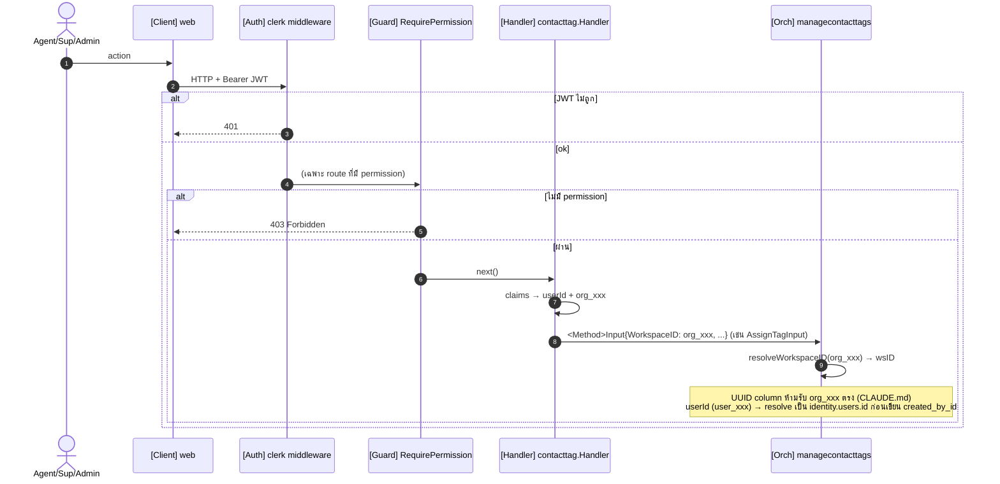
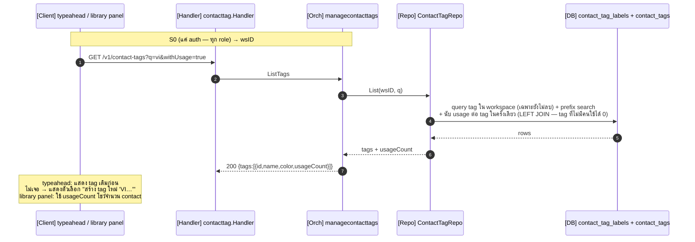
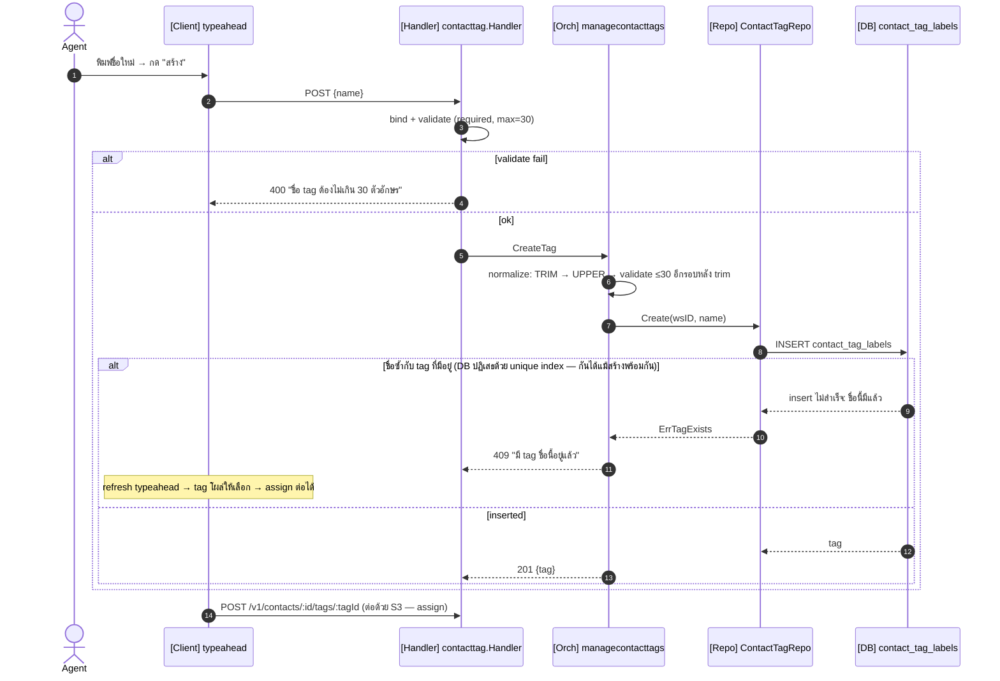
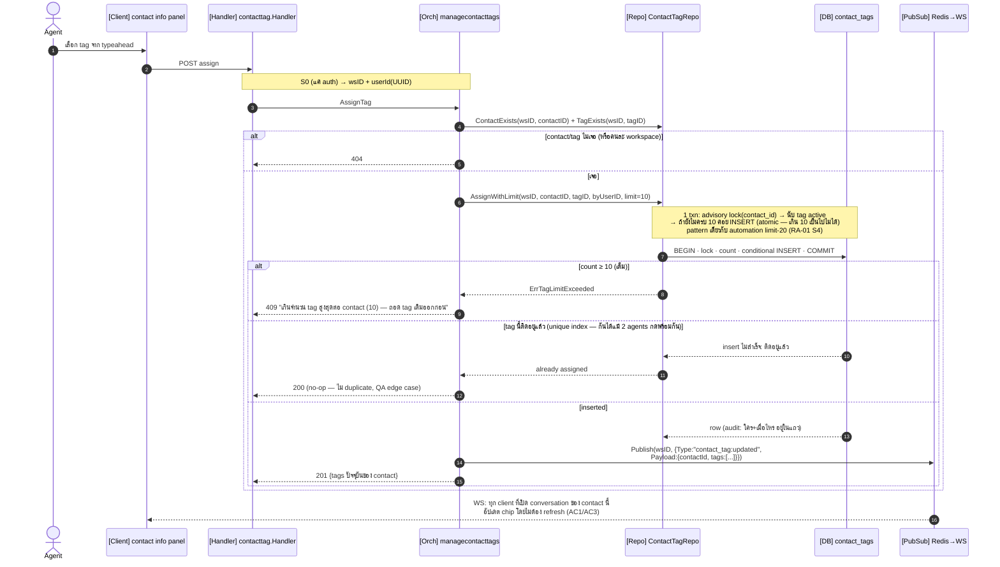
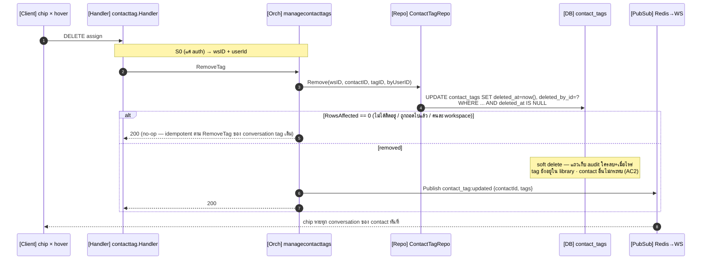
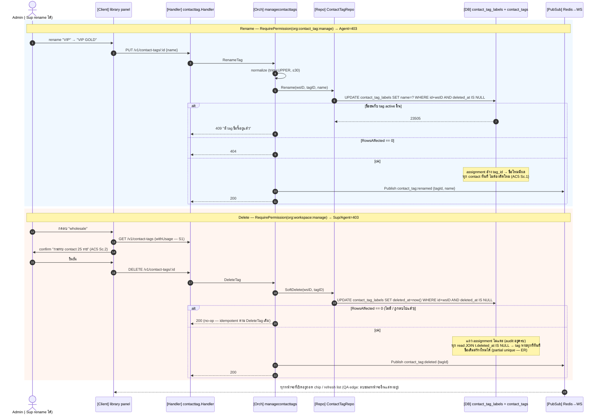
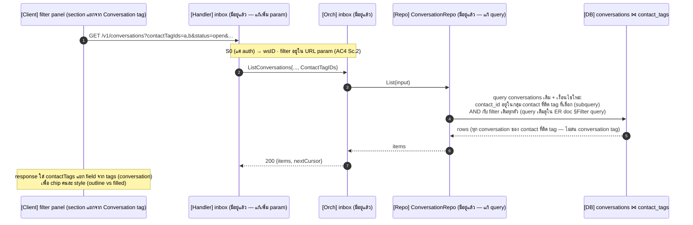

# CTX-07 Contact Tags — Sequence Diagram (Go / `ace-omnichat-go`)

> STORY: [ACE-2714](https://app.clickup.com/t/86d3knuen) · EPIC: ACE-1472 · ER: [contact_tags_er_go.md](./contact_tags_er_go.md)
> Scope: assign/remove tag บน contact · create inline · library CRUD · filter · realtime — auto-tagging/bulk/SLA-routing อยู่นอก scope
> Layering: `handler` → `orchestration` interface → `domain port` (repo) — **ไม่มี Core** (§หมายเหตุ) ชื่อทุกตัว verified กับ repo จริง

---

## Naming reference (verified จาก repo จริง)

| ใน diagram    | สัญลักษณ์/ชื่อจริงใน repo                                                                                                                             | อ้างอิง                                    |
| ------------- | ----------------------------------------------------------------------------------------------------------------------------------------------------- | ------------------------------------------ |
| claims        | `clerk.SessionClaimsFromContext(ctx)` → `claims.ActiveOrganizationID` (org_xxx), `claims.Subject` (userId)                                            | `handler/conversation/handler.go`          |
| RBAC          | `appMiddleware.RequirePermission("org:xxx")` — เช็ค `claims.HasPermission`                                                                            | `middleware/rbac.go:17`, `router.go:86-92` |
| resolve wsID  | `resolveWorkspaceID(ctx, clerkOrgOrUUID)` — `len==36`→UUID else `WorkspaceRepository.GetIDByClerkOrgID`                                               | `manageconversation/orchestrator.go:36`    |
| response      | `response.Success / Created / BadRequest / NotFound / Conflict / InternalServerError` — body `{message, data}`                                        | `delivery/http/response/response.go`       |
| bind/validate | `c.Bind(&req)` แล้ว `c.Validate(&req)` (แยกกัน)                                                                                                       | pattern ทุก handler                        |
| **Orch**      | `managecontacttags.Orchestrator` (interface ใน `port.go`) — method รับ `XxxInput` DTO                                                                 | pattern: `manageconversation.Orchestrator` |
| **Repo**      | domain iface `domain/messaging.ContactTagRepository` (ใน `domain/messaging/port.go`) → impl `repository/postgres/messaging/contact_tag_repository.go` | pattern: `TagRepo`                         |
| **PubSub**    | `pubsub.Publisher.Publish(ctx, wsID, pubsub.Event{Type, Payload})` → Redis channel `omnichat:events:{workspaceUUID}` → WS hub fan-out (ทั้ง workspace — FE กรองด้วย `payload.contactId` เอง แบบเดียวกับ `message:new`) | `infrastructure/pubsub/pubsub.go:58` · `_shared/REPOSITORY_SUMMARY.md` §Realtime |
| **Filter**    | `inbox.ListConversationsInput` — เพิ่ม field `ContactTagIDs []string` (มี `TagID` ของ conversation tag อยู่แล้วเป็น precedent)                        | `orchestration/inbox/model.go:7`           |
| logger        | `log.Error().Err(e).Str("contact_id", id).Msg(…)` ก่อน 500 เสมอ                                                                                       | CLAUDE.md                                  |

> **ทำไมไม่มี Core:** CRUD+assign ใช้ที่ orchestrator เดียว (`managecontacttags`) ส่วน filter (S6) เป็นแค่เงื่อนไข query ใน conversation list repo เดิม ไม่ใช่ logic ที่ share — pass-through Core ผิดกฎ `_shared/ARCHITECTURE.md` ("worse than calling the repo directly") ถ้าอนาคต auto-tagging (out of scope) มาจริงค่อยยก dedup/limit logic ขึ้น Core

---

## Participants

| diagram          | ไฟล์จริง (ใหม่ ยกเว้นระบุ)                                              |
| ---------------- | ----------------------------------------------------------------------- |
| **FE**           | contact info panel / filter panel / library panel (`ace-omnichat-web`)  |
| **H** Handler    | `delivery/http/handler/contacttag/handler.go`                           |
| **MW** AuthMW    | `delivery/http/middleware/clerk_auth.go` (มีอยู่แล้ว)                   |
| **RBAC**         | `middleware/rbac.go` `RequirePermission` (มีอยู่แล้ว — branch ACE-2722) |
| **O** Orch       | `usecase/orchestration/managecontacttags/`                              |
| **Repo**         | `repository/postgres/messaging/contact_tag_repository.go`               |
| **DB**           | Postgres `messaging.contact_tag_labels` + `messaging.contact_tags`      |
| **PS** PubSub    | `infrastructure/pubsub` → Redis → WS hub (มีอยู่แล้ว)                   |
| **IO** InboxOrch | `usecase/orchestration/inbox/` (แก้เพิ่ม filter — S6)                   |

**Permission ต่อ endpoint** (enforce ที่ router ด้วย `RequirePermission`):

| Method / Path                                | permission                     | role           |
| -------------------------------------------- | ------------------------------ | -------------- |
| `GET /v1/contact-tags` (typeahead + library) | — (แค่ auth)                   | ทุก role       |
| `POST /v1/contact-tags` (create inline)      | — (แค่ auth)                   | ทุก role       |
| `POST /v1/contacts/:id/tags/:tagId`          | — (แค่ auth)                   | ทุก role       |
| `DELETE /v1/contacts/:id/tags/:tagId`        | — (แค่ auth)                   | ทุก role       |
| `PUT /v1/contact-tags/:id` (rename)          | `org:contact_tag:manage` ⚠️NEW | Admin·Sup      |
| `DELETE /v1/contact-tags/:id`                | `org:workspace:manage`         | **Admin only** |

> ⚠️ **ต้องเพิ่ม Clerk permission ใหม่ 1 key**: `org:contact_tag:manage` ให้ role Admin+Supervisor (key เดิม 7 ตัวไม่มีตัวไหน semantic ตรง) ส่วน delete ใช้ `org:workspace:manage` ตาม precedent เดียวกับ automation delete — sync กับ branch `feat/ACE-2722-rbac-permission`

---

## S0 — Common preamble (auth + RBAC + resolve)

---

## S1 — Typeahead + Library list (GET /v1/contact-tags)

> query ด้วย `UPPER(q)` เพราะชื่อเก็บ normalized uppercase อยู่แล้ว (ER ตัดสินใจ #4) — ไม่ต้อง ILIKE
> **ไม่มี Redis cache (จงใจ — ต่างจาก RA-01):** automation cache เพราะ engine อ่านทุก inbound message (hot path) แต่อันนี้ยิงตาม human action + ตารางเล็ก + query index ครอบ และ `usageCount` เปลี่ยนทุกครั้งที่ assign/remove → ถ้า cache ต้อง bust ใน S2–S5 ทุกจุด ได้ไม่คุ้มเสีย ถ้า metrics ชี้ว่า typeahead หนักจริงค่อยเพิ่ม cache เฉพาะชื่อ tag ทีหลังโดยไม่แตะ API

---

## S2 — Create tag inline (POST /v1/contact-tags) `AC1 Sc.2`

> **create แล้ว FE ยิง assign ต่อ (2 calls)** — ไม่ทำ endpoint create+assign รวม: reuse S3 ทั้งก้อน, ถ้า assign fail (เช่น เต็ม 10) tag ยังอยู่ใน library ให้เลือกครั้งหน้า = พฤติกรรมที่ถูกอยู่แล้ว
> **duplicate-name → 409 Conflict** ตาม `CreateTag` ของ conversation tag เดิม (`inbox/handler.go:307`) — API family เดียวกันต้องพฤติกรรมเดียวกัน สอง agent สร้าง "VIP" พร้อมกันก็ยังจบที่ tag เดียว: คนแรกได้ 201, คนที่สองได้ 409 → refresh typeahead แล้วเลือกตัวที่มี (unique index กัน tag ซ้ำที่ DB อยู่แล้ว)

---

## S3 — Assign tag (POST /v1/contacts/:id/tags/:tagId) `AC1 · AC6 · realtime`

> **dedup ที่ DB ไม่ใช่ check-then-insert** — partial unique index ปิด race (ต่างจาก `conversation_tags` เดิมที่เช็คระดับ app) repo จับ 23505 เป็น no-op
> **limit 10 = hard limit (ปิด TOCTOU)** — count + insert อยู่ใน **transaction เดียว** + `pg_advisory_xact_lock(contact_id)` → การติด tag บน contact เดียวกัน serialize กัน เกิน 10 เป็นไปไม่ได้แม้ 2 agents ติดคนละ tag พร้อมกันตอนมี 9 ตัว lock เป็นราย contact — ติด tag คนละ contact ไม่บล็อกกัน pattern เดียวกับ `CreateWithLimit`/`EnableIfUnderLimit` ของ automation limit-20

---

## S4 — Remove tag (DELETE /v1/contacts/:id/tags/:tagId) `AC2 · realtime`

---

## S5 — Library: rename + delete (Admin panel) `AC5`

---

## S6 — Filter conversation list ด้วย contact tag `AC4`

> เพิ่ม `ContactTagIDs []string` ใน `ListConversationsInput` (model.go:7) + `contactTags []TagItem` ใน `ConversationItem` — filter เดิม (`TagID`, `Status`, …) ไม่แตะ = saved view เดิมทำงานเหมือนเดิม (must-not-break)

---

## หมายเหตุสำคัญ

**Realtime event ใหม่ 3 type** ใน `infrastructure/pubsub/pubsub.go`: `contact_tag:updated` (assign/remove — payload `{contactId, tags[]}`), `contact_tag:renamed`, `contact_tag:deleted` — ใช้ Publisher + WS hub เดิมทั้งหมด ไม่มี infra ใหม่ FE subscribe ต่อ workspace channel อยู่แล้ว แค่ handle type ใหม่แล้ว update ทุก conversation view ที่ `contactId` ตรง

**Audit (AC1/AC2) = columns ในแถว assignment** — `created_by_id/created_at` (ใครติด) + `deleted_by_id/deleted_at` (ใครลบ) ไม่มีตาราง audit แยก ไม่มี endpoint ดู log ใน story นี้ (เก็บไว้ก่อน ครบตาม AC "บันทึก audit")

**userId จาก claims เป็น `user_xxx`** — ก่อนเขียน `created_by_id/deleted_by_id` (UUID) ต้อง resolve ผ่าน `identity.users` เหมือน pattern `resolveWorkspaceID` (CLAUDE.md: UUID column ห้ามรับ Clerk id ตรง)

**Error → response helper:**
| กรณี | helper | code |
|---|---|---|
| JWT/claims ไม่ถูก | `response.Unauthorized` | 401 |
| ไม่มี permission (rename/delete library) | RBAC middleware | 403 |
| **assign**: contact/tag ไม่เจอ / คนละ workspace | `response.NotFound` — pre-check ก่อน insert (จงใจต่างจาก `ApplyTag` เดิมที่ปล่อย FK พังเป็น 500 — CLAUDE.md ห้าม 500) | 404 |
| **rename**: tag ไม่เจอ | `response.NotFound` (ตาม `UpdateTag` เดิม) | 404 |
| bind/validate fail (ชื่อเกิน 30, ว่าง) | `response.BadRequest` | 400 |
| create/rename ชนชื่อ tag ที่มีอยู่ | `response.Conflict` (ตาม `ErrTagExists` เดิม) | 409 |
| เกิน 10 tags/contact | `response.Conflict` (ตาม automation limit-20 — `automationrule/handler.go:51`) | 409 |
| assign ซ้ำ (ติดอยู่แล้ว) | **200 no-op** — DB unique index กันแถวซ้ำ | 200 |
| remove/delete ของที่ไม่มี/ลบไปแล้ว | **200 no-op** — idempotent ตาม `RemoveTag`/`DeleteTag` เดิม | 200 |
| DB/infra error | `response.InternalServerError` (log ก่อน) | 500 |

**สิ่งที่ต้องทำนอก repo นี้:** เพิ่ม Clerk permission `org:contact_tag:manage` (Admin+Sup) ใน Clerk Dashboard — เป็น key ที่ 8 (ปัจจุบันมี 7) และอัปเดต rbac test ให้ครอบ

**Checklist ตาม `_shared` ที่ diagram ไม่ได้วาด (แต่ต้องทำ):**
- **Wire DI** — ผูก `ContactTagRepo` + `managecontacttags.Orchestrator` + handler ใน `internal/app/wire/wire.go` แล้ว regenerate `wire_gen.go` (Adding a New Route step 6)
- **อัปเดต `_shared/REPOSITORY_SUMMARY.md` หลัง ship** (กฎ "Keeping this in sync"): ตาราง HTTP API (+6 endpoints), Orchestration index (+`managecontacttags`), Handler index (+`contacttag`), Domain Model (+`ContactTagLabel`), Realtime Events (+`contact_tag:*` 3 types), Database Init Files (+`15_contact_tags.sql`) และเพิ่มกล่องใน system diagram ของ `ARCHITECTURE.md`
