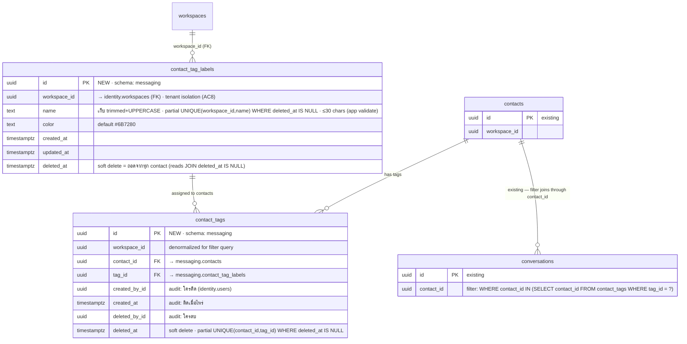

# Contact Tags — ER Diagram (Go / `ace-omnichat-go`)

> STORY: [ACE-2714](https://app.clickup.com/t/86d3knuen) STORY-CTX-07 · EPIC: ACE-1472
> Target: **Go repo** (`ace-omnichat-go`, GORM + raw SQL ใน `db/init/`)
> Placement: **`messaging` schema** — contact tag เป็นข้อมูลติดตัว contact (`messaging.contacts`) วางข้าง `messaging.tags`/`messaging.conversation_tags` ที่เป็น precedent ตรงตัว

---

## Domain placement: messaging (ตาม conversation tag pattern)

Conversation tag มี pattern ครบอยู่แล้ว: library table (`tags`) + join table (`conversation_tags`) + soft delete + `TagRepo` — contact tag ทำ mirror โครงเดียวกัน แต่**แยกตารางใหม่ ไม่ reuse** (ดูตัดสินใจ #1)

| layer                        | ที่                                                                    |
| ---------------------------- | ---------------------------------------------------------------------- |
| Entity `ContactTag` + ports  | `internal/domain/messaging/` (ข้าง `Tag`)                              |
| Repository (GORM)            | `internal/repository/postgres/messaging/contact_tag_repository.go`     |
| CRUD + assign orchestrator   | `internal/usecase/orchestration/managecontacttags/`                    |
| Filter ใน conversation list  | inbox orchestrator query เดิม — JOIN ผ่าน `conversations.contact_id`   |

---

## การตัดสินใจออกแบบ (อ่านก่อน)

| #   | เรื่อง                                        | ตัดสิน                                                                                       | เหตุผล                                                                                                                                                                                                                                     |
| --- | --------------------------------------------- | -------------------------------------------------------------------------------------------- | -------------------------------------------------------------------------------------------------------------------------------------------------------------------------------------------------------------------------------------------- |
| 1   | reuse `messaging.tags` + เพิ่ม `scope` column? | **ไม่ — สร้าง 2 ตารางใหม่** `contact_tag_labels` + `contact_tags`                        | AC บังคับ library แยก + "must not break" conversation tag เดิม ถ้าเพิ่ม `scope` ทุก query เดิมใน `tag_repository.go` ต้องเติม filter — พลาดจุดเดียว contact tag รั่วเข้า list conversation tag ตารางใหม่ blast radius = ศูนย์                  |
| 2   | กัน duplicate ตอน 2 agents ติดพร้อมกัน        | **DB-level partial unique index** `UNIQUE(contact_id, tag_id) WHERE deleted_at IS NULL`      | `conversation_tags` dedup ระดับ app (check-then-insert) ซึ่งแพ้ race — AC edge case ระบุ explicit ว่าห้ามซ้ำ partial index กันที่ DB และยังยอมให้ re-add หลังลบ (แถว soft-deleted ไม่ block) repo แค่จับ unique violation เป็น no-op        |
| 3   | audit "ใครติด/ลบ เมื่อไหร่" เก็บยังไง          | **columns บนแถว assignment** (`created_by_id/created_at` + `deleted_by_id/deleted_at`)       | soft delete = ประวัติอยู่ในแถวเดิม re-add หลังลบ = insert แถวใหม่ (append-only) → history เต็ม = ทุกแถวของ (contact, tag) ไม่ต้องมีตาราง audit แยก — YAGNI จนกว่าจะมี requirement ดู audit log เป็น timeline                                  |
| 4   | uppercase เก็บยังไง                           | **normalize ตอน write: trim + UPPER แล้วค่อยเก็บ** → partial `UNIQUE(workspace_id, name) WHERE deleted_at IS NULL` | spec เขียนว่า uppercase "ในการแสดงผล" แต่ถ้าเก็บ raw จะได้ "vip"/"VIP" เป็นคนละ tag ที่แสดงเหมือนกัน — ขัด AC กัน duplicate เก็บ normalized ตัดปัญหาทิ้งทั้งก้อน ⚠️ **เคลียร์กับ PO** ว่ายอมรับว่า tag เป็น uppercase ทุกที่ (รวม export/API) |
| 5   | limit 10 tags/contact                        | **hard limit ที่ repo: count+insert ใน txn เดียว + `pg_advisory_xact_lock(contact_id)`** — ER ไม่มี column เพิ่ม | กันเกิน 10 เด็ดขาด: 2 agents ติดคนละ tag พร้อมกันตอนมี 9 → ถ้าเช็คแยกจาก insert (TOCTOU) หลุดเป็น 11 ได้ advisory lock ทำให้ติด tag บน contact เดียวกัน serialize — pattern เดียวกับ automation limit-20 (lock ราย contact ไม่บล็อกข้าม contact) |
| 6   | delete tag จาก library                       | **soft delete ที่ `contact_tag_labels.deleted_at`** — แถว assignment ไม่แตะ                        | ตาม pattern `tags` เดิมเป๊ะ: ทุก read JOIN `deleted_at IS NULL` → tag หายจากทุก contact ทันที ประวัติ audit ยังอยู่ครบ usage count สำหรับ confirmation = `COUNT(DISTINCT contact_id) WHERE deleted_at IS NULL` บน contact_tags                |
| 7   | `is_system` column                           | **ไม่มี**                                                                                    | auto-tagging อยู่ out of scope ไม่มี system contact tag → YAGNI (ALTER เพิ่มทีหลังได้ถ้า automation มาจริง)                                                                                                                                   |
| 8   | rename มีผลทุก contact ทันที (AC5)           | ได้ฟรีจากโครงสร้าง — assignment อ้าง `tag_id` ชื่ออยู่ที่ library แถวเดียว                   | ไม่ต้อง denormalize ชื่อ (ต่างจาก `tagged_by_rule_name` ของ automation ที่ต้อง snapshot เพราะ hard delete — อันนี้ soft delete ชื่อไม่หาย)                                                                                                    |

---

## ER Diagram



---

## Indexes

```sql
-- ชื่อ tag unique เฉพาะแถวที่ยังไม่ถูกลบ — ลบ "VIP" แล้วสร้าง "VIP" ใหม่ได้
-- (plain UNIQUE จะ block เพราะแถว soft-deleted ยังอยู่ในตาราง)
CREATE UNIQUE INDEX ux_contact_tag_labels_name_active
    ON messaging.contact_tag_labels (workspace_id, name)
    WHERE deleted_at IS NULL;

-- กัน duplicate ระดับ DB (ตัดสินใจ #2) — ยอม re-add หลัง soft delete
-- (ครอบ query "tags ของ contact" ด้วย — leftmost prefix คือ contact_id)
CREATE UNIQUE INDEX ux_contact_tags_active
    ON messaging.contact_tags (contact_id, tag_id)
    WHERE deleted_at IS NULL;

-- conversation list filter + usage count: contacts ที่ติด tag
CREATE INDEX ix_contact_tags_tag ON messaging.contact_tags (workspace_id, tag_id);
```

---

## Filter query (AC4) — ไม่แก้ schema conversations

```sql
-- contact tag filter = subquery/JOIN ผ่าน contacts ไม่แตะ conversation_tags เดิม
SELECT c.* FROM messaging.conversations c
WHERE c.workspace_id = :ws
  AND c.contact_id IN (
      SELECT a.contact_id FROM messaging.contact_tags a
      JOIN messaging.contact_tag_labels t ON t.id = a.tag_id AND t.deleted_at IS NULL
      WHERE a.workspace_id = :ws AND a.tag_id IN (:tagIds) AND a.deleted_at IS NULL)
  -- AND เงื่อนไข filter อื่นตามเดิม (status, conversation tag, ...)
```

> **มีอยู่แล้ว**: `contacts`, `conversations`, `workspaces` — ไม่ ALTER อะไรทั้งสิ้น
> **ใหม่**: `messaging.contact_tag_labels` + `messaging.contact_tags` (migration ไฟล์เดียว เช่น `db/init/15_contact_tags.sql`)
> **หมายเหตุชื่อตาราง**: `contact_tags` = join — mirror `conversation_tags` เป๊ะ (X_tags = tag ที่ติดบน X) ส่วน library ใช้ `contact_tag_labels` เพื่อไม่ชนกับชื่อ join
