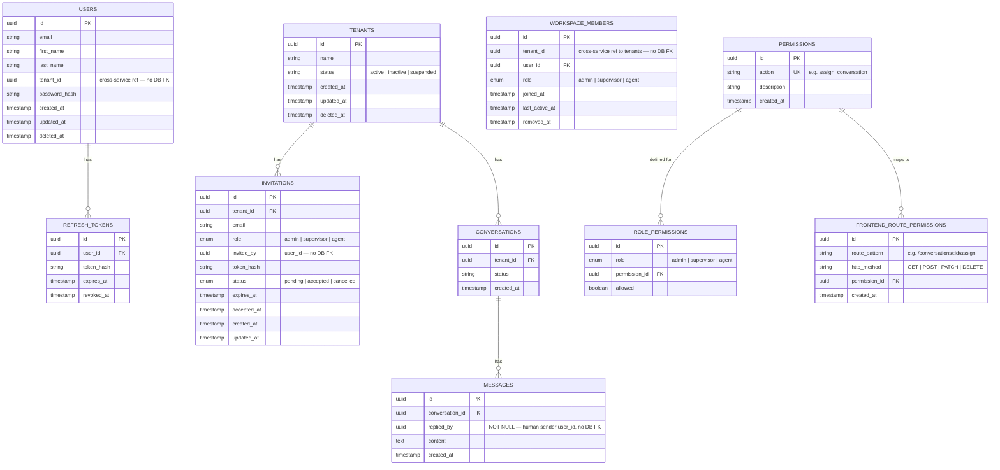
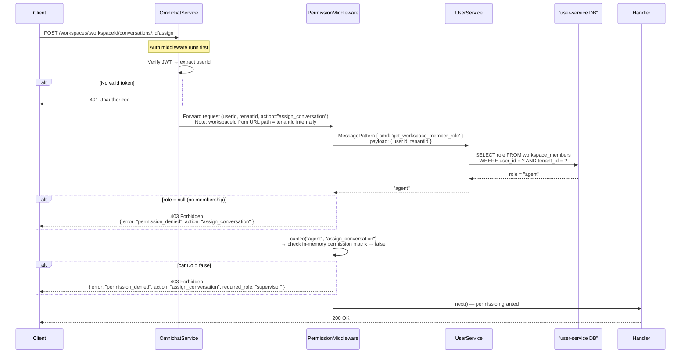
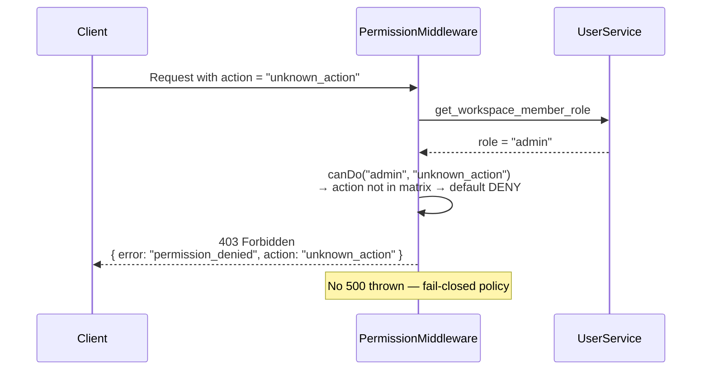
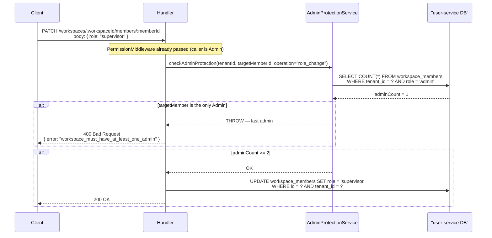
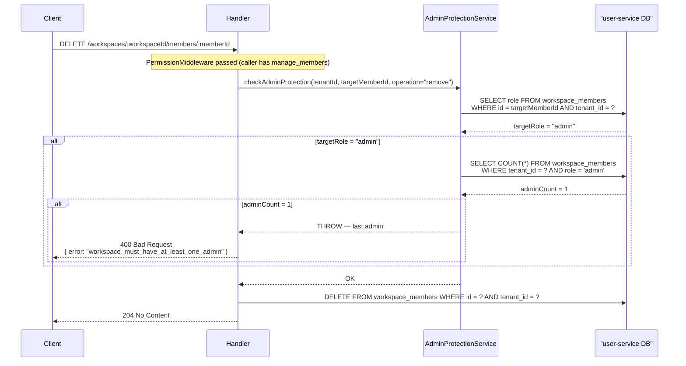
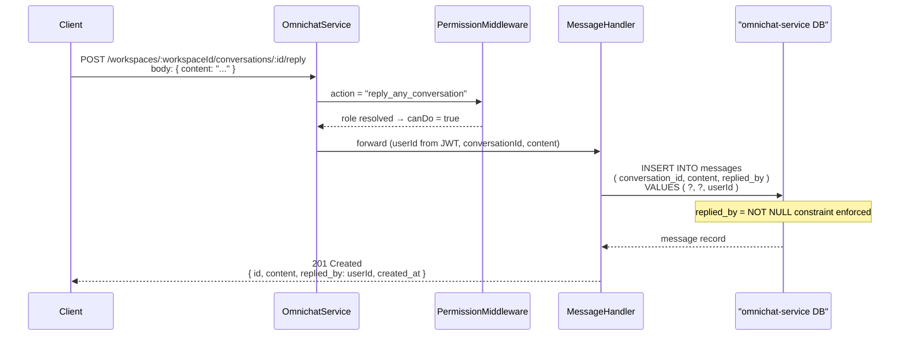

# STORY-RBAC-01: Diagrams & API Docs

---

## 1. ER Diagram

> RBAC-01 (Permission Model) + RBAC-02 (Member Management)



### ภาพรวมง่าย ๆ

ระบบแบ่งออกเป็น **3 service** แต่ละ service มี database ของตัวเอง:

- **user-service** — Identity & Auth Hub: เก็บ user, membership (workspace_members), และ permission matrix ทั้งหมดไว้ในที่เดียว (source of truth ของ "ใครเป็นใคร ทำอะไรได้บ้าง")
- **tenant-service** — เก็บข้อมูล tenant (บริษัท) และ invitation เท่านั้น
- **omnichat-service** — เก็บ conversation และ message เท่านั้น

เวลา user กดทำอะไรสักอย่าง omnichat-service จะ**ถาม**user-service ก่อนว่า "user คนนี้ใน workspace นี้มี role อะไร?" แล้วค่อยเช็คว่า role นั้นทำ action นี้ได้ไหม — ถ้าไม่ได้ → 403 ทันที

> **สำคัญ:** role ไม่ได้เก็บใน JWT — ดึงจาก DB ทุกครั้ง ดังนั้นถ้า Admin เปลี่ยน role ใคร มีผลทันทีบน request ถัดไปเลย ไม่ต้อง logout/login ใหม่

---

### Table Summary

| Table | Service | Story | Status |
|---|---|---|---|
| `users` | user-service | — | Existing |
| `refresh_tokens` | user-service | — | Existing |
| `workspace_members` | user-service | RBAC-02 | **New** |
| `permissions` | user-service | RBAC-01 | **New** |
| `role_permissions` | user-service | RBAC-01 | **New** |
| `frontend_route_permissions` | user-service | RBAC-01 | **New** |
| `tenants` | tenant-service | — | Existing |
| `invitations` | tenant-service | RBAC-02 | Modified (+`role`, +`invited_by`, +`cancelled` status) |
| `conversations` | omnichat-service | — | Existing |
| `messages` | omnichat-service | RBAC-01 | Modified (+`replied_by`) |

### Cross-Service References

> **อธิบายง่าย ๆ:** เพราะแต่ละ service มี DB แยกกัน จึงไม่สามารถทำ FK ข้าม DB ได้ตามปกติ — ต้อง validate ที่ code แทน เช่น `workspace_members.tenant_id` ชี้ไปหา `tenants` ใน tenant-service DB คนละ DB กัน จึงไม่มี FK — app code validate แทน

Fields marked **"no DB FK"** span two separate service databases — referential integrity is enforced at the application layer, not DB-level:

| Field | From | To | How enforced |
|---|---|---|---|
| `workspace_members.tenant_id` | user-service DB | tenant-service DB | Set at workspace join, immutable |
| `users.tenant_id` | user-service DB | tenant-service DB | Set at registration, immutable |
| `invitations.invited_by` | tenant-service DB | user-service DB | Resolved from JWT before insert |
| `messages.replied_by` | omnichat-service DB | user-service DB | Resolved from JWT, NOT NULL constraint |

### Key Design Decisions

> **อธิบายง่าย ๆ:** ทำไมถึงออกแบบแบบนี้ — แต่ละข้อมีเหตุผลที่ชัดเจน ไม่ใช่แค่ convention

| Decision | Reason |
|---|---|
| `workspace_members` lives in user-service, not tenant-service | user-service is the identity & auth hub — owns users, membership, and permission matrix together; omnichat needs only one service to query |
| Permission middleware resolves role via MessagePattern, not direct DB query | Services don't share DB — omnichat calls user-service via message bus |
| `expired` invitation status not stored — derived from `expires_at < now` | Avoids cron job; no state to sync |
| Role not in JWT — fetched from DB on every request | Role change takes effect immediately without token re-issue |
| `replied_by` is NOT NULL, no bot exemption | Platform has no automated messages yet — all messages from human agents |

---

## 2. Sequence Diagrams

### 2.1 Permission Middleware — Normal Flow



---

### 2.2 Permission Middleware — Unknown Action (Fail-Closed)



---

### 2.3 Admin Protection — Role Change



---

### 2.4 Admin Protection — Remove Member



---

### 2.5 Reply — Save Message with replied_by



---

## 3. API Documentation

### Base URL
```
/workspaces/:workspaceId
```

All protected endpoints require:
- `Authorization: Bearer <jwt>` header
- Valid membership in `:workspaceId`

---

### 3.1 Authentication Errors (Pre-Permission)

| HTTP | Body |
|------|------|
| `401 Unauthorized` | `{ "error": "unauthorized" }` |

---

### 3.2 Permission Error (Standard Format)

```json
{
  "error": "permission_denied",
  "action": "<action_name>",
  "required_role": "<minimum_role>"
}
```

| HTTP | When |
|------|------|
| `403 Forbidden` | No membership, insufficient role, or unknown action |

---

### 3.3 Conversations

#### Assign Conversation
```
POST /workspaces/:workspaceId/conversations/:conversationId/assign
```

**Permission:** `assign_conversation` — Admin, Supervisor only

**Request Body:**
```json
{
  "assignee_id": "uuid"
}
```

**Responses:**

| HTTP | Body |
|------|------|
| `200 OK` | `{ "id": "uuid", "assignee_id": "uuid", "updated_at": "ISO8601" }` |
| `403 Forbidden` | Permission denied body |
| `404 Not Found` | `{ "error": "conversation_not_found" }` |

---

#### Reply to Conversation
```
POST /workspaces/:workspaceId/conversations/:conversationId/reply
```

**Permission:** `reply_any_conversation` — Admin, Supervisor, Agent

**Request Body:**
```json
{
  "content": "string"
}
```

**Responses:**

| HTTP | Body |
|------|------|
| `201 Created` | `{ "id": "uuid", "conversation_id": "uuid", "content": "string", "replied_by": "uuid", "created_at": "ISO8601" }` |
| `403 Forbidden` | Permission denied body |

> `replied_by` is set server-side from JWT `userId` — not accepted from client. Field is immutable after creation.

---

#### Change Conversation Status
```
PATCH /workspaces/:workspaceId/conversations/:conversationId/status
```

**Permission:** `change_conversation_status` — Admin, Supervisor, Agent

**Request Body:**
```json
{
  "status": "open | resolved | pending"
}
```

**Responses:**

| HTTP | Body |
|------|------|
| `200 OK` | `{ "id": "uuid", "status": "string", "updated_at": "ISO8601" }` |
| `400 Bad Request` | `{ "error": "invalid_status_value" }` |
| `403 Forbidden` | Permission denied body |

---

### 3.4 SLA Configuration

#### Update SLA Config
```
PATCH /workspaces/:workspaceId/sla
```

**Permission:** `config_sla` — Admin, Supervisor only

| HTTP | Body |
|------|------|
| `200 OK` | SLA config object |
| `403 Forbidden` | Permission denied body |

> Full request/response spec อยู่ใน SLA feature story

---

### 3.5 Notification Configuration

#### Update Notification Config
```
PATCH /workspaces/:workspaceId/notifications
```

**Permission:** `config_notification` — Admin, Supervisor only

| HTTP | Body |
|------|------|
| `200 OK` | Notification config object |
| `403 Forbidden` | Permission denied body |

> Full request/response spec อยู่ใน Notification feature story

---

### 3.6 Reports

#### Get Team Report
```
GET /workspaces/:workspaceId/reports/team
```

**Permission:** `view_team_report` — Admin, Supervisor only

| HTTP | Body |
|------|------|
| `200 OK` | Report data object |
| `403 Forbidden` | Permission denied body |

---

## 4. Permission Matrix (Seed Data)

| Action | Admin | Supervisor | Agent |
|--------|-------|------------|-------|
| `reply_any_conversation` | ✅ | ✅ | ✅ |
| `assign_conversation` | ✅ | ✅ | ❌ |
| `change_conversation_status` | ✅ | ✅ | ✅ |
| `config_sla` | ✅ | ✅ | ❌ |
| `config_notification` | ✅ | ✅ | ❌ |
| `view_team_report` | ✅ | ✅ | ❌ |
| `manage_members` | ✅ | ❌ | ❌ |
| `manage_channels` | ✅ | ❌ | ❌ |
| `manage_workspace` | ✅ | ❌ | ❌ |

---

## 5. Internal Message Patterns (Microservice)

### get_workspace_member_role

```typescript
// Pattern
{ cmd: 'get_workspace_member_role' }

// Payload
{ userId: string, tenantId: string }

// Response
role: 'admin' | 'supervisor' | 'agent' | null
// null = no membership record
```

Used by: `resolveRole(userId, tenantId)` in permission middleware. Calls **user-service**.

---

## 6. Route-to-Action Map

```typescript
const ROUTE_ACTION_MAP: Record<string, string> = {
  'POST /conversations/:id/assign':          'assign_conversation',
  'POST /conversations/:id/reply':           'reply_any_conversation',
  'PATCH /conversations/:id/status':         'change_conversation_status',
  'PATCH /sla':                              'config_sla',
  'PATCH /notifications':                    'config_notification',
  'GET /reports/team':                       'view_team_report',
  'GET /members':                            'manage_members',
  'PATCH /members/:memberId':                'manage_members',
  'DELETE /members/:memberId':               'manage_members',
  'POST /channels':                          'manage_channels',
  'PATCH /channels/:channelId':              'manage_channels',
  'DELETE /channels/:channelId':             'manage_channels',
  'PATCH /':                                 'manage_workspace',
};
```

> Keys in this map must match `action` values in `permissions` DB table. Enforce via startup validation or consistency test.
