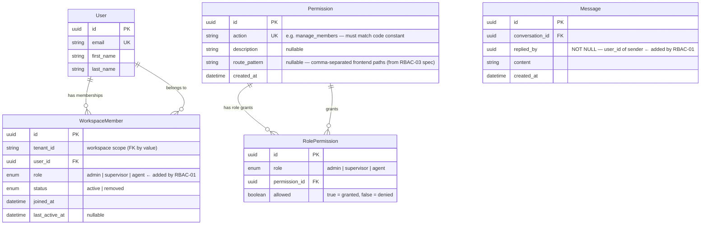

# ACE-1611: RBAC-01 — ER Diagram

Source: story `ACE-1611` scope only.

**Tables owned by this story:**
- `WorkspaceMember` — add `role` enum field
- `Permission` — new table: action list
- `RolePermission` — new table: role × action mapping (the permission matrix)
- `Message.replied_by` — new field on omnichat-service messages

**Out of scope:** `Tenant`, `Invitation` → RBAC-02 | `RefreshToken` → auth story | `FrontendRouteAccess` → RBAC-03

---

## ER Diagram

---

## Permission Matrix (seed data)

Each row in `RolePermission` — 11 actions × 3 roles = 33 rows total.

| Action | Admin | Supervisor | Agent | route_pattern |
|---|:---:|:---:|:---:|---|
| `reply_any_conversation` | ✅ | ✅ | ✅ | `/inbox` |
| `assign_conversation` | ✅ | ✅ | ❌ | `/inbox` |
| `change_conversation_status` | ✅ | ✅ | ✅ | `/inbox` |
| `config_sla` | ✅ | ✅ | ❌ | `/settings/sla` |
| `config_notification` | ✅ | ✅ | ❌ | `/settings/notifications` |
| `config_notification_rules` | ✅ | ✅ | ❌ | `/settings/notifications/rules` |
| `config_notification_preferences` | ✅ | ✅ | ❌ | `/settings/notifications/preferences` |
| `view_team_report` | ✅ | ✅ | ❌ | _(null)_ |
| `manage_members` | ✅ | ❌ | ❌ | `/settings/members` |
| `manage_channels` | ✅ | ❌ | ❌ | `/settings/channels` |
| `manage_workspace` | ✅ | ❌ | ❌ | `/settings/workspace/*` |

---

## Key Constraints

| Table | Constraint | Detail |
|---|---|---|
| `WorkspaceMember` | `UNIQUE(tenant_id, user_id)` | 1 membership per user per workspace |
| `WorkspaceMember.role` | enum validation | Must be `admin \| supervisor \| agent` — 400 on any other value |
| `WorkspaceMember` | min 1 admin rule | Enforced in service layer with `SELECT ... FOR UPDATE` — not a DB constraint |
| `Permission.action` | `UNIQUE` | Action name = canonical key shared between DB and code constant |
| `RolePermission` | `UNIQUE(role, permission_id)` | One row per (role, action) pair |
| `Message.replied_by` | `NOT NULL` | Always set at creation, immutable after — 400 on update attempt |
