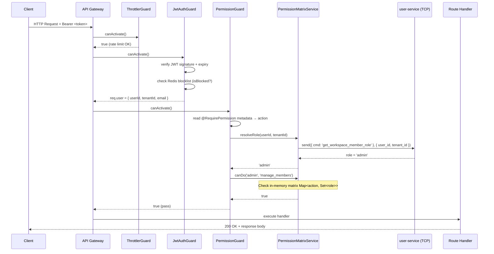
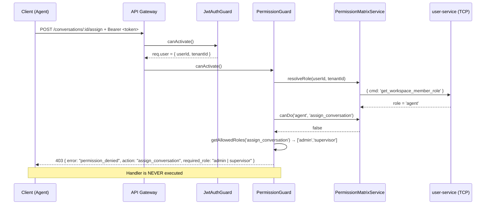
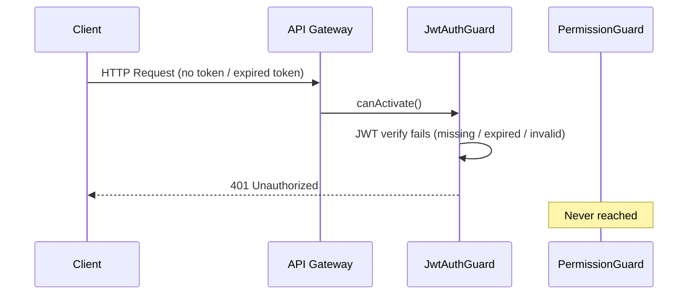
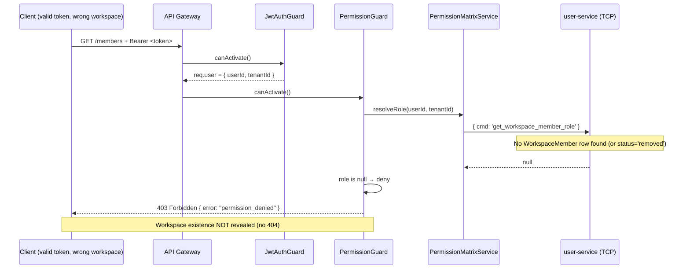
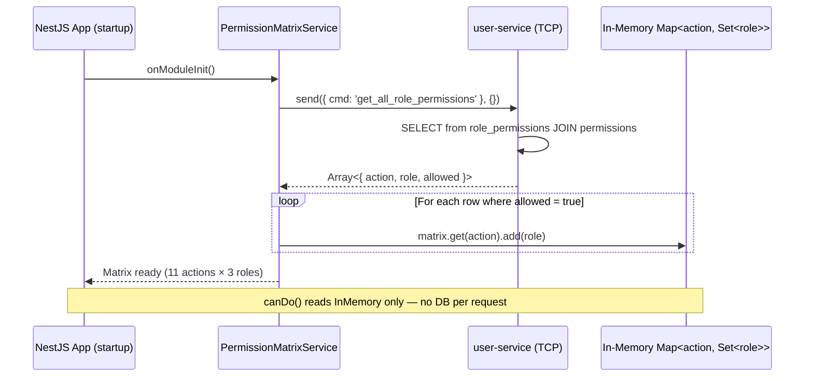
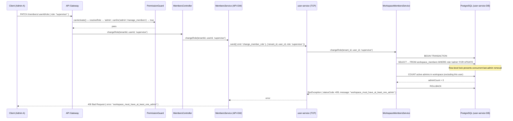
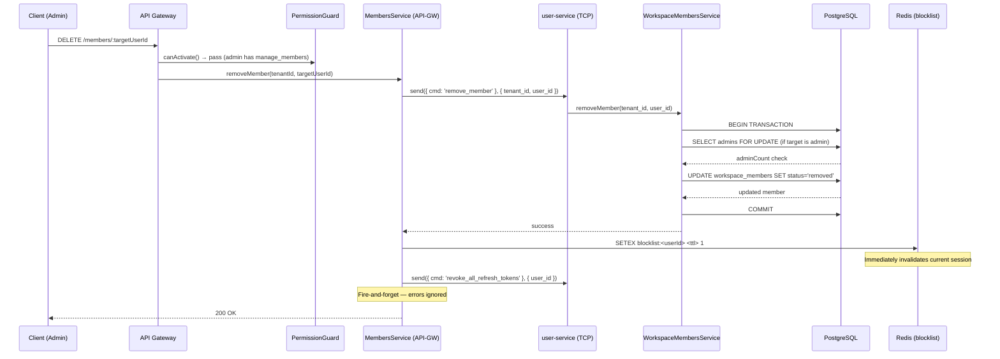
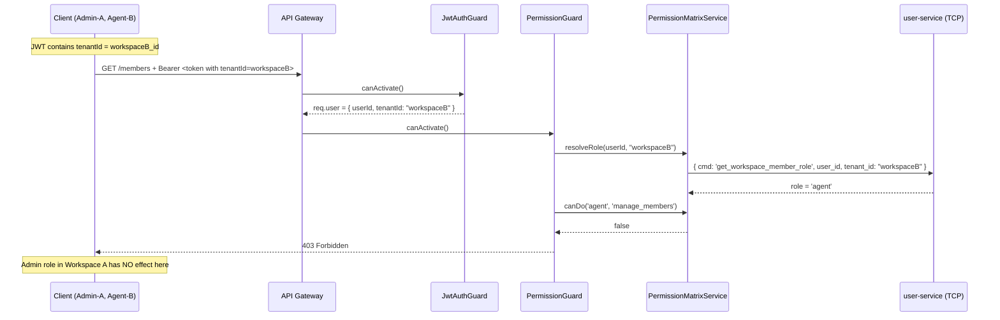

# ACE-1611: RBAC-01 — Sequence Diagrams

Source: story `ACE-1611` + actual code in `apps/api-gateway` & `apps/user-service`.

---

## 1. Normal Protected Request (Permission Granted)

Flow for any authenticated user calling an endpoint that requires a permission they hold (e.g. Admin calling `manage_members`).

---

## 2. Permission Denied (403)

Agent calls `POST /conversations/:id/assign` which requires `assign_conversation` — Agent does not have it.

---

## 3. Unauthenticated Request (401)

Request arrives without a valid JWT — rejected before permission check.

---

## 4. Non-Member Authenticated User (403, not 404)

User has valid JWT but has no `WorkspaceMember` record for the requested workspace.

---

## 5. Permission Matrix Load at Startup

`PermissionMatrixService` loads the full permission matrix from user-service on module init, and caches it in memory.

---

## 6. Change Member Role (Admin Protection)

Admin A attempts to downgrade their own role when they are the last admin in the workspace.

**Happy path** (2+ admins exist): `adminCount ≥ 1` → UPDATE role → COMMIT → 200 OK.

---

## 7. Remove Member (with Token Revocation)

Admin removes a member: soft-delete + Redis blocklist + refresh token revocation.

---

## 8. Workspace-Scoped Permission Check

User is Admin in Workspace A but Agent in Workspace B — calls `manage_members` with Workspace B context.

