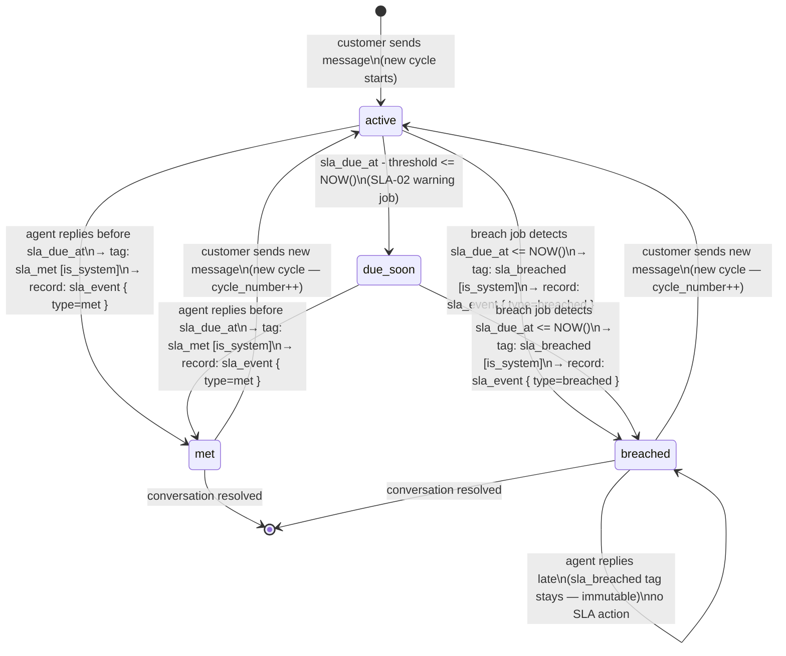
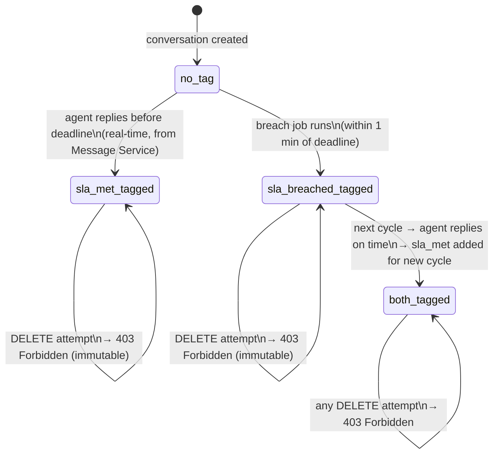
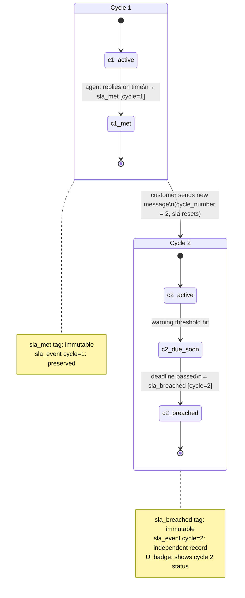
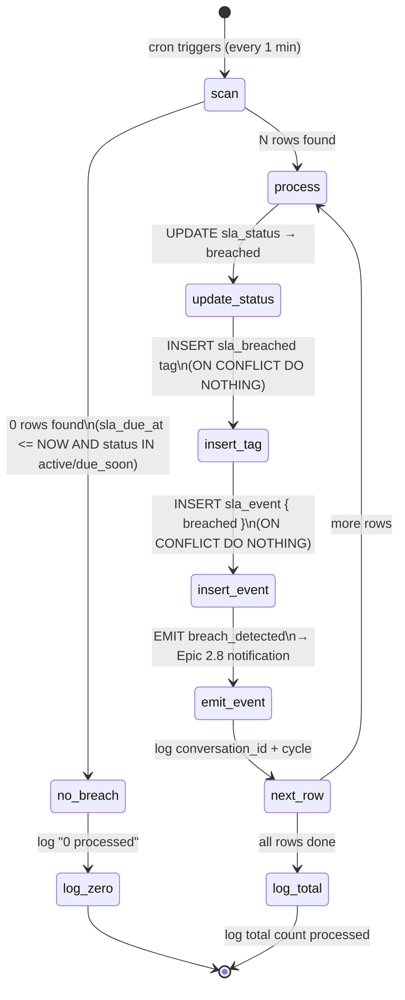

# SLA-04: Breach Detection & Auto-tag — State Diagram

**Story:** ACE-1643  
**Epic:** ACE-1618 SLA Management

---

## Diagram 1: SLA Conversation Status States

**ว่าด้วย:** `sla_status` บน conversation เปลี่ยนยังไงตลอด lifecycle

| State | ความหมาย |
|-------|----------|
| `active` | SLA กำลังนับอยู่ ยังไม่มีใครตอบ |
| `due_soon` | ใกล้หมดเวลา (warning zone) |
| `met` | Agent ตอบทัน ✓ |
| `breached` | หมดเวลาแล้ว ไม่มีใครตอบ ✗ |



**ตัวอย่าง Happy Path:**
```
10:00  ลูกค้าทัก        → active
10:50  ใกล้หมดเวลา      → due_soon
10:55  Agent ตอบ        → met ✓
```

**ตัวอย่าง Breach Path:**
```
10:00  ลูกค้าทัก        → active
10:50  ใกล้หมดเวลา      → due_soon
11:01  job วิ่ง ไม่มีใครตอบ → breached ✗
11:30  Agent ตอบสาย     → ยังคง breached (ไม่เปลี่ยน)
```

> `met` และ `breached` ไม่ใช่ terminal — ถ้าลูกค้าทักใหม่จะวนกลับ `active` (cycle ใหม่)

---

## Diagram 2: System Tag Lifecycle

**ว่าด้วย:** tag `sla_met` / `sla_breached` ถูก add ได้ยังไง และลบไม่ได้เพราะอะไร



**ตัวอย่าง:**
```
Cycle 1: agent ตอบทัน
  → tags: [sla_met]

Cycle 2: ไม่มีใครตอบ
  → tags: [sla_met, sla_breached]

Admin พยายามลบ sla_breached → 403 "system tag ไม่สามารถลบได้"
```

> ล็อคไว้เป็น audit trail — supervisor ต้องรู้ว่า conversation เคย breach แม้ agent จะตอบทีหลัง

---

## Diagram 3: Multi-cycle State Transitions

**ว่าด้วย:** 1 conversation มีหลาย SLA cycle และแต่ละ cycle independent กัน — ผลของ cycle หนึ่งไม่ทับอีก cycle



**ตัวอย่าง:**
```
Cycle 1 (เช้า):
  10:00  ลูกค้าทัก → sla_due_at 11:00
  10:45  Agent ตอบ → sla_met [cycle=1]

Cycle 2 (บ่าย):
  14:00  ลูกค้าทักใหม่ → sla_due_at 15:00
  (ไม่มีใครตอบ)     → sla_breached [cycle=2]

Inbox badge แสดง:  "Overdue +1m"         ← cycle 2 (latest)
History เก็บ:      cycle 1 met ✓          ← ยังอยู่ครบ
                   cycle 2 breached ✗     ← ยังอยู่ครบ
```

> แยก record ต่อ cycle เพื่อ analytics — รู้ได้ว่าแต่ละครั้งที่ลูกค้าทัก team ตอบทันหรือเปล่า

---

## Diagram 4: Breach Job Decision Flow

**ว่าด้วย:** job ที่วิ่งทุก 1 นาทีทำอะไรบ้าง step by step



**ตัวอย่าง job run ตอน 15:01:**
```
Scan พบ 3 conversations ที่ deadline ผ่านแล้ว

conv A: update breached → add tag → emit event  ✓  (new breach)
conv B: update breached → add tag → emit event  ✓  (new breach)
conv C: tag มีอยู่แล้ว (job รอบก่อน insert ไป)
        ON CONFLICT DO NOTHING → ข้ามไป ไม่ duplicate ✓

Log: "processed 3 conversations"
```

> `ON CONFLICT DO NOTHING` คือ idempotency guard — job crash แล้ว restart ก็ไม่สร้าง tag ซ้ำ
