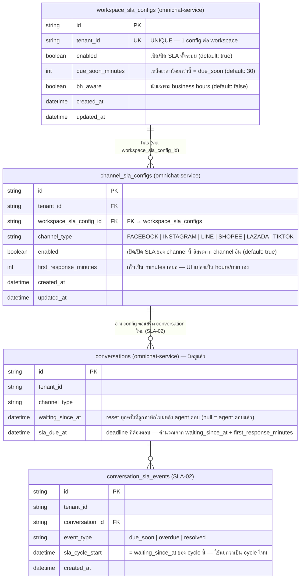
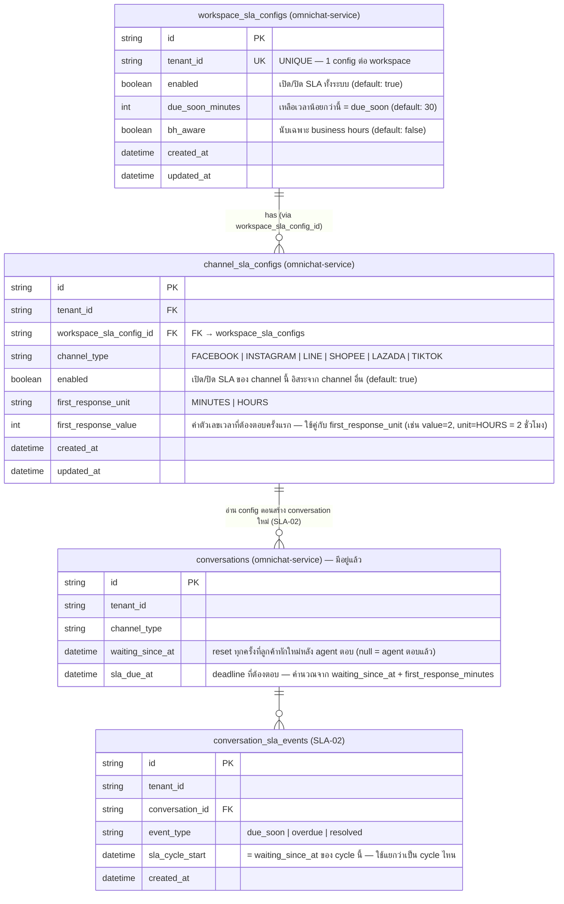

# STORY-SLA-01: SLA Configuration UI — ER Diagram

**Story:** ACE-1640 — SLA Configuration UI
**Parent Epic:** ACE-1618
**ClickUp Doc Page:** [ER STORY-SLA-01: SLA Configuration UI](https://app.clickup.com/25605274/v/dc/rdd4u-133996/rdd4u-82136)

> v2 is latest — `channel_sla_configs` uses `first_response_value + first_response_unit` instead of `first_response_minutes`

---

## version-1

---

## version-2 (latest)

> Key change: `first_response_minutes` → `first_response_value (int)` + `first_response_unit (MINUTES|HOURS)`

