# STORY-SLA-01: SLA Configuration UI — Sequence Diagram

**Story:** ACE-1640 — SLA Configuration UI
**Parent Epic:** ACE-1618
**ClickUp Doc Page:** [STORY-SLA-01: SLA Configuration UI](https://app.clickup.com/25605274/v/dc/rdd4u-133996/rdd4u-82516)

---

## GET /omnichat/sla/workspace-config

```mermaid
sequenceDiagram
    autonumber
    actor Agent as Agent (Browser)
    participant GW as API Gateway
    participant OC as Omnichat Service
    participant DB as Omnichat DB
    participant TS as Tenant Service

    Note over Agent,DB: 1. Auth & Permission
    Agent->>GW: GET /omnichat/sla/workspace-config<br/>Authorization: Bearer JWT
    Note right of GW: extract { tenantId } from JWT<br/>require role: Admin | Supervisor

    Note over Agent,DB: 2. Forward Request
    GW->>OC: GET /omnichat/sla/workspace-config<br/>x-tenant-id: tenantId

    Note over Agent,DB: 3. Fetch or Init SLA Config
    OC->>DB: SELECT * FROM workspace_sla_configs WHERE tenant_id = tenantId
    DB-->>OC: workspaceSlaConfig (nullable)

    alt not found — tenant เก่า (ก่อน feature นี้เข้า)
        rect rgb(40, 40, 40)
            Note over OC,DB: DB Transaction — Auto-create default config
            OC->>DB: UPSERT workspace_sla_configs<br/>ON CONFLICT (tenant_id) DO NOTHING
            OC->>DB: INSERT INTO channel_sla_configs (× 6 rows)<br/>workspace_sla_config_id, tenant_id, channel_type,<br/>first_response_unit, first_response_value<br/>LINE / FACEBOOK / INSTAGRAM → value=60, unit=MINUTES<br/>TIKTOK / SHOPEE / LAZADA → value=2, unit=HOURS<br/>ON CONFLICT (tenant_id, channel_type) SKIP DUPLICATES

            alt Transaction failed
                Note over OC,DB: ROLLBACK
                OC-->>GW: 500 Internal Server Error
                GW-->>Agent: 500 Internal Server Error
            else
                Note over OC,DB: COMMIT
                DB-->>OC: { workspaceSlaConfig, channelSlaConfigs[] } (from transaction result)
            end
        end
    else found — tenant ใหม่ (หลัง feature เข้า)
        OC->>DB: SELECT * FROM channel_sla_configs<br/>WHERE workspace_sla_config_id = workspaceSlaConfig.id<br/>ORDER BY CASE channel_type<br/>  WHEN 'LINE' THEN 1<br/>  WHEN 'FACEBOOK' THEN 2<br/>  WHEN 'INSTAGRAM' THEN 3<br/>  WHEN 'TIKTOK' THEN 4<br/>  WHEN 'SHOPEE' THEN 5<br/>  WHEN 'LAZADA' THEN 6<br/>  ELSE 7 END
        DB-->>OC: channelSlaConfigs[]
    end

    OC-->>GW: 200 OK<br/>{ id, tenant_id, enabled, due_soon_minutes, bh_aware,<br/>  channel_configs: [{ id, channel_type, enabled,<br/>    first_response_value, first_response_unit }] }

    Note over GW,TS: 4. Fetch Business Hours
    GW->>TS: GET /tenants/:tenantId
    TS-->>GW: tenant { business_hours: DayWire[] }

    Note over Agent,GW: 5. Response
    Note right of GW: merge workspaceSlaConfig + business_hours
    GW-->>Agent: 200 OK<br/>{ id, tenant_id, enabled, due_soon_minutes, bh_aware,<br/>  channel_configs: [...],<br/>  business_hours: DayWire[] }
```

---

## PATCH /omnichat/sla/workspace-config/:id

```mermaid
sequenceDiagram
    autonumber
    actor Agent as Agent (Browser)
    participant GW as API Gateway
    participant OC as Omnichat Service
    participant DB as Omnichat DB

    Note over Agent,DB: 1. Auth & Permission
    Agent->>GW: PATCH /omnichat/sla/workspace-config/:id<br/>Authorization: Bearer JWT<br/>body: { enabled?, due_soon_minutes?, bh_aware?,<br/>  channel_configs?: [{ id, enabled?,<br/>    first_response_value?, first_response_unit? }] }
    Note right of GW: extract { tenantId } from JWT<br/>require role: Admin | Supervisor

    Note over Agent,DB: 2. Forward Request
    GW->>OC: PATCH /omnichat/sla/workspace-config/:id<br/>x-tenant-id: tenantId<br/>body: { enabled?, due_soon_minutes?, bh_aware?,<br/>  channel_configs?: [{ id, enabled?,<br/>    first_response_value?, first_response_unit? }] }

    Note over Agent,OC: 3. Validate Body
    Note right of GW: all fields optional — if present must be correct type<br/>workspace level:<br/>  enabled: boolean<br/>  due_soon_minutes: int > 0<br/>  bh_aware: boolean<br/>channel_configs[] (each item):<br/>  id: string (required)<br/>  enabled: boolean<br/>  first_response_value: int > 0<br/>  first_response_unit: MINUTES | HOURS
    alt invalid
        GW-->>Agent: 400 Bad Request
    end

    Note over Agent,DB: 4. Verify Ownership
    OC->>DB: SELECT id FROM workspace_sla_configs<br/>WHERE id = :id AND tenant_id = tenantId
    DB-->>OC: workspaceSlaConfig (nullable)

    alt not found
        OC-->>GW: 404 Not Found
        GW-->>Agent: 404 Not Found
    else found
        Note over Agent,DB: 5. Update Config
        rect rgb(40, 40, 40)
            Note over OC,DB: DB Transaction

            OC->>DB: UPDATE workspace_sla_configs SET<br/>  enabled = enabled ?? existing,<br/>  due_soon_minutes = due_soon_minutes ?? existing,<br/>  bh_aware = bh_aware ?? existing,<br/>  updated_at = NOW()<br/>WHERE id = :id AND tenant_id = tenantId

            opt channel_configs present in body
                OC->>DB: UPDATE channel_sla_configs SET<br/>  enabled = enabled ?? existing,<br/>  first_response_value = first_response_value ?? existing,<br/>  first_response_unit = first_response_unit ?? existing,<br/>  updated_at = NOW()<br/>WHERE id = channel_config.id<br/>  AND tenant_id = tenantId<br/>  AND workspace_sla_config_id = workspaceSlaConfig.id<br/>— for each channel_config in body (parallel)
                DB-->>OC: { count } per update

                alt any count === 0
                    Note over OC: ROLLBACK
                    OC-->>GW: 404 Not Found<br/>{ message: "Channel SLA config '{id}' could not be updated" }
                    GW-->>Agent: 404 Not Found
                end
            end

            alt DB error
                OC-->>GW: 500 Internal Server Error
                GW-->>Agent: 500 Internal Server Error
            else
                OC->>DB: COMMIT
                DB-->>OC: ok
            end
        end

        Note over Agent,DB: 6. Response
        OC-->>GW: 204 No Content
        GW-->>Agent: 204 No Content
    end
```

---

## POST /auth/register — Auto-create Default SLA Config

> On new tenant registration, API Gateway creates default SLA config (non-blocking).

```mermaid
sequenceDiagram
    autonumber
    actor Agent as Agent (Browser)
    participant GW as API Gateway
    participant TS as Tenant Service
    participant US as User Service
    participant OC as Omnichat Service
    participant DB as Omnichat DB

    Note over Agent,DB: 1. Register
    Agent->>GW: POST /auth/register

    Note over Agent,DB: 2. Create Tenant
    GW->>TS: POST /tenants
    TS-->>GW: 201

    Note over Agent,DB: 3. Create Default SLA Config (workspace + channels)
    GW->>OC: POST /omnichat/sla/workspace-config<br/>body: { tenant_id: tenantId, enabled: false,<br/>  due_soon_minutes: 30, bh_aware: false, channel_configs: [] }

    alt OC error
        OC-->>GW: 500
        Note right of GW: log error, continue<br/>(non-blocking — SLA config is not<br/>required for login or core features)
    else ok
        rect rgb(40, 40, 40)
            Note over OC,DB: DB Transaction — Create default SLA config
            OC->>DB: UPSERT workspace_sla_configs<br/>ON CONFLICT (tenant_id) DO NOTHING
            OC->>DB: INSERT INTO channel_sla_configs (× 6 rows)<br/>workspace_sla_config_id, tenant_id, channel_type,<br/>first_response_unit, first_response_value<br/>LINE / FACEBOOK / INSTAGRAM → value=60, unit=MINUTES<br/>TIKTOK / SHOPEE / LAZADA → value=2, unit=HOURS<br/>ON CONFLICT (tenant_id, channel_type) SKIP DUPLICATES

            alt Transaction failed
                Note over OC,DB: ROLLBACK
                OC-->>GW: 500
                Note right of GW: log error, continue<br/>(non-blocking)
            else
                Note over OC,DB: COMMIT
                OC-->>GW: 201
            end
        end
    end

    Note over Agent,DB: 4. Create User + WorkspaceMember
    GW->>US: TCP create_auth_user
    US-->>GW: user

    Note over Agent,DB: 5. Issue Tokens
    GW->>US: TCP store_refresh_token
    GW-->>Agent: 201 { access_token, refresh_token, tenant }
```

