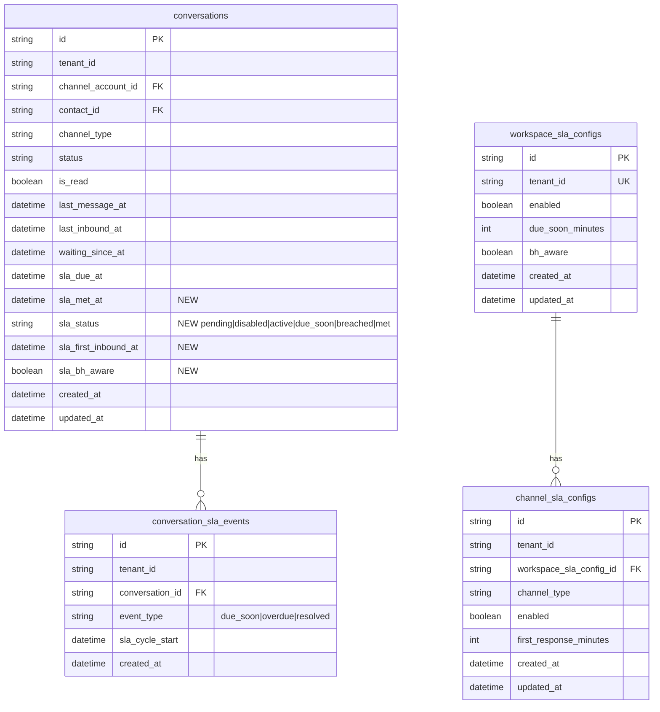

# STORY-SLA-02: ER Diagram

**Story:** ACE-1641 — SLA Timer Engine
**Parent Epic:** ACE-1618

> **Sources:** `omnichat-service/prisma/schema.prisma` + ACE-1641 story spec
> **Fields marked NEW** = ยังไม่มีใน schema.prisma ปัจจุบัน — จะ migrate ใน ACE-1663
> **`sla_due_soon_at`** = computed field (ไม่เก็บใน DB): `sla_due_at - due_soon_minutes` — คำนวณตอน API serialize เพื่อส่งให้ FE (SLA-03)

---



---

## SLA Status State Machine

```
first inbound → [active]
[active] → remaining <= due_soon_minutes → [due_soon]
[active | due_soon] → sla_due_at <= NOW() → [breached]
[active | due_soon | breached] → agent first outbound reply → [met]
[met] → customer follow-up → [active] (new cycle, same bh_aware snapshot)
SLA disabled on channel → [disabled]
```

## Notes

- `sla_due_at` คำนวณ 1 ครั้งตอน `sla_first_inbound_at` set — ไม่ recalculate ถ้า BH config เปลี่ยนทีหลัง
- `sla_bh_aware` snapshot ไว้เพื่อให้ follow-up cycle ใช้ mode เดิม แม้ config จะถูกเปลี่ยนระหว่างนั้น
- `waiting_since_at` ยังคงอยู่สำหรับ `sort_by=oldest_waiting` — ทำงานร่วมกับ `sla_first_inbound_at`
- DB indexes ที่มีอยู่แล้ว: `@@index([tenant_id, sla_due_at(sort: Asc)])`, `@@index([tenant_id, status, sla_due_at(sort: Asc)])`
