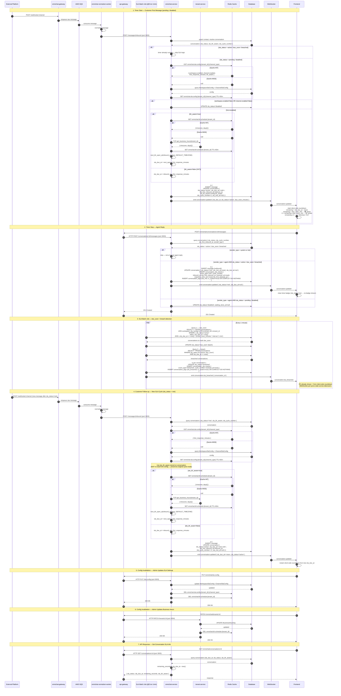

# STORY-SLA-02: Sequence Diagram

**Story:** ACE-1641 — SLA Timer Engine
**Parent Epic:** ACE-1618

> Referenced by: SLA-03 (display), SLA-04 (breach detection)

---

```mermaid
sequenceDiagram
    autonumber

    participant EXT  as External Platform
    participant OCG  as omnichat-gateway
    participant SQS  as AWS SQS
    participant NW   as omnichat-normalizer-worker
    participant AGW  as api-gateway
    participant JOB  as SLA Batch Job (@Cron 1min)
    participant OC   as omnichat-service
    participant TS   as tenant-service
    participant CACHE as Redis Cache
    participant DB   as Database
    participant WS   as WebSocket
    participant FE   as Frontend

    Note over EXT,FE: 1. Timer Start — Customer First Message (pending / disabled)

    EXT->>OCG: POST /webhooks/:channel
    OCG->>SQS: enqueue raw message
    SQS->>NW: consume message
    NW->>NW: normalize message
    NW->>OC: POST /messages/inbound (port 3003)
    OC->>DB: upsert contact, resolve conversation
    DB-->>OC: conversation { sla_status, sla_bh_aware, sla_cycle_number }

    alt sla_status = active / due_soon / breached
        OC->>OC: timer already running — skip SLA logic
    else sla_status = pending / disabled
        OC->>CACHE: GET omnichat:sla:config:{tenant_id}:{channel_type}
        alt Cache HIT
            CACHE-->>OC: { workspace.enabled, channel.enabled,<br/>first_response_minutes, bh_aware }
        else Cache MISS
            CACHE-->>OC: null
            OC->>DB: query WorkspaceSlaConfig + ChannelSlaConfig
            DB-->>OC: config
            OC->>CACHE: SET omnichat:sla:config:{tenant_id}:{channel_type} TTL=60m
        end

        alt workspace.enabled=false OR channel.enabled=false
            OC->>DB: UPDATE sla_status='disabled'
        else SLA enabled
            alt bh_aware=true
                OC->>CACHE: GET omnichat:bh:schedule:{tenant_id}
                alt Cache HIT
                    CACHE-->>OC: { timezone, days[] }
                else Cache MISS
                    CACHE-->>OC: null
                    OC->>TS: TCP get_business_hours(tenant_id)
                    TS-->>OC: { timezone, days[] }
                    OC->>CACHE: SET omnichat:bh:schedule:{tenant_id} TTL=60m
                end
                OC->>OC: next_bh_open_at(inbound_at, days, DEFAULT_TIMEZONE)
                OC->>OC: sla_due_at = next_open + first_response_minutes
            else bh_aware=false (24/7)
                OC->>OC: sla_due_at = inbound_at + first_response_minutes
            end

            OC->>DB: tx {<br/>  INSERT message<br/>  UPDATE conversation {<br/>    sla_status='active', sla_due_at=<calc>,<br/>    sla_first_inbound_at=inbound_at,<br/>    sla_bh_aware=config.bh_aware,<br/>    sla_cycle_number=1, sla_met_at=null } }

            OC->>WS: emit conversation:updated { sla_due_at, sla_status='active', due_soon_minutes }
            WS->>FE: conversation:updated
            FE->>FE: start client-side countdown<br/>remaining = sla_due_at - now()<br/>remaining > due_soon_min → 🟢 green<br/>0 < remaining ≤ due_soon_min → 🟡 amber<br/>remaining ≤ 0 → 🔴 "Overdue +Xm"
        end
    end

    Note over EXT,FE: 2. Timer Stop — Agent Reply

    FE->>AGW: POST /omnichat/conversations/:id/messages
    AGW->>OC: HTTP POST /conversations/:id/messages (port 3003)
    OC->>DB: query conversation { sla_status, sla_cycle_number,<br/>sla_first_inbound_at, sender_type }
    DB-->>OC: sla_status = active / due_soon / breached

    alt sender_type = system or bot
        OC->>OC: skip — not a human agent reply
    else sender_type = agent AND sla_status = active / due_soon / breached
        OC->>DB: tx {<br/>  INSERT message (outbound)<br/>  UPDATE conversation { sla_status='met', sla_met_at=now(), sla_due_at=null }<br/>  INSERT conversation_sla_events {<br/>    event_type='met', cycle_number,<br/>    inbound_at=sla_first_inbound_at, resolved_at=now(),<br/>    response_time_sec=now()-sla_first_inbound_at }<br/>  INSERT conversation_tags (sla_met, is_system=true) ON CONFLICT DO NOTHING<br/>}
        OC->>WS: emit conversation:updated { sla_status='met', sla_due_at=null }
        WS->>FE: conversation:updated
        FE->>FE: clear timer badge (sla_status=met → no badge shown)
    else sender_type = agent AND sla_status = pending / disabled
        OC->>DB: UPDATE sla_status='disabled', waiting_since_at=null
    end

    OC-->>AGW: 201 Created
    AGW-->>FE: 201 Created

    Note over EXT,FE: 3. SLA Batch Job — due_soon + breach detection

    loop Every 1 minute
        JOB->>DB: Query 1 — due_soon<br/>SELECT c.* FROM conversations c<br/>JOIN workspace_sla_configs w ON w.tenant_id=c.tenant_id<br/>WHERE c.sla_status='active'<br/>  AND c.sla_due_at > now()<br/>  AND c.sla_due_at <= now() + (w.due_soon_minutes * interval '1 min')
        DB-->>JOB: conversations to mark due_soon
        JOB->>DB: UPDATE sla_status='due_soon' (batch)

        JOB->>DB: Query 2 — breach<br/>SELECT * FROM conversations<br/>WHERE sla_status IN ('active','due_soon')<br/>  AND sla_due_at <= now()
        DB-->>JOB: breached conversations
        JOB->>DB: tx per conversation {<br/>  UPDATE sla_status='breached'<br/>  INSERT conversation_sla_events {<br/>    event_type='breached', cycle_number, resolved_at=now() }<br/>  INSERT conversation_tags (sla_breached, is_system=true) ON CONFLICT DO NOTHING<br/>}
        JOB->>WS: emit conversation:sla_breached { conversation_id }
        WS->>FE: conversation:sla_breached
        Note right of FE: FE already shows 🔴 from client-side countdown<br/>WebSocket just syncs state across tabs/users
    end

    Note over EXT,FE: 4. Customer Follow-up — New SLA Cycle (sla_status = met)

    EXT->>OCG: POST /webhooks/:channel (new message after sla_status=met)
    OCG->>SQS: enqueue raw message
    SQS->>NW: consume message
    NW->>NW: normalize message
    NW->>OC: POST /messages/inbound (port 3003)
    OC->>DB: query conversation { sla_status='met', sla_bh_aware, sla_cycle_number }
    DB-->>OC: conversation

    OC->>CACHE: GET omnichat:sla:config:{tenant_id}:{channel_type}
    alt Cache HIT
        CACHE-->>OC: { first_response_minutes }
    else Cache MISS
        CACHE-->>OC: null
        OC->>DB: query WorkspaceSlaConfig + ChannelSlaConfig
        DB-->>OC: config
        OC->>CACHE: SET omnichat:sla:config:{tenant_id}:{channel_type} TTL=60m
    end

    Note over OC: Use sla_bh_aware stored on conversation<br/>(NOT re-read from config — preserves original cycle mode)

    alt sla_bh_aware=true
        OC->>CACHE: GET omnichat:bh:schedule:{tenant_id}
        alt Cache HIT
            CACHE-->>OC: { timezone, days[] }
        else Cache MISS
            CACHE-->>OC: null
            OC->>TS: TCP get_business_hours(tenant_id)
            TS-->>OC: { timezone, days[] }
            OC->>CACHE: SET omnichat:bh:schedule:{tenant_id} TTL=60m
        end
        OC->>OC: next_bh_open_at(inbound_at, days, DEFAULT_TIMEZONE)
        OC->>OC: sla_due_at = next_open + first_response_minutes
    else sla_bh_aware=false
        OC->>OC: sla_due_at = inbound_at + first_response_minutes
    end

    OC->>DB: tx {<br/>  INSERT message<br/>  UPDATE conversation {<br/>    sla_status='active', sla_due_at=<new calc>,<br/>    sla_first_inbound_at=inbound_at,<br/>    sla_cycle_number+=1, sla_met_at=null } }
    OC->>WS: emit conversation:updated { sla_due_at=<new>, sla_status='active' }
    WS->>FE: conversation:updated
    FE->>FE: restart client-side countdown from new sla_due_at

    Note over EXT,FE: 5. Config Invalidation — Admin Updates SLA Settings

    FE->>AGW: PUT /omnichat/sla-config
    AGW->>OC: HTTP PUT /sla-config (port 3003)
    OC->>DB: update WorkspaceSlaConfig / ChannelSlaConfig
    DB-->>OC: updated
    OC->>CACHE: DEL omnichat:sla:config:{tenant_id}:{channel_type}
    OC->>CACHE: DEL omnichat:bh:schedule:{tenant_id}
    OC-->>AGW: 200 OK
    AGW-->>FE: 200 OK

    Note over EXT,FE: 6. Config Invalidation — Admin Updates Business Hours

    FE->>AGW: PATCH /omnichat/tenants/:id
    AGW->>TS: HTTP PATCH /tenants/:id (port 3004)
    TS->>DB: UPDATE BusinessHourDay
    DB-->>TS: updated
    TS->>CACHE: DEL omnichat:bh:schedule:{tenant_id}
    TS-->>AGW: 200 OK
    AGW-->>FE: 200 OK

    Note over EXT,FE: 7. API Response — Get Conversation SLA Info

    FE->>AGW: GET /omnichat/conversations/:id
    AGW->>OC: HTTP GET /conversations/:id (port 3003)
    OC->>DB: query conversation (sla_due_at, sla_status, sla_bh_aware)
    DB-->>OC: conversation
    OC->>OC: remaining_seconds = sla_due_at - now()
    OC-->>AGW: { sla_status, sla_due_at, remaining_seconds, sla_bh_aware }
    AGW-->>FE: response
```
