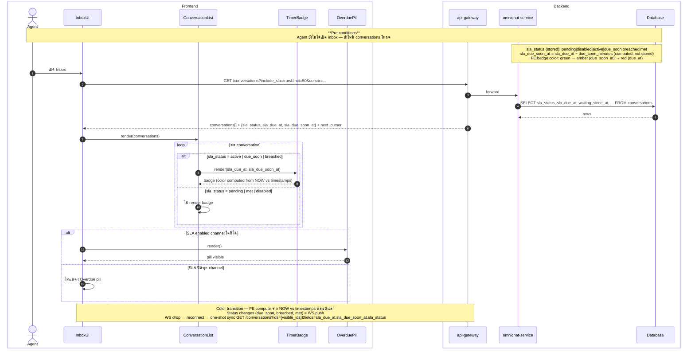
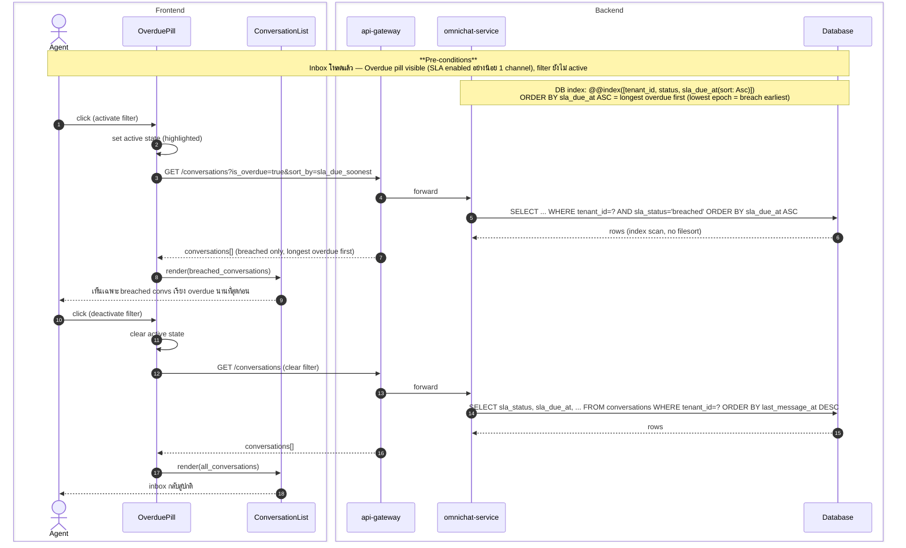
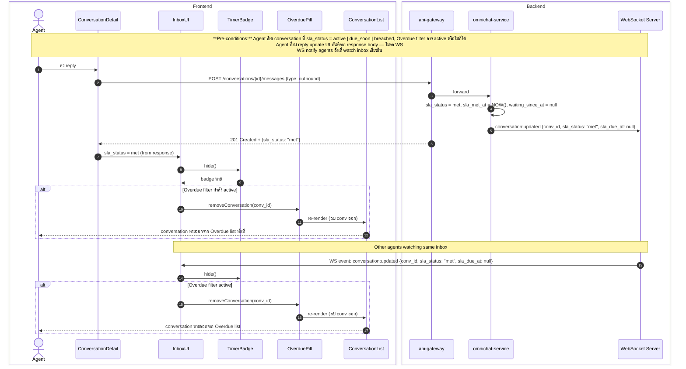
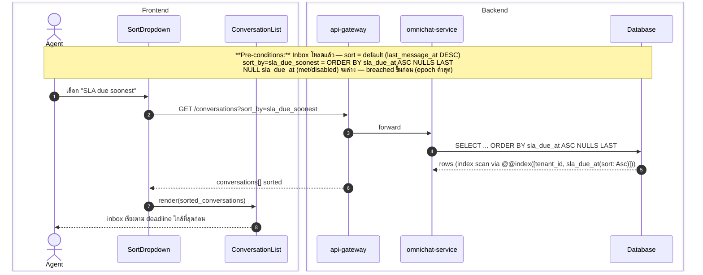

# STORY-SLA-03: Sequence Diagrams

**Story:** ACE-1642 — Timer Display in Inbox
**Parent Epic:** ACE-1618

---

## SD-01: Initial Inbox Load with SLA Data

---

## SD-02: Overdue Filter Pill Interaction

---

## SD-03: Agent Reply → SLA Met → Remove from Overdue List

---

## SD-04: Sort by SLA Due Soonest

---

> **sla_status state transitions** → see [ACE-1641_STORY-SLA-02_State_Diagram.md](ACE-1641_STORY-SLA-02_State_Diagram.md)
