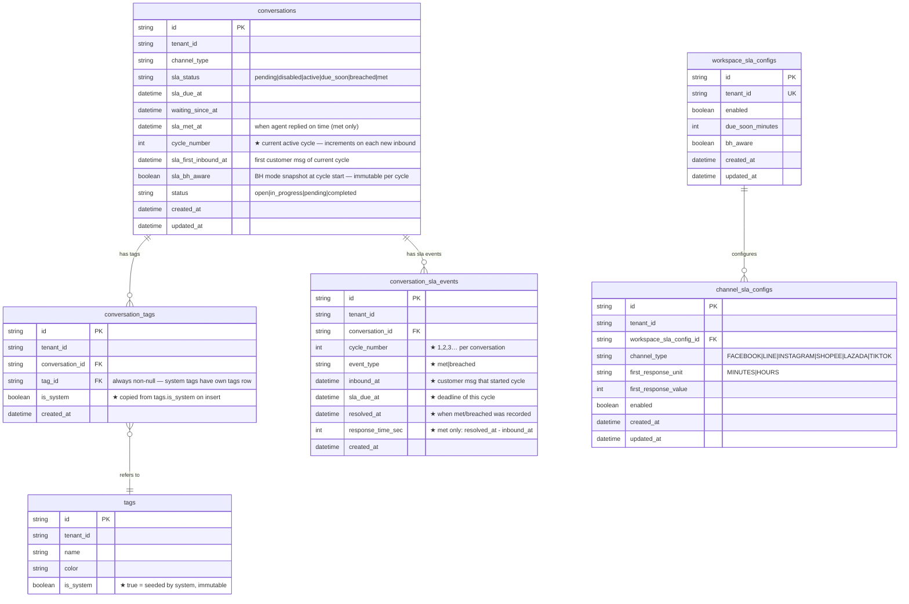

# SLA-04: ER Diagram

**Story:** ACE-1643 — Breach Detection & Auto-tag  
**Scope:** Schema changes required for SLA-04 only (excludes unrelated tables)

> ★ = new field/table added in SLA-04  
> Fields from SLA-01/SLA-02 shown without ★ (for context only)

---

## Diagram



---

## Key Rules (from story)

| Rule | Field | Where |
|------|-------|-------|
| System tag = immutable | `is_system = true` | `tags` |
| Delete blocked at API | check `tags.is_system` before delete | API layer → 403 |
| System tags seeded per tenant | INSERT on tenant creation | migration / onboarding hook |
| Each cycle = independent audit row | `cycle_number` | `conversation_sla_events` |
| Response time stored on `met` only | `response_time_sec` | `conversation_sla_events` |
| Breach analytics: elapsed time | `resolved_at - sla_due_at` | computed from `conversation_sla_events` |
| Idempotent insert | `ON CONFLICT DO NOTHING` | tag + event inserts |

---

## System Tag Seeding

System tags (`sla_met`, `sla_breached`) เป็นแถวใน `tags` table — seeded ตอน tenant ถูกสร้าง:

```sql
INSERT INTO tags (id, tenant_id, name, color, is_system)
VALUES
  (gen_random_uuid(), :tenant_id, 'sla_met',      '#22c55e', true),
  (gen_random_uuid(), :tenant_id, 'sla_breached', '#ef4444', true);
```

**ข้อดีเทียบกับ denormalize:**

| | Denormalize `tag_name` | Seed in `tags` (approach นี้) |
|--|--|--|
| Rename tag | update ล้านแถวใน `conversation_tags` | update 1 แถวใน `tags` |
| JOIN | ไม่ต้อง join | join ปกติ |
| Consistency | เสี่ยง stale | guaranteed |

---

## What Changed From Current Schema

> Fields added in **SLA-01**: `waiting_since_at`, `sla_due_at`  
> Fields added in **SLA-02**: `sla_status`, `sla_met_at`, `sla_first_inbound_at`, `sla_bh_aware`  
> SLA-04 adds only what is listed below.

### `conversations` — 1 new field
| Field | Change |
|-------|--------|
| `cycle_number` | NEW — current active cycle counter, increments on each new inbound |

### `tags` — 1 new field
| Field | Change |
|-------|--------|
| `is_system` | NEW — `true` = seeded by system, blocks delete at API layer (403) |

### `conversation_tags` — 1 new field
| Field | Change |
|-------|--------|
| `is_system` | NEW — copied from `tags.is_system` on insert for fast lookup (no join needed on delete check) |

### `conversation_sla_events` — full redesign
Current schema has: `event_type (due_soon|overdue|resolved)`, `sla_cycle_start`  
New schema needs: `cycle_number`, `event_type (met|breached)`, `inbound_at`, `sla_due_at`, `resolved_at`, `response_time_sec`

> Migration: rename + add columns (or drop/recreate if no prod data yet)

---

## Multi-cycle Example

```
tags table (seeded):
  { name=sla_met,      is_system=true, id=TAG_MET_ID }
  { name=sla_breached, is_system=true, id=TAG_BREACH_ID }

conversation #A:

  cycle 1:
    conversation_sla_events: { cycle=1, event_type=met, response_time_sec=2700 }
    conversation_tags:       { tag_id=TAG_MET_ID,    is_system=true }

  cycle 2:
    conversation_sla_events: { cycle=2, event_type=breached, resolved_at=15:01 }
    conversation_tags:       { tag_id=TAG_BREACH_ID, is_system=true }

  both rows in conversation_sla_events → immutable audit trail
  both rows in conversation_tags       → immutable system tags
```
