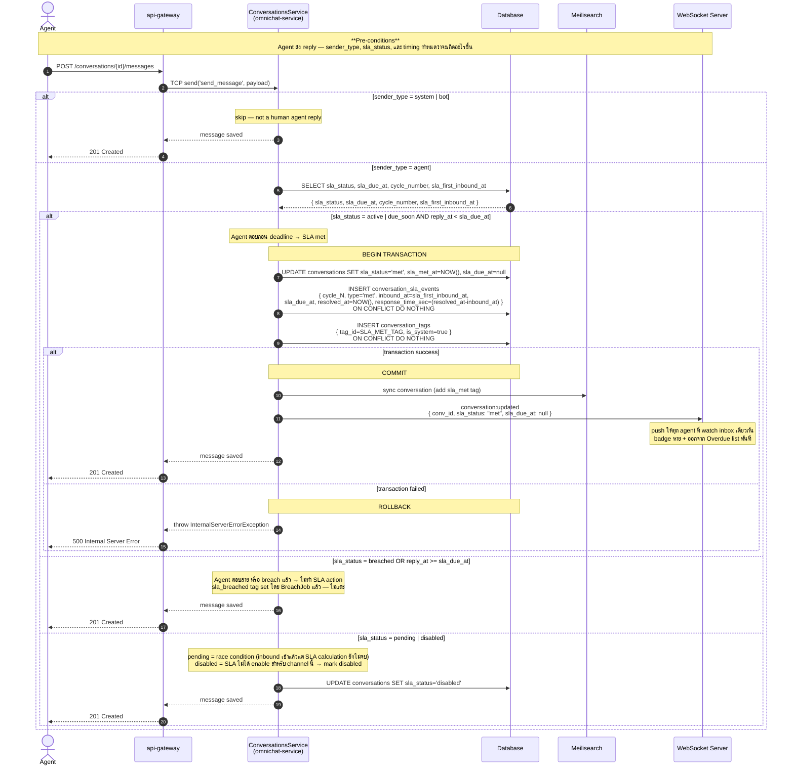
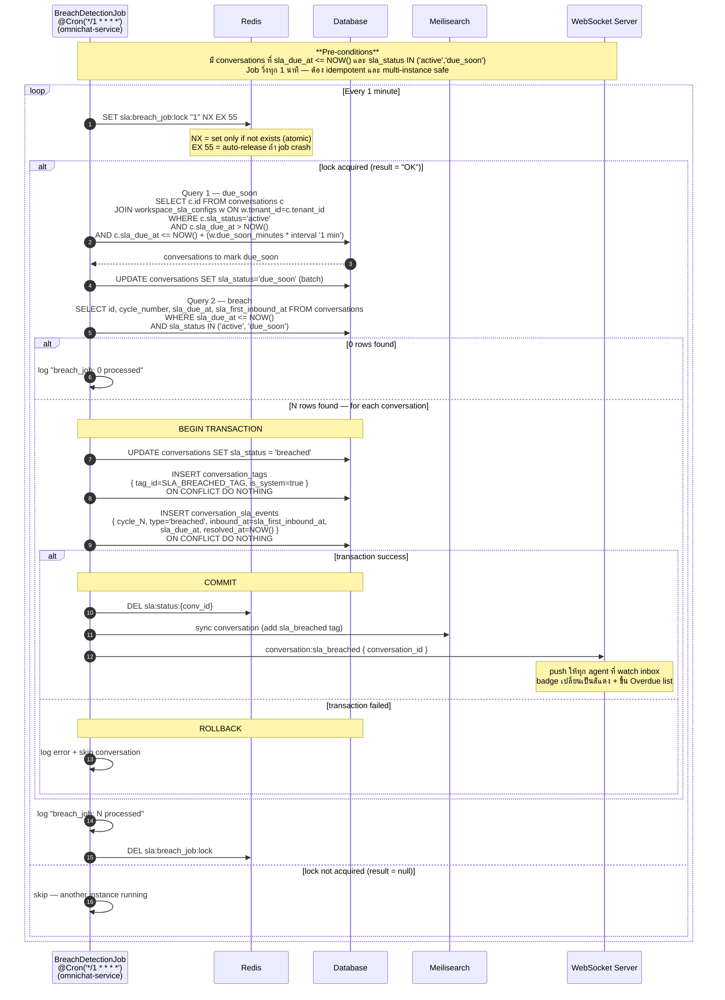
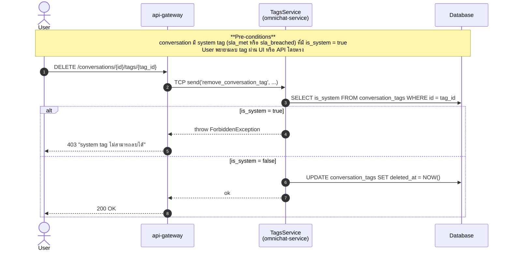

# SLA-04: Sequence Diagrams

**Story:** ACE-1643 — Breach Detection & Auto-tag  
**Service:** `omnichat-service`

---

## SD-01: Agent Reply — SLA Outcome Handler



---

## SD-02: Breach Detection Job — due_soon & breach scan (@Cron 1 min)

> Redis ใช้ **Distributed lock** — กัน race condition ถ้า omnichat-service scale หลาย instance



---

## SD-03: System Tag Delete Protection



---

## Redis Key Summary

| Key | TTL | Purpose | ใช้ใน |
|-----|-----|---------|-------|
| `sla:breach_job:lock` | 55s | Distributed lock — กัน multi-instance race | BreachDetectionJob |
| `omnichat:sla:config:{tenant_id}:{channel_type}` | 60m | SLA config cache (bh_aware, first_response_minutes) — DEL+SET ทันทีเมื่อ admin เปลี่ยน | ConversationsService |
| `omnichat:bh:schedule:{tenant_id}` | 60m | Business Hours schedule cache — DEL เมื่อ admin เปลี่ยน BH settings | ConversationsService |

---

## Component Map (Real Code)

```
packages/redis/                            ← existing — import RedisModule ใน omnichat-service
├── redis.service.ts                       ← RedisService.getClient() → raw ioredis
└── cache/redis-cache.service.ts           ← RedisCacheService.setJson/getJson/del/exists

omnichat-service/
├── src/
│   ├── app.module.ts                      ← add RedisModule import (NEW)
│   ├── conversations/
│   │   └── conversations.service.ts       ← sendMessage() — add cache read/invalidate + WS push
│   ├── tags/
│   │   └── tags.service.ts                ← deleteTag() — add is_system guard
│   └── sla/                              ← NEW module
│       ├── breach-detection.job.ts        ← @Cron, distributed lock, breach loop + WS push
│       └── sla.service.ts                 ← tag helpers + cache helpers
└── prisma/
    └── schema.prisma                      ← add is_system to Tag + ConversationTag
                                              redesign ConversationSlaEvent
```

---

> **Multi-cycle Timeline Example** → see [ACE-1643_STORY-SLA-04_Timeline.md](ACE-1643_STORY-SLA-04_Timeline.md)  
> **SLA status state transitions** → see [ACE-1643_STORY-SLA-04_State_Diagram.md](ACE-1643_STORY-SLA-04_State_Diagram.md)  
> **ER Diagram** → see [ACE-1643_STORY-SLA-04_ER_Diagram.md](ACE-1643_STORY-SLA-04_ER_Diagram.md)
