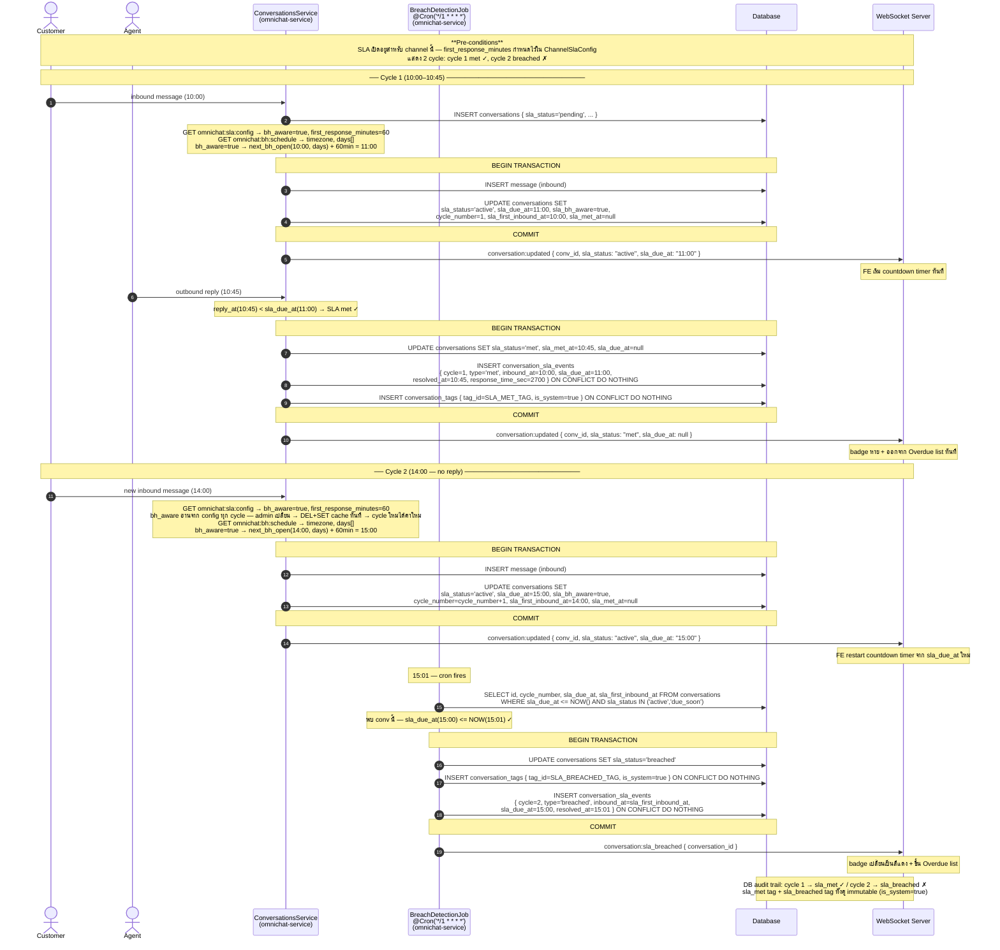

# SLA-04: Multi-cycle Timeline Example

**Story:** ACE-1643 — Breach Detection & Auto-tag  
**Service:** `omnichat-service`

> Concrete walkthrough — cycle 1 (met ✓) → cycle 2 (breached ✗)  
> Infrastructure details (cache, lock, error paths) → [ACE-1643_STORY-SLA-04_Sequence_Diagram.md](ACE-1643_STORY-SLA-04_Sequence_Diagram.md)

---

