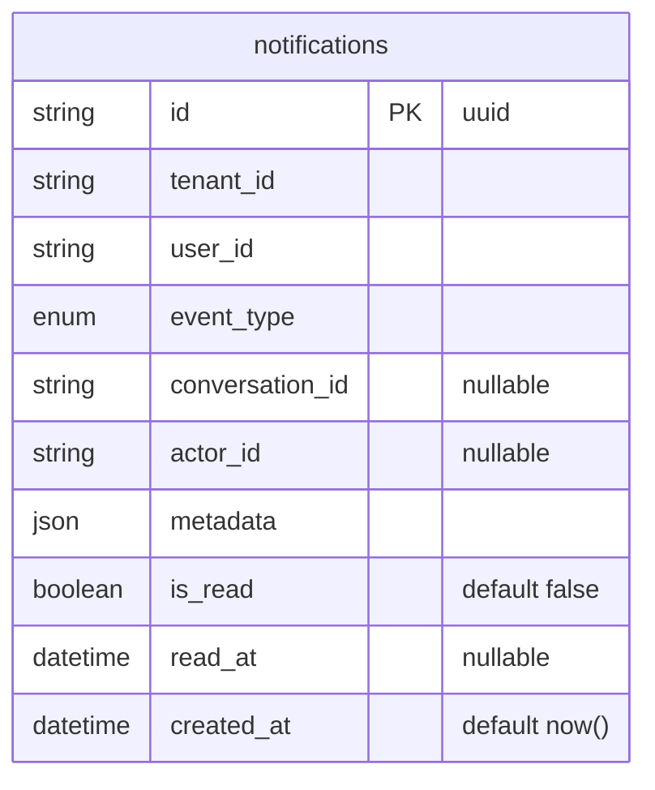

## ER Diagram



**Prisma model → DB table mapping**

| Prisma model | DB table (`@@map`) |
|---|---|
| `Notification` | `notifications` (used as entity name in diagram) |

**event_type enum**

```
conversation_assigned | conversation_reassigned | conversation_unassigned
new_conversation | customer_replied | mention
sla_due_soon | sla_breached | sla_breached_team | channel_error
```

**metadata shape per event_type**

| event_type | metadata fields |
| --- | --- |
| `conversation_assigned` / `reassigned` | `conversation_id, customer_name, channel, assigned_by_name` |
| `new_conversation` | `customer_name, channel, message_preview, message_count` |
| `customer_replied` | `customer_name, channel, message_preview, message_count` |
| `mention` | `conversation_id, note_id, actor_name, channel, note_preview` |
| `sla_due_soon` | `conversation_id, customer_name, channel, remaining_minutes` |
| `sla_breached` / `sla_breached_team` | `conversation_id, customer_name, channel, elapsed_minutes` |
| `channel_error` | `channel_type, error_description` |

**Indexes**

```prisma
@@index([tenant_id, user_id, is_read, created_at])
@@index([tenant_id, user_id, conversation_id, is_read])
```
