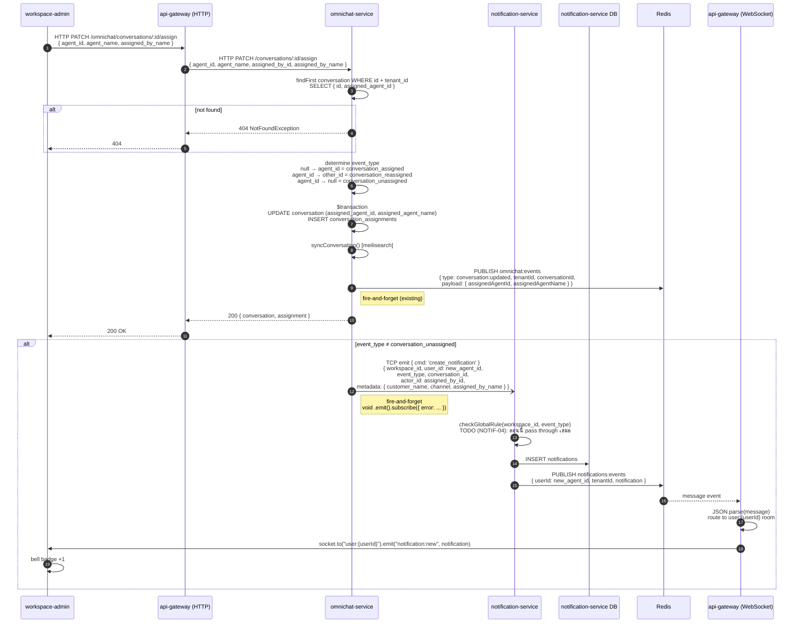
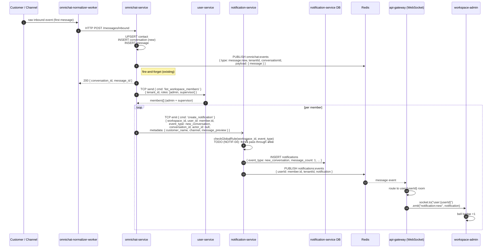
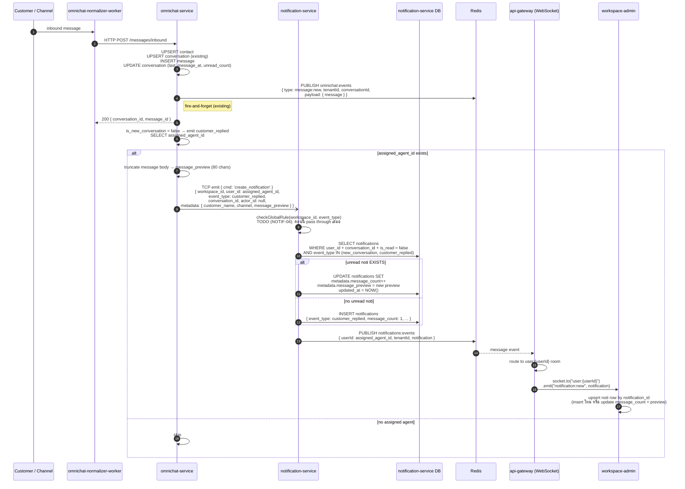
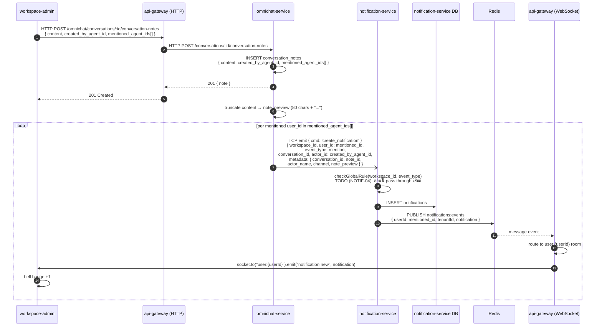
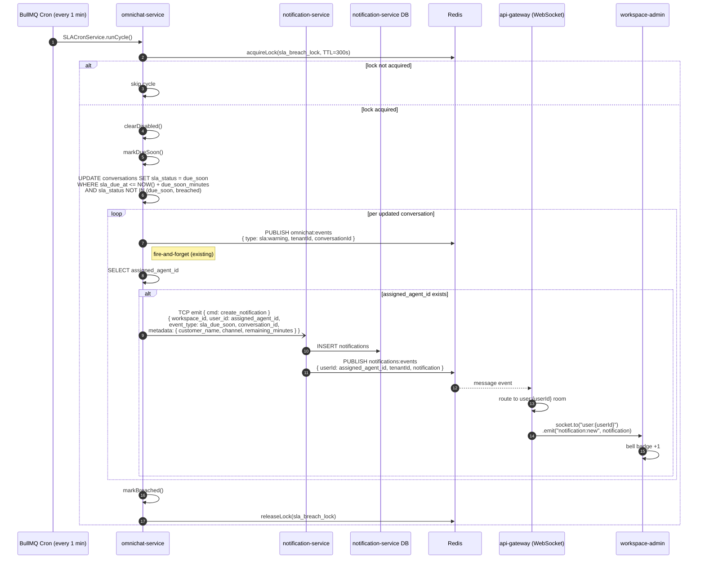
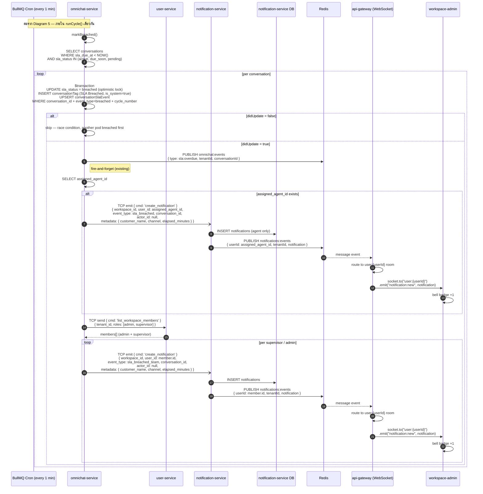
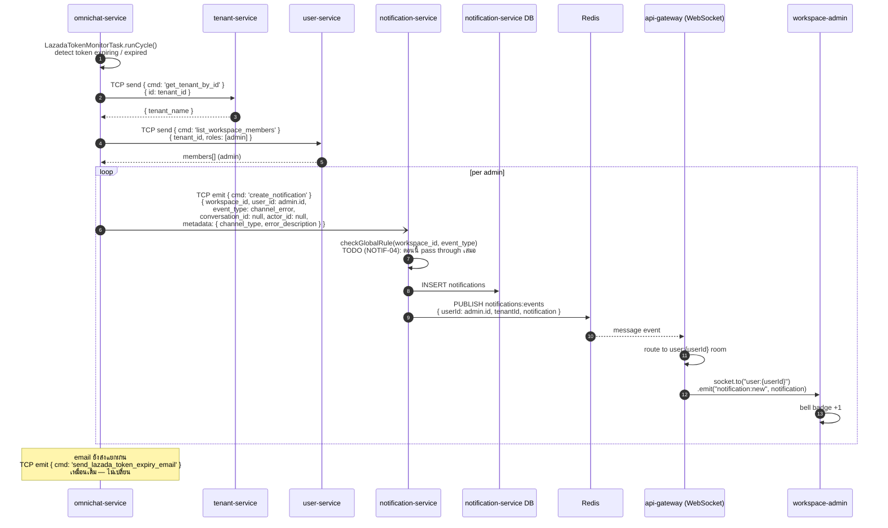
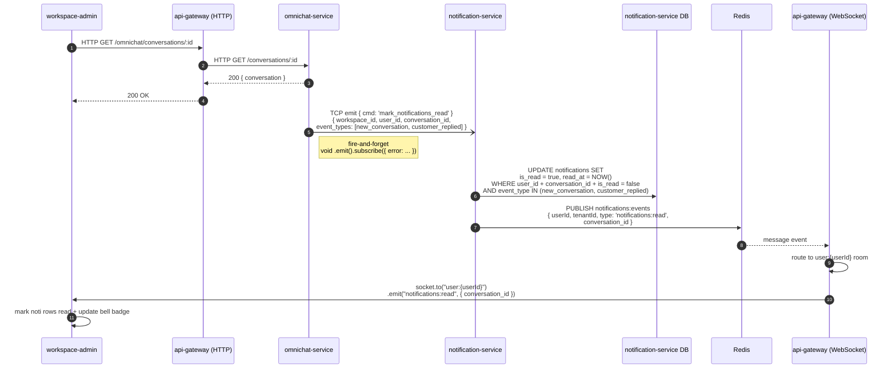
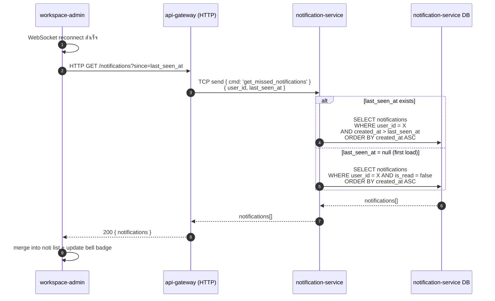

## Sequence Diagrams

### 1 — Conversation Assigned / Reassigned / Unassigned

---

### 2 — New Conversation

---

### 3 — Customer Replied

---

### 4 — Mention in Conversation Note

---

### 5 — SLA Due Soon

---

### 6 — SLA Breached (Dual Recipients)

---

### 7 — Channel Error

---

### 8 — Mark Notifications Read (FE เปิด Conversation)

---

### 9 — WebSocket Reconnected

---

## Transport Reference

| From | To | Protocol | Key |
| --- | --- | --- | --- |
| workspace-admin | api-gateway (HTTP) | HTTP | `PATCH /omnichat/conversations/:id/assign` |
| workspace-admin | api-gateway (HTTP) | HTTP | `POST /omnichat/conversations/:id/conversation-notes` |
| workspace-admin | api-gateway (HTTP) | HTTP | `GET /omnichat/conversations/:id` |
| api-gateway (HTTP) | omnichat-service | HTTP | `PATCH /conversations/:id/assign` |
| api-gateway (HTTP) | omnichat-service | HTTP | `POST /conversations/:id/conversation-notes` |
| api-gateway (HTTP) | omnichat-service | HTTP | `GET /conversations/:id` |
| omnichat-normalizer-worker | omnichat-service | HTTP | `POST /messages/inbound` |
| omnichat-service | user-service | TCP send | `{ cmd: 'list_workspace_members' }` |
| omnichat-service | tenant-service | TCP send | `{ cmd: 'get_tenant_by_id' }` |
| omnichat-service | notification-service | TCP emit | `{ cmd: 'create_notification' }` |
| omnichat-service | notification-service | TCP emit | `{ cmd: 'mark_notifications_read' }` |
| notification-service | Redis | PUBLISH | `notifications:events` |
| Redis | api-gateway (WebSocket) | SUB message | `notifications:events` |
| api-gateway (WebSocket) | workspace-admin | Socket.io emit | `notification:new` → room `user:{userId}` |
| api-gateway (WebSocket) | workspace-admin | Socket.io emit | `notifications:read` → room `user:{userId}` |

---

## ACE-2382 — สิ่งที่ต้องเพิ่มใน ChatGateway

| ไฟล์ | การเปลี่ยนแปลง |
| --- | --- |
| `chat.gateway.ts` `handleConnection()` | เพิ่ม `client.join(user:${data.userId})` |
| `chat.gateway.ts` `onModuleInit()` | subscribe `notifications:events` channel + route to `user:{userId}` room |
| `notification-service` | เพิ่ม RedisModule + `PUBLISH notifications:events` หลัง INSERT notifications |

---

## TODO Tracker

| ref | งาน | blocked by |
| --- | --- | --- |
| `TODO (NOTIF-04)` | `checkGlobalRule()` ใน notification-service | ACE NOTIF-04 |
