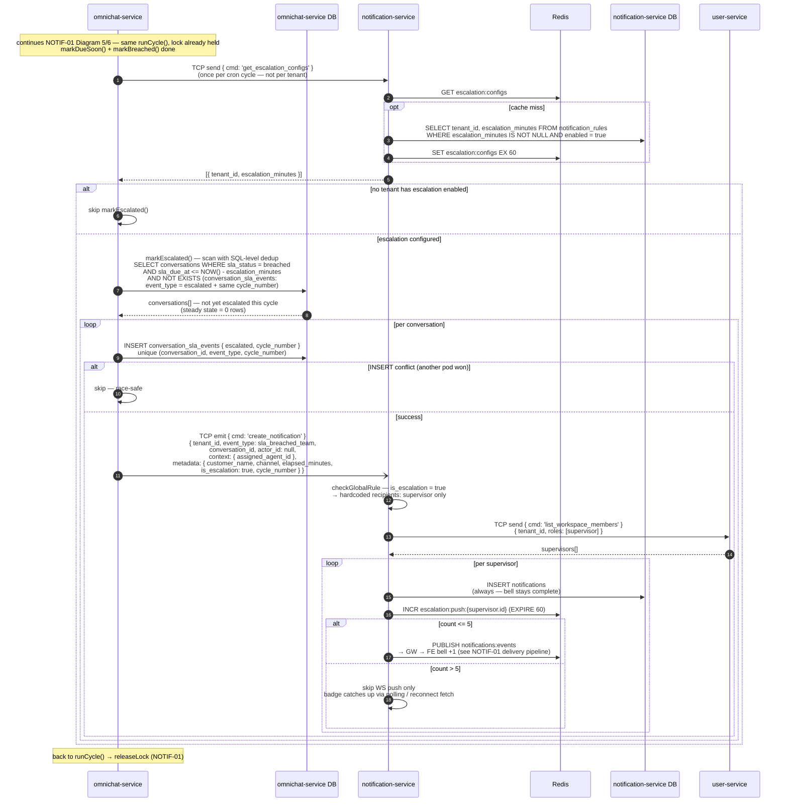

# NOTIF-04 — SLA Breach Escalation (v2 Redesign)

> ออกแบบใหม่จาก Diagram 4 เดิม — ย้าย detection ไปอยู่กับข้อมูล (omnichat-service) ฝังใน SLA cron cycle เดิม
> Dedup **แบบ B**: `conversation_sla_events` NOT EXISTS — ไม่แตะ `sla_status` ไม่กระทบ dashboard/filter เดิม
> แก้ปัญหา "breach เยอะๆ เช็คซ้ำทุกนาที" ที่ระดับ SQL — **ไม่ต้องมี dedup batch query และไม่ต้องมี Redis short-circuit**

---

## หลักคิด

| หลัก | เหตุผล |
|---|---|
| **Detection อยู่ที่ omnichat-service** | conversation + sla_status + cycle_number อยู่ใน DB นี้ — เช็ค "ใคร breach เกิน X นาที + ยังไม่เคย escalate" จบใน query เดียว ไม่ต้องลากข้อมูลข้าม service ทุกนาที |
| **Dedup ที่ระดับ SQL (NOT EXISTS) — แบบ B** | conv ที่ escalate แล้ว**ไม่ถูกคืนจาก scan อีกเลย** — steady state scan = 0 rows ต่อให้ breach ค้าง 1,000 convs และไม่ต้องเพิ่มค่า `escalated` ใน `sla_status` (เลี่ยง blast radius: dashboard, list filter, agent-reply handler ที่ filter `breached` อยู่) |
| **Fan-out + rate-limit อยู่ที่ notification-service** | สอดคล้อง Diagram 3 (NotiSvc resolve recipients เอง) — omnichat emit แค่ 1 ครั้งต่อ conversation |
| **ใช้ cron + lock เดิม** | `SlaCronService.runCycle()` + `sla:breach_job:lock` มีอยู่แล้ว — ไม่สร้าง cron ตัวที่ 2 ไม่มี lock ตัวที่ 2 ไม่มี timing skew ระหว่าง 2 jobs |

---

## Sequence Diagram — เฉพาะส่วนใหม่ (ต่อจาก NOTIF-01 Diagram 5/6)

> lock acquire/release, `clearDisabled()`, `markDueSoon()`, `markBreached()` และ delivery pipeline (GW → FE)
> มีใน NOTIF-01 แล้ว — ไม่เขียนซ้ำ diagram นี้แสดงเฉพาะ `markEscalated()` ที่เพิ่มใหม่

**Notes:**

- เงื่อนไข "ยังไม่มีใครตอบ" เป็น implicit — agent ตอบเมื่อไหร่ SLA กลายเป็น `met` หลุดจาก `breached` เอง → ไม่โดน scan
- `INSERT conflict` เกิดได้ตอน lock TTL หมดกลางรอบแล้วอีก pod ชิง — กันสองชั้น (lock + unique constraint) pattern เดียวกับ `didUpdate` guard ของ `markBreached()`
- ใช้ `event_type: sla_breached_team` เดิม ไม่เพิ่ม enum — แยก escalation ด้วย `metadata.is_escalation` สอดคล้องกับ `escalation_minutes` ที่อยู่บน row เดียวกัน — escalation ข้าม `rules.recipients` (supervisor + admin) เหลือ **supervisor เท่านั้น** ตาม story
- emit 1 ครั้งต่อ conversation แบบ fire-and-forget — NotiSvc fan-out หา supervisors เอง (เหมือน Diagram 3)
- rate-limit ตัดเฉพาะ WS push — INSERT ครบทุกใบ bell ไม่ขาด ใบที่เกิน 5/นาที badge อัปเดตเองผ่าน polling 30s / reconnect fetch ของ NOTIF-01

> ไม่ PUBLISH `omnichat:events` ตอน escalate — `sla_status` ไม่เปลี่ยน (ยัง `breached`) → conversation list ฝั่ง FE ไม่มีอะไรต้องอัปเดต ต่างจาก `markDueSoon`/`markBreached` ที่ publish `sla:warning`/`sla:overdue` เพราะ status เปลี่ยน

---

## เทียบกับ Diagram 4 เดิม

| มิติ | เดิม (cron ใน NotiSvc) | v2 (ฝังใน SLA cron) |
|---|---|---|
| Cron + lock | ตัวใหม่ `escalation_lock` แยก | ใช้ `runCycle()` + lock เดิม — ไม่มี job ที่ 2 |
| Config fetch | TCP ต่อ tenant ทุกรอบ (N calls) | **1 TCP call ต่อรอบ** (batch, cache 60s) |
| หา breached convs | TCP ข้าม service ลาก conversations มาทุกนาที | query ใน DB ตัวเอง — ไม่มี data ข้าม service |
| Dedup | batch query `notifications` + filter JSONB ทุกรอบ | **SQL NOT EXISTS — scan คืน 0 rows หลัง fire แล้ว** |
| Breach ค้าง 1,000 convs | เช็คซ้ำ ~5,000 pairs ทุกนาที (ต้องเสริม Redis short-circuit) | ไม่กลับมาอีกเลย — **ไม่ต้องมี Redis short-circuit** |
| Race multi-pod | พึ่ง lock อย่างเดียว | lock + unique constraint สองชั้น (pattern `markBreached()` เดิม) |
| Emit | ต่อ (conversation × supervisor) | ต่อ conversation — NotiSvc fan-out (สอดคล้อง Diagram 3) |
| Rate-limit | ตัดทั้ง INSERT (drop แล้วรอ retry รอบหน้า) | **ตัดเฉพาะ WS push** — DB ครบ ไม่มี data loss ไม่ต้องมี retry logic |
| event_type | `sla_breached` + `metadata.is_escalation` | `sla_breached_team` + `metadata.is_escalation` — ไม่เพิ่ม enum, สอดคล้องกับ row ที่เก็บ `escalation_minutes` และกลุ่มผู้รับ (supervisor) |
| Index ที่ต้องเพิ่มบน notifications | `(tenant_id, event_type, conversation_id)` สำหรับ dedup | ไม่ต้อง (dedup ไม่ได้ใช้ notifications table แล้ว) |

**ทำไมไม่ใช้ sla_status = `escalated` (แบบ A — mirror `markDueSoon` เป๊ะ):**
สวยใน diagram แต่ทุกที่ที่ filter `sla_status = breached` อยู่ (dashboard, conversation list filter, agent-reply handler ที่เปลี่ยน breached → met) ต้องแก้เป็น `IN (breached, escalated)` — blast radius ใหญ่กว่าที่เห็น แบบ B ไม่กระทบใครเลย

---

## Rate-limit semantics — จุดที่ตีความต่างจากเดิม

AC: *"a rate-limit prevents more than 5 escalation notifications per minute per user"*

v2 ตีความเป็น **limit ที่ real-time push** ไม่ใช่ limit ที่ creation:

- INSERT ครบทุกใบ → supervisor เห็นครบใน bell (AC "individual notifications per conversation" ✓)
- WS push สูงสุด 5/นาที → ไม่ spam toast (AC "max 5 per minute" ✓)
- ใบที่เกิน badge อัปเดตเองผ่าน polling 30s / reconnect fetch ที่ NOTIF-01 มีอยู่แล้ว
- ไม่มี notification หายเงียบ ไม่ต้องเขียน retry logic

> ⚠️ **ต้อง confirm PO**: ถ้า PO ตั้งใจให้ limit ที่ "การสร้าง" (breach 1,000 convs → bell มีแค่ 5 ใบ ไม่ใช่ 1,000 ใบ) ให้สลับ INCR ไปก่อน INSERT แล้วใบที่เกิน drop — แต่จะเสีย "bell ครบ" และต้องตอบคำถามว่า 995 ใบที่เหลือหายไปไหน
> และกรณี breach หลักพัน convs พร้อมกัน bell มี noti หลักพันใบก็เป็นคำถาม UX อยู่ดี — อาจต้องมี digest notification ("มี N conversations breach") เป็น story แยก

---

## สิ่งที่ต้องมีเพื่อ implement v2

| รายการ | ที่ไหน | หมายเหตุ |
|---|---|---|
| enum `escalated` ใน `conversation_sla_events.event_type` | omnichat-service Prisma | ปัจจุบันมี `met` / `breached` |
| unique constraint `(conversation_id, event_type, cycle_number)` | `conversation_sla_events` | ถ้ายังไม่มี — เป็นตัวกัน race |
| `markEscalated()` step ใน `SlaCronService.runCycle()` | `apps/omnichat-service/src/sla/sla-cron.service.ts` | ต่อท้าย `markBreached()` ใน lock เดิม |
| TCP cmd `get_escalation_configs` (`@MessagePattern`) | notification-service | batch ทุก tenant ที่เปิด escalation + Redis cache 60s |
| `checkGlobalRule` special-case `metadata.is_escalation` | notification-service | escalation ใช้ `event_type: sla_breached_team` เดิม — แต่ recipients hardcode supervisor เท่านั้น ไม่ใช่ `rules.recipients` ของ sla_breached_team (supervisor + admin) |
| NOTIF-02/03 bell UI แยก render escalation | workspace-admin | เช็ค `metadata.is_escalation` — ข้อความ/icon ต่างจาก sla_breached_team ปกติ (ใบแรกตอน breach) |
| Redis key `escalation:push:{user_id}` | notification-service | INCR + EXPIRE 60 — limit เฉพาะ push |

**Design ตัดสินแล้ว:** escalation ผูกกับ `sla_breached_team` ทั้งคู่ — `escalation_minutes` อยู่บน row นี้ (ตาม ER doc) และ escalation notification ใช้ `event_type: sla_breached_team` + `metadata.is_escalation` → config กับ notification อยู่ event เดียวกัน สอดคล้องกันเอง
**✅ Confirmed 2026-06-12:** ปิด `sla_breached_team` = ปิด escalation ด้วย เป็น intended behavior — story update แล้ว (แก้ wording จาก `sla_breached` → `sla_breached_team` + เพิ่ม AC "Disabling sla_breached_team also disables escalation")
