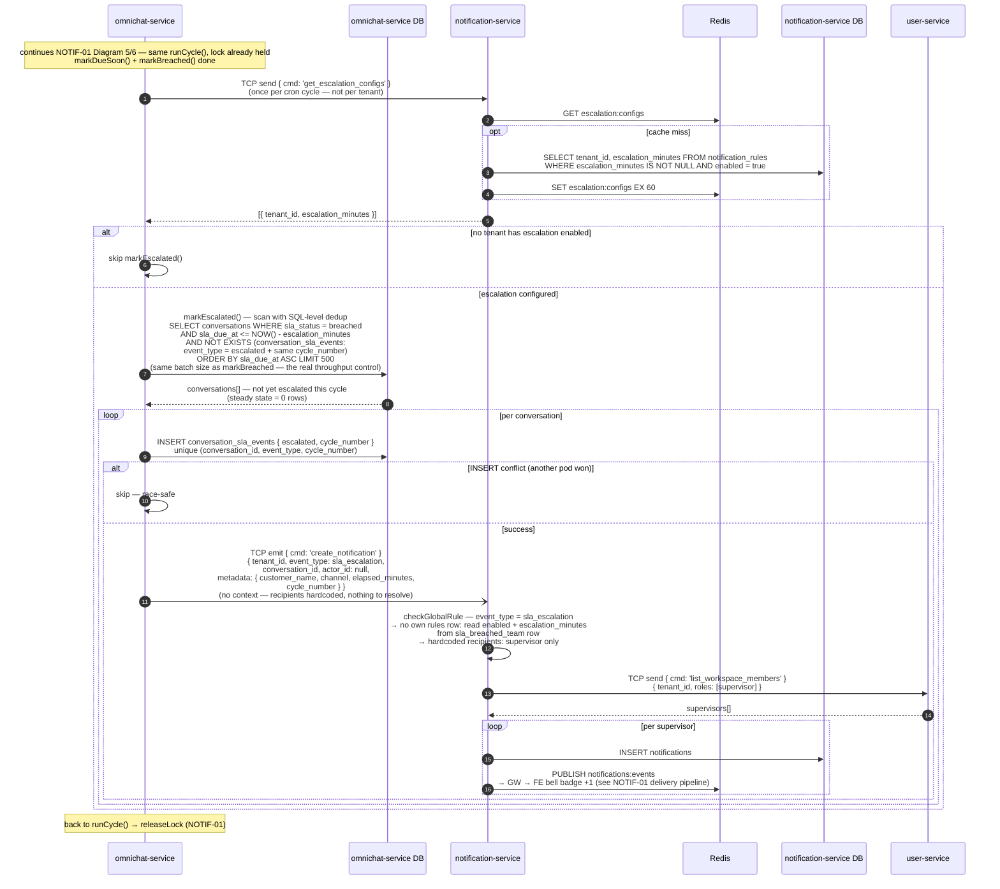

# NOTIF-04 — SLA Breach Escalation (v3)

> **v3 = v2 + เปลี่ยน notification event เป็น event_type ใหม่ `sla_escalation`** (ตัดสิน 2026-06-12 — เดิม v2 ใช้ `sla_breached_team` + `metadata.is_escalation`)
> เหตุผลที่เปลี่ยน: field ที่ตัดสิน routing/recipients/render เป็น **logic** — ไม่เก็บใน metadata (JSONB ไม่มี validation, และ key `(user_id, conversation_id, event_type)` จะชนกับใบ breach แรกถ้า reuse `sla_breached_team`)
> โครงสร้างอื่นเหมือน v2 ทุกอย่าง: detection ฝังใน SLA cron cycle เดิม (omnichat-service), dedup **แบบ B** `conversation_sla_events` NOT EXISTS — ไม่แตะ `sla_status` ไม่กระทบ dashboard/filter เดิม, ไม่ต้องมี dedup batch query และไม่ต้องมี Redis short-circuit
> ไฟล์เดิม: [NOTIF-04_escalation_v2_sequence.md](./NOTIF-04_escalation_v2_sequence.md) — **superseded** เก็บไว้อ้างอิง

---

## หลักคิด

| หลัก | เหตุผล |
|---|---|
| **Detection อยู่ที่ omnichat-service** | conversation + sla_status + cycle_number อยู่ใน DB นี้ — เช็ค "ใคร breach เกิน X นาที + ยังไม่เคย escalate" จบใน query เดียว ไม่ต้องลากข้อมูลข้าม service ทุกนาที |
| **Dedup ที่ระดับ SQL (NOT EXISTS) — แบบ B** | conv ที่ escalate แล้ว**ไม่ถูกคืนจาก scan อีกเลย** — steady state scan = 0 rows ต่อให้ breach ค้าง 1,000 convs และไม่ต้องเพิ่มค่า `escalated` ใน `sla_status` (เลี่ยง blast radius: dashboard, list filter, agent-reply handler ที่ filter `breached` อยู่) |
| **Fan-out อยู่ที่ notification-service** | สอดคล้อง Diagram 3 (NotiSvc resolve recipients เอง) — omnichat emit แค่ 1 ครั้งต่อ conversation |
| **ใช้ cron + lock เดิม** | `SlaCronService.runCycle()` + `sla:breach_job:lock` มีอยู่แล้ว — ไม่สร้าง cron ตัวที่ 2 ไม่มี lock ตัวที่ 2 ไม่มี timing skew ระหว่าง 2 jobs |
| **event_type ใหม่ `sla_escalation` — ไม่ใช้ metadata flag** | logic ที่ตัดสิน "ใครได้รับ / FE render แบบไหน / rate-limit นับมั้ย" ต้องเป็น first-class field — เพิ่ม 1 บรรทัดใน shared enum, **ไม่มี migration** (column เป็น TEXT ทั้ง `notifications` และ `notification_rules`) — config ยังอยู่บน row `sla_breached_team` ผ่าน mapping จุดเดียวใน `checkGlobalRule` |

---

## Sequence Diagram — เฉพาะส่วนใหม่ (ต่อจาก NOTIF-01 Diagram 5/6)

> lock acquire/release, `clearDisabled()`, `markDueSoon()`, `markBreached()` และ delivery pipeline (GW → FE)
> มีใน NOTIF-01 แล้ว — ไม่เขียนซ้ำ diagram นี้แสดงเฉพาะ `markEscalated()` ที่เพิ่มใหม่

**Notes:**

- เงื่อนไข "ยังไม่มีใครตอบ" เป็น implicit — agent ตอบเมื่อไหร่ SLA กลายเป็น `met` หลุดจาก `breached` เอง → ไม่โดน scan
- `INSERT conflict` เกิดได้ตอน lock TTL หมดกลางรอบแล้วอีก pod ชิง — กันสองชั้น (lock + unique constraint) pattern เดียวกับ `didUpdate` guard ของ `markBreached()` — **ใช้ `create()` + catch P2002 ไม่ใช่ `upsert`** เพราะต้องรู้ว่าใครชนะ race เพื่อตัดสินใจ emit (upsert `update: {}` ไม่บอกว่า created หรือ existed)
- ใช้ `event_type: sla_escalation` ใหม่ — เพิ่ม `SLA_ESCALATION = 'sla_escalation'` 1 บรรทัดใน shared `NotificationEventType` (**ไม่มี DB migration** — column เป็น TEXT) — escalation ข้าม `rules.recipients` (supervisor + admin) เหลือ **supervisor เท่านั้น** ตาม story — config (`enabled`/`escalation_minutes`) ยังอ่านจาก row `sla_breached_team` ผ่าน mapping จุดเดียวใน `checkGlobalRule`
- emit 1 ครั้งต่อ conversation แบบ fire-and-forget — NotiSvc fan-out หา supervisors เอง (เหมือน Diagram 3)
- **ไม่มี rate-limit ที่ delivery** — INSERT + PUBLISH ครบทุกใบ: UX จริงของ epic เป็น bell badge + panel เท่านั้น ไม่มี notification toast/sound (ตรวจทั้ง epic แล้ว) → ไม่มี intrusive UI ให้กัน — throughput คุมที่ source ด้วย scan `take 500` ต่อรอบ cron (batch เดียวกับ `markBreached()`)

> ไม่ PUBLISH `omnichat:events` ตอน escalate — `sla_status` ไม่เปลี่ยน (ยัง `breached`) → conversation list ฝั่ง FE ไม่มีอะไรต้องอัปเดต ต่างจาก `markDueSoon`/`markBreached` ที่ publish `sla:warning`/`sla:overdue` เพราะ status เปลี่ยน

---

## ทำไม event_type ใหม่ — ไม่ใช่ `metadata.is_escalation` (จุดที่เปลี่ยนจาก v2)

| มิติ | `metadata.is_escalation` (v2) | `sla_escalation` (v3) |
|---|---|---|
| หลักการ | เก็บ logic ที่ตัดสิน recipients/render/rate-limit ไว้ใน JSONB | logic เป็น first-class field — metadata เหลือเฉพาะ display payload (`customer_name`, `elapsed_minutes`, `cycle_number`) |
| Validation | JSONB pass-through — typo/ลืมใส่ flag = กลายเป็น team breach ธรรมดาเงียบๆ | `@IsEnum` validate ที่ขอบ service — ค่าผิด = reject ทันที |
| Collision key | ใบ breach แรก + ใบ escalation มี `(user_id, conversation_id, event_type)` เหมือนกันเป๊ะ — merge/group logic ใดๆ ที่ไม่รู้จัก flag จะยุบ escalation หายเงียบ (ทั้ง BE merge allowlist และ FE store grouping) | key ไม่ซ้ำกันโดยโครงสร้าง — พลาดไม่ได้ |
| FE render / mark-read / analytics | ต้อง branch ด้วย metadata ทุกจุด | switch ตาม event_type ปกติเหมือน event อื่น — `mark_notifications_read` allowlist เลือก clear แยกใบ breach/escalation ได้อิสระ |
| ต้นทุน | ศูนย์ (reuse event เดิม) | 1 บรรทัดใน shared enum — ไม่มี migration, ไม่มี rules row ที่ 11, seed/DEFAULT_RULES ไม่แตะ |
| สอดคล้องกับ design เดิม | escalation เป็น special case เดียวที่ key ด้วย metadata | เข้า family เดียวกับ `mention`/`channel_error` ที่ hardcode recipients โดย key ด้วย event_type อยู่แล้ว (ตาราง Diagram 3) |

---

## เทียบกับ Diagram 4 เดิม (v1 — cron ใน NotiSvc)

| มิติ | v1 (cron ใน NotiSvc) | v3 (ฝังใน SLA cron) |
|---|---|---|
| Cron + lock | ตัวใหม่ `escalation_lock` แยก | ใช้ `runCycle()` + lock เดิม — ไม่มี job ที่ 2 |
| Config fetch | TCP ต่อ tenant ทุกรอบ (N calls) | **1 TCP call ต่อรอบ** (batch, cache 60s) |
| หา breached convs | TCP ข้าม service ลาก conversations มาทุกนาที | query ใน DB ตัวเอง — ไม่มี data ข้าม service |
| Dedup | batch query `notifications` + filter JSONB ทุกรอบ | **SQL NOT EXISTS — scan คืน 0 rows หลัง fire แล้ว** |
| Breach ค้าง 1,000 convs | เช็คซ้ำ ~5,000 pairs ทุกนาที (ต้องเสริม Redis short-circuit) | ไม่กลับมาอีกเลย — **ไม่ต้องมี Redis short-circuit** |
| Race multi-pod | พึ่ง lock อย่างเดียว | lock + unique constraint สองชั้น (pattern `markBreached()` เดิม) |
| Emit | ต่อ (conversation × supervisor) | ต่อ conversation — NotiSvc fan-out (สอดคล้อง Diagram 3) |
| Rate-limit | ตัดทั้ง INSERT (drop แล้วรอ retry รอบหน้า) | **ไม่มี rate-limit ที่ delivery** — UX เป็น bell badge อย่างเดียว ไม่มี intrusive UI ให้กัน; throughput คุมที่ source (cron batch 500/รอบ) — AC เดิมรอ PO เคาะ (ดู section ด้านล่าง) |
| event_type | `sla_breached` + `metadata.is_escalation` | **`sla_escalation` (event_type ใหม่)** — 1 บรรทัดใน shared enum ไม่มี migration — ไม่เก็บ logic ใน metadata, key ไม่ชนกับใบ breach แรก |
| Index ที่ต้องเพิ่มบน notifications | `(tenant_id, event_type, conversation_id)` สำหรับ dedup | ไม่ต้อง (dedup ไม่ได้ใช้ notifications table แล้ว) |

**ทำไมไม่ใช้ sla_status = `escalated` (แบบ A — mirror `markDueSoon` เป๊ะ):**
สวยใน diagram แต่ทุกที่ที่ filter `sla_status = breached` อยู่ (dashboard, conversation list filter, agent-reply handler ที่เปลี่ยน breached → met) ต้องแก้เป็น `IN (breached, escalated)` — blast radius ใหญ่กว่าที่เห็น แบบ B ไม่กระทบใครเลย

---

## Rate-limit — ตัดออกจาก delivery (ตัดสิน 2026-06-12)

AC: *"a rate-limit prevents more than 5 escalation notifications per minute per user"*

ตรวจสอบแล้ว AC นี้ตั้งบน premise ที่ไม่มีจริงใน UX:

- Real-time surface เดียวของ epic นี้คือ **bell badge + panel** — ไม่มี notification toast / sound / desktop notification ที่ไหนเลย (grep ทั้ง epic: คำว่า toast มีเฉพาะ form-save toast กับ error toast ตอน click noti ที่ปลายทางถูกลบ)
- เมื่อไม่มี intrusive UI — badge ขยับจาก 5 → 100 ไม่ใช่ spam มันคือตัวเลขแสดงความจริง (NOTIF-02 cap แสดงผลที่ "99+" อยู่แล้ว)
- ใบ breach แรก (`sla_breached_team`) ใน NOTIF-01 ไม่เคยมี rate-limit อยู่แล้ว — limit เฉพาะ escalation คือความไม่สม่ำเสมอใน pipeline
- การ drop WS push สร้างปัญหา badge stale แทน เพราะ **NOTIF-01/02 ไม่มี polling** — มีแค่ reconnect fetch (Diagram 9) + unread-count ตอน page load ("polling 30s" ที่ v2 เดิมอ้างเป็น assumption ที่ไม่มีจริง)

**Throughput ถูกคุมที่ source อยู่แล้ว:** `markEscalated()` scan `take 500` ต่อรอบ cron (batch เดียวกับ `markBreached()` ในโค้ดจริง) — ต่อให้ backlog 2,000 convs (เช่น cron ตายแล้วฟื้น) ระบบระบาย 500/นาที: ~500 emit/นาที, ~1,500 INSERT + PUBLISH/นาที (supervisor 3 คน), ~8 WS msg/วินาที/supervisor — ทุก hop รับสบาย

> ⚠️ **คำถาม PO ที่เหลือ:** AC rate-limit จะ (a) **ตัดทิ้ง — แนะนำ** หรือ (b) เก็บเป็น future-proofing สำหรับวันที่มี intrusive channel จริง (เช่น sound/desktop notification ใน NOTIF-05) → ค่อย implement ที่ layer นั้นตอนนั้น
> และกรณี breach/escalate หลักพัน convs — bell มี noti หลักพันใบ notification รายใบหมดความหมาย (relief valve ปัจจุบันคือ "อ่านทั้งหมด") → **digest notification ("มี N conversations escalate") จำเป็นที่ scale นี้** — story แยก

---

## สิ่งที่ต้องมีเพื่อ implement v3

> ✅ = verify กับโค้ดจริงแล้ว (2026-06-12)

| รายการ | ที่ไหน | หมายเหตุ |
|---|---|---|
| ค่า `escalated` ใน `conversation_sla_events.event_type` | omnichat-service Prisma | ✅ **ไม่มี migration** — `event_type` เป็น `String` ธรรมดา (ไม่ใช่ enum) แก้ comment `// met \| breached` → `// met \| breached \| escalated` พอ |
| unique constraint `(conversation_id, event_type, cycle_number)` | `conversation_sla_events` | ✅ **มีอยู่แล้ว** (migration `20260528103814_add_unique_sla_event`) — ใช้กัน race ได้ทันที |
| `markEscalated()` step ใน `SlaCronService.runCycle()` | `apps/omnichat-service/src/sla/sla-cron.service.ts` | ต่อท้าย `markBreached()` ใน lock เดิม — scan `take 500` ต่อรอบ (batch เดียวกับ `markBreached` — เป็น throughput control ตัวจริง) — ใช้ `create()` + catch P2002 (ไม่ใช่ upsert) เพื่อรู้ผล race ก่อน emit |
| TCP cmd `get_escalation_configs` (`@MessagePattern`) | notification-service | batch ทุก tenant ที่เปิด escalation + Redis cache 60s |
| enum `SLA_ESCALATION = 'sla_escalation'` ใน `NotificationEventType` | `packages/shared/src/types/notification.types.ts` | ✅ 1 บรรทัด — DTO `@IsEnum` รับอัตโนมัติ, **ไม่มี DB migration** (`event_type` เป็น TEXT ทั้ง `notifications` และ `notification_rules`) |
| `checkGlobalRule` special-case `sla_escalation` | notification-service | ไม่มี rules row ของตัวเอง — อ่าน `enabled` + `escalation_minutes` จาก row `sla_breached_team`, recipients hardcode supervisor เท่านั้น — **ระวังอย่าให้ตก fallback `DEFAULT_RULES[event_type]`** (ไม่มี key นี้ใน map) |
| NOTIF-02/03 bell UI แยก render escalation | workspace-admin | switch case `event_type: sla_escalation` — ข้อความ/icon ต่างจาก `sla_breached_team` ปกติ (ใบแรกตอน breach) |
| Cache supervisor list ใน NotiSvc | notification-service | `workspace_members:{tenant}:{role}` EX 30–60s — ตอน burst 500 emit/นาที จะกัน `list_workspace_members` 500 calls/นาทีไป user-service ให้เหลือ ~1/นาที |
| `take`/limit ใน `get_notifications` | notification-service (**ของ NOTIF-01**) | ปัจจุบันคืน unread ทั้งหมดไม่มี `take` — backlog 2,000 ใบ = response ก้อนยักษ์ตอน reconnect/first load → ใส่ limit + ให้ NOTIF-03 infinite scroll โหลดต่อ |
| `metadata.agent_name` (optional) | omnichat-service | display payload สำหรับ item design "conversation ของ agent X ไม่มีคนตอบ" — เพิ่มถ้า UX ต้องการ (ห้ามใช้ `context` — สงวนไว้สำหรับ recipient resolution) |

**Design ตัดสินแล้ว (2026-06-12):** escalation notification ใช้ **event_type ใหม่ `sla_escalation`** — ส่วน config (`escalation_minutes`) อยู่บน row `sla_breached_team` (ตาม ER doc) — mapping ระหว่างสองตัวอยู่จุดเดียวใน `checkGlobalRule` ไม่กระจาย discipline ไปทุก consumer แบบ metadata flag
**✅ Confirmed 2026-06-12:** ปิด `sla_breached_team` = ปิด escalation ด้วย เป็น intended behavior — story update แล้ว (แก้ wording จาก `sla_breached` → `sla_breached_team` + เพิ่ม AC "Disabling sla_breached_team also disables escalation")
