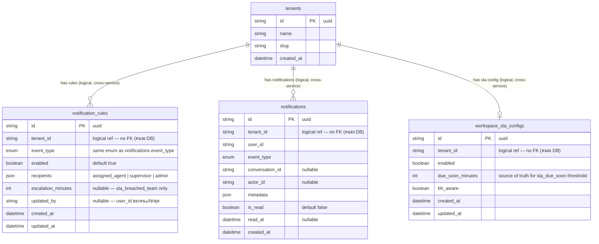

## ER Diagram — NOTIF-04: Notification Rules Configuration

> Prisma model names = PascalCase / DB table names (@@map) = snake_case



**Prisma model → DB table mapping + ตารางไหนอยู่ service ไหน**

| Prisma model         | DB table (`@@map`) = entity name in diagram | Service / Database (Prisma schema แยกกัน) |
| -------------------- | ------------------------------------------- | ------------------------------------------ |
| `NotificationRule`   | `notification_rules`                        | **notification-service DB** (NOTIF-04 เพิ่ม) |
| `Notification`       | `notifications`                             | **notification-service DB** (NOTIF-01 เพิ่ม) |
| `WorkspaceSlaConfig` | `workspace_sla_configs`                     | **omnichat-service DB** (มีอยู่แล้ว — SLA-01) |
| `Tenant`             | `tenants`                                   | **tenant-service DB** (มีอยู่แล้ว)           |

> ⚠️ **3 databases คนละ service — ความสัมพันธ์ใน diagram เป็น logical ทั้งหมด ไม่มี FK constraint จริง:**
>
> - JOIN ข้ามตารางต่าง service **ไม่ได้** — ต้องยิง TCP ถาม service เจ้าของ (เหตุผลเดียวกับที่ escalation dedup ใช้ `conversation_sla_events` ฝั่ง omnichat ได้ใน query เดียว แต่ใช้ `notifications` ไม่ได้)
> - **ไม่มี cascade delete** — tenant ถูกลบ rows ใน `notification_rules` / `notifications` ไม่หายเอง (orphan rows — ยอมรับได้ / จัดการด้วย cleanup job ภายหลัง)
> - Prisma ของ notification-service ไม่มี model `Tenant` — ห้ามพยายามเขียน `@relation` ไปหา

**event_type enum** (shared — same values in both `NotificationRule` and `Notification`)

```
conversation_assigned | conversation_reassigned | conversation_unassigned
new_conversation | customer_replied | mention
sla_due_soon | sla_breached | sla_breached_team | channel_error
```

**recipients JSON** — per `NotificationRule` row

| value            | meaning                                       |
| ---------------- | --------------------------------------------- |
| `assigned_agent` | agent currently assigned to the conversation  |
| `supervisor`     | all members with supervisor role in workspace |
| `admin`          | all members with admin role in workspace      |

> `mention` and `channel_error` recipients are **hardcoded** in notification logic — column `recipients` ของ 2 event นี้ไม่ถูกใช้ตอน delivery (เก็บเป็น `[]`) และตอน Save ถ้าส่งค่ามาแก้จะถูก **reject 400** (ดู validation ใน Diagram 2)

> `due_soon_minutes` ไม่เก็บใน `notification_rules` — UI อ่านตรงจาก `workspace_sla_configs.due_soon_minutes` (read-only display เท่านั้น, แก้ได้ที่ SLA settings เท่านั้น)

**Column notes**

| column               | detail                                                                                                                                                    |
| -------------------- | --------------------------------------------------------------------------------------------------------------------------------------------------------- |
| `escalation_minutes` | nullable; only meaningful for `event_type = sla_breached_team`; X minutes after breach with no agent reply → escalation notification fires to supervisors |
| `updated_by`         | nullable; user_id จาก JWT ของคนที่กด Save — audit ว่าใครแก้ rule (`null` = row จาก seed/default ยังไม่มีใครแก้)                                              |

**Unique constraint**

```prisma
@@unique([tenant_id, event_type])
```

One row per event type per workspace — upsert on save.

**Indexes**

```prisma
// notification_rules
@@index([tenant_id])           // checkGlobalRule() lookup
@@index([tenant_id, enabled])  // filter disabled rules fast

// notifications
@@index([tenant_id, user_id, is_read, created_at])
@@index([tenant_id, user_id, conversation_id, is_read])
```

**Relationship with NOTIF-01 delivery pipeline**

`checkGlobalRule(tenant_id, event_type)` in `notification-service`:

1. SELECT `notification_rules` WHERE `tenant_id` + `event_type`
2. If row not found → fallback ใช้ `DEFAULT_RULES[event_type]` (hardcoded map — ดูด้านล่าง)
3. If `enabled = false` → skip `INSERT notifications`
4. If `enabled = true` → use `recipients` to resolve target `user_id` list, then `INSERT notifications` per recipient

**DEFAULT_RULES — fallback + seed source เดียวกัน**

```typescript
// notification-service — single source of truth สำหรับค่า default
const DEFAULT_RULES: Record<EventType, { enabled: boolean; recipients: Role[] }> = {
  conversation_assigned:   { enabled: true, recipients: ['assigned_agent'] },
  conversation_reassigned: { enabled: true, recipients: ['assigned_agent'] }, // = agent คนเดิม
  conversation_unassigned: { enabled: true, recipients: ['supervisor', 'admin'] },
  new_conversation:        { enabled: true, recipients: ['supervisor', 'admin'] },
  customer_replied:        { enabled: true, recipients: ['assigned_agent'] },
  mention:                 { enabled: true, recipients: [] }, // hardcoded: mentioned_agent_ids
  sla_due_soon:            { enabled: true, recipients: ['assigned_agent', 'supervisor'] },
  sla_breached:            { enabled: true, recipients: ['assigned_agent'] },
  sla_breached_team:       { enabled: true, recipients: ['supervisor', 'admin'] },
  channel_error:           { enabled: true, recipients: [] }, // hardcoded: admin only
};
```

ใช้ 2 ที่ — **ห้ามเขียนค่า default ซ้ำที่อื่น**:

1. **Seed** ตอน workspace created / data migration → INSERT จาก map นี้
2. **Fallback** ใน `checkGlobalRule()` เมื่อ row not found — เคสที่เกิดได้จริง:
   - seed ตอน workspace created fail เงียบ (fire-and-forget ไม่มี retry)
   - data migration ตกบาง tenant
   - เพิ่ม event_type ใหม่ในอนาคต → tenant เก่าไม่มี row ของ event ใหม่ (เคสหลัก)

**Escalation job (v2)** — ดู diagram เต็มใน `NOTIF-04_escalation_v2_sequence.md`

```
markEscalated() ใน SlaCronService.runCycle() (omnichat-service — lock เดิม)

→ TCP send get_escalation_configs ครั้งเดียวต่อรอบ
   (SELECT notification_rules WHERE escalation_minutes IS NOT NULL AND enabled = true)
→ scan conversations WHERE sla_status = breached
   AND sla_due_at <= NOW() - escalation_minutes
   AND NOT EXISTS (conversation_sla_events
                   WHERE event_type = escalated AND cycle_number = ปัจจุบัน)
   ← dedup ในตัว query — conv ที่ fire แล้วไม่ถูกคืนอีก (steady state = 0 rows)
→ INSERT conversation_sla_events (escalated, cycle_number) — unique constraint กัน race
→ emit create_notification 1 ครั้งต่อ conversation
   { event_type: sla_breached_team, metadata: { is_escalation: true, cycle_number } }
→ NotiSvc fan-out supervisors — INSERT ครบทุกใบ
→ rate-limit เฉพาะ WS push: max 5/user/min (escalation:push:{user_id})
   ใบเกินอยู่ใน bell แล้ว → badge อัปเดตผ่าน polling
```

**Escalation notification metadata shape**

```json
{
  "customer_name": "...",
  "channel": "line",
  "elapsed_minutes": 45,
  "is_escalation": true,
  "cycle_number": 2
}
```

> `is_escalation` ใช้ให้ NotiSvc special-case recipients (supervisor เท่านั้น) และให้ NOTIF-02/03 bell UI render ต่างจาก `sla_breached_team` ปกติ — **dedup ไม่ได้ใช้ตาราง `notifications` แล้ว** (ย้ายไป `conversation_sla_events` ฝั่ง omnichat ตาม v2) `cycle_number` เก็บไว้เพื่อ traceability
