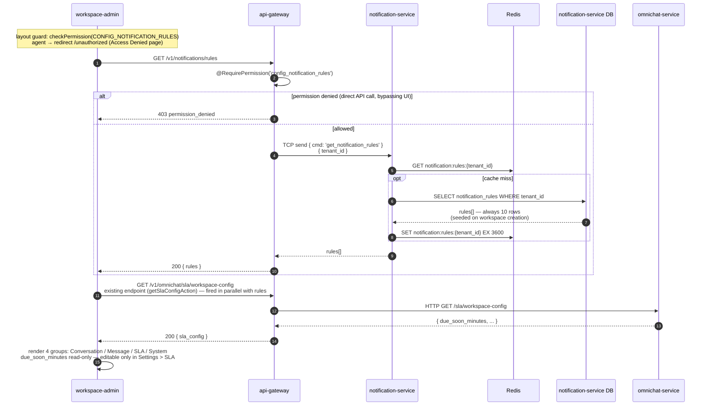
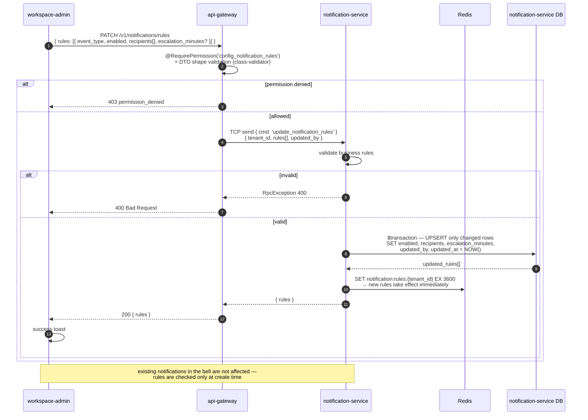
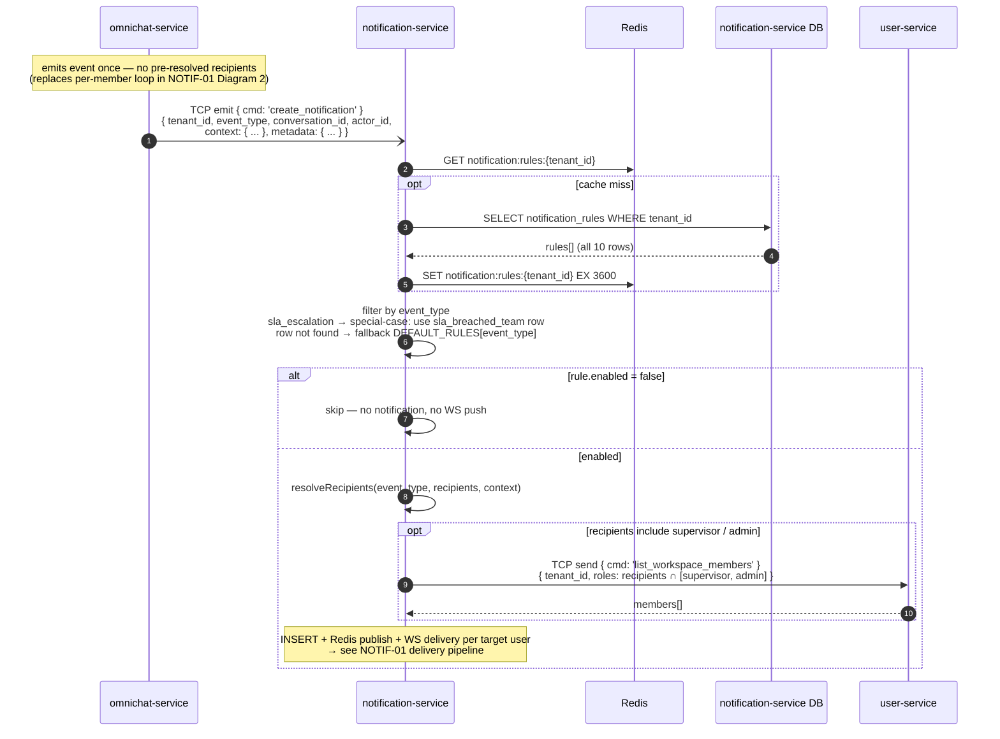
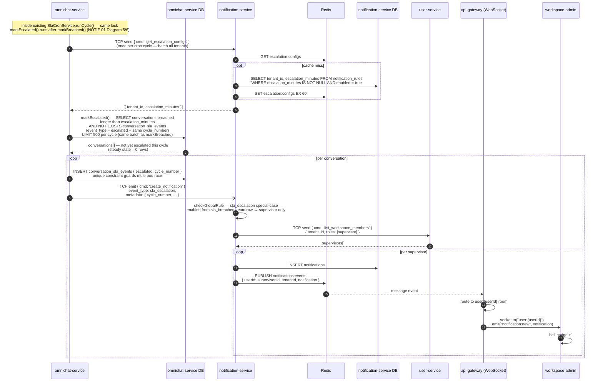

## Sequence Diagrams — NOTIF-04: Notification Rules Configuration (v2)

> **v2 (2026-06-12):** escalation notification เปลี่ยนเป็น event_type ใหม่ `sla_escalation` (เดิม `sla_breached_team` + `metadata.is_escalation`) — เหตุผลใน [NOTIF-04_escalation_v3_sequence.md](./NOTIF-04_escalation_v3_sequence.md)
> ไฟล์เดิม: [NOTIF-04_notification_rules_sequence.md](./NOTIF-04_notification_rules_sequence.md) — **superseded** เก็บไว้อ้างอิง

---

### 1 — Load Notification Rules Page



**Notes:**

- `PermissionGuard` เป็น global `APP_GUARD` — resolve role จาก user-service แล้วเช็คผ่าน permission matrix (ไม่ hardcode role)
- FE layout guard ใช้ pattern เดียวกับ `settings/sla/layout.tsx`
- endpoint SLA guard ด้วย `config_sla` (คนละ permission กับ rules — admin/supervisor มีทั้งคู่ตาม matrix) query DB ตรง ไม่มี cache เพราะไม่ใช่ hot path
- seed: workspace ใหม่ seed ตอนสร้าง / workspace เก่า data migration ตอน deploy — ถ้า row หาย fallback `DEFAULT_RULES` (ดู ER doc)
- `/v1/notifications/rules` อยู่ domain เดียวกับ `GET /v1/notifications` ของ NOTIF-01

---

### 2 — Save Notification Rules (Upsert)



**Notes:**

- business validation อยู่ที่ NotiSvc ด่านเดียว (ครอบทุก TCP caller ไม่ใช่แค่ gateway) — gateway ทำแค่ DTO shape:
  - `event_type` ∈ 10 ค่า configurable (`sla_escalation` **ไม่อยู่ในชุดนี้** — ไม่มี rules row, ส่งมา = reject)
  - `recipients` ⊆ `[assigned_agent, supervisor, admin]` และห้าม empty ถ้า `enabled = true`
  - `escalation_minutes`: int บวก หรือ `null` — เฉพาะ `sla_breached_team`
  - `mention` / `channel_error`: reject ถ้าส่ง recipients มาแก้
- UPSERT เฉพาะ row ที่ diff แล้วค่าเปลี่ยนจริง → `updated_by` ต่อ row = คนที่แก้ row นั้นจริง ไม่ใช่แค่คนกด save ล่าสุด — ทั้ง transaction all-or-nothing rollback ถ้า fail
- cache เป็น write-through (SET ทับด้วยค่าใหม่) — rule มีผลกับ event ถัดไปทันที, TTL 3600 เป็น safety net
- 400: gateway แปลง `RpcException { statusCode, message }` → `HttpException` ตาม proxy pattern เดิมของ repo

**Shape: `notification_rules[]`** — ใช้ทั้ง API response → FE และ Redis cache value

```json
[
  {
    "event_type": "new_conversation",
    "enabled": true,
    "recipients": ["supervisor", "admin"],
    "escalation_minutes": null,
    "updated_by": null,
    "updated_at": "2026-06-12T10:00:00Z"
  },
  {
    "event_type": "sla_breached_team",
    "enabled": true,
    "recipients": ["supervisor", "admin"],
    "escalation_minutes": 30,
    "updated_by": "usr_01HXXX",
    "updated_at": "2026-06-12T10:00:00Z"
  },
  {
    "event_type": "mention",
    "enabled": true,
    "recipients": [],
    "escalation_minutes": null,
    "updated_by": null,
    "updated_at": "2026-06-12T10:00:00Z"
  }
]
```

- ครบ 10 แถวเสมอ — 1 แถวต่อ `event_type` (ไม่มีแถว `sla_escalation` — ไม่ใช่ configurable event)
- `escalation_minutes` — มีเฉพาะ `sla_breached_team`, แถวอื่น `null`
- `mention` / `channel_error` — `recipients` เก็บเป็น `[]` เสมอ (ผู้รับ hardcoded ใน delivery logic — FE แสดงเป็น fixed label, toggle ได้อย่างเดียว)
- `updated_at` / `updated_by` — ส่งไป FE (audit / โชว์ "แก้ล่าสุดโดย" ได้) แต่ไม่ถูกใช้ใน `checkGlobalRule()` logic — `updated_by` เป็น `null` สำหรับ row จาก seed ที่ยังไม่มีใครแก้

---

### 3 — checkGlobalRule() & Recipient Resolution

แทนที่ `TODO (NOTIF-04)` ใน NOTIF-01 diagrams ทุก diagram — omnichat-service emit ครั้งเดียว ไม่ต้อง resolve recipients เองอีกต่อไป



**Notes:**

- emit เป็น fire-and-forget — `void .emit().subscribe({ error: ... })` — field ใน `context` ขึ้นกับ event_type (ดูตาราง context shape ด้านล่าง)
- cache: `GET notification:rules:{tenant_id}` ได้ทั้ง 10 rows → filter ตาม event_type ใน memory — miss → SELECT DB → `SET EX 3600`
- fallback `DEFAULT_RULES[event_type]` เมื่อ row หาย (seed fail / event_type ใหม่ที่ tenant เก่ายังไม่มี row) — map เดียวกับที่ใช้ seed (ดู ER doc)
- **`sla_escalation` ไม่มี row ใน `notification_rules` และไม่มีใน `DEFAULT_RULES`** — `checkGlobalRule` ต้อง special-case **ก่อน**ถึง fallback: อ่าน `enabled` + `escalation_minutes` จาก row `sla_breached_team`, recipients hardcode supervisor (ดู `NOTIF-04_escalation_v3_sequence.md`)
- `resolveRecipients`: slot `assigned_agent` → `context.assigned_agent_id` (`null` → skip) — `conversation_reassigned`/`unassigned` ใช้ `context.previous_agent_id` (agent คนเดิม) — `mention` ใช้ `context.mentioned_agent_ids[]` ข้าม rules

**Context shape — interface ของ `create_notification`**

```typescript
context: {
  assigned_agent_id?: string | null   // agent ปัจจุบันของ conversation
  previous_agent_id?: string | null   // agent คนเดิม (ก่อนย้าย/ถอดงาน)
  mentioned_agent_ids?: string[]      // คนที่ถูก mention ใน note
}
```

| event_type | context ที่ emitter ต้องส่ง | slot `assigned_agent` resolve เป็น |
| --- | --- | --- |
| `conversation_assigned` | `assigned_agent_id` | agent คนใหม่ |
| `conversation_reassigned` | `previous_agent_id` + `assigned_agent_id` | **agent คนเดิม** (`previous_agent_id` — ตาม story default) |
| `conversation_unassigned` | `previous_agent_id` | agent คนเดิม (ถ้า recipients มี assigned_agent) |
| `customer_replied`, `sla_due_soon`, `sla_breached`, `sla_breached_team` | `assigned_agent_id` | agent ปัจจุบัน |
| `sla_escalation` | ไม่ต้องส่ง context | — (hardcoded supervisor, ข้าม rules — recipients ไม่มี slot ให้ resolve) |
| `mention` | `mentioned_agent_ids[]` | — (hardcoded, ข้าม rules) |
| `new_conversation`, `channel_error` | ไม่ต้องส่ง context | — (resolve จาก role ล้วนๆ) |

**recipients logic ต่อ event_type**

| event_type      | hardcoded / from rules                                                                |
| --------------- | -------------------------------------------------------------------------------------- |
| `mention`       | hardcoded: `context.mentioned_agent_ids[]` (ไม่ใช้ rules.recipients ตอน delivery)      |
| `channel_error` | hardcoded: admin only (ไม่ใช้ rules.recipients ตอน delivery)                            |
| `sla_escalation` | hardcoded: supervisor เท่านั้น — ไม่มี rules row ของตัวเอง, `checkGlobalRule` อ่าน `enabled`/`escalation_minutes` จาก row `sla_breached_team` (ดู `NOTIF-04_escalation_v3_sequence.md`) |
| ทุก event อื่น  | ใช้ `recipients` จาก `notification_rules` row + resolve ผ่าน context ตามตารางด้านบน |

---

### 4 — SLA Breached Escalation (v3)

> ย่อจาก [NOTIF-04_escalation_v3_sequence.md](./NOTIF-04_escalation_v3_sequence.md) (single source of truth — rationale, ตารางเทียบ v1/v2, rate-limit semantics, implementation checklist อยู่ที่นั่น)



**Notes:**

- **Detection ฝังใน `SlaCronService.runCycle()` เดิม** ของ omnichat-service — `markEscalated()` ต่อท้าย `markBreached()` ใช้ lock เดิม (`sla:breach_job:lock`) ไม่มี cron ที่ 2
- **Dedup ระดับ SQL** (`NOT EXISTS` + unique constraint) — conv ที่ fire แล้วไม่ถูกคืนจาก scan อีก, ไม่แตะ `sla_status` (ยัง `breached`) → dashboard/filter เดิมไม่กระทบ และไม่ PUBLISH `omnichat:events` เพราะ status ไม่เปลี่ยน
- **Emit 1 ครั้งต่อ conversation** (fire-and-forget) → NotiSvc fan-out เอง — escalation ข้าม `rules.recipients` เหลือ **supervisor เท่านั้น** (`sla_escalation` special-case ใน `checkGlobalRule`, ดูตาราง Diagram 3)
- **event_type ใหม่ `sla_escalation`** (1 บรรทัดใน shared enum — **ไม่มี migration**, column เป็น TEXT) — ไม่เก็บ logic ใน metadata; config ยังอยู่บน row `sla_breached_team` ไม่มี rules row ที่ 11
- **ไม่มี rate-limit ที่ delivery** — INSERT + PUBLISH ครบทุกใบ: UX จริงเป็น bell badge + panel ไม่มี toast → ไม่มีอะไรให้ spam — throughput คุมที่ source ด้วย batch 500/รอบ cron — AC rate-limit เดิมรอ PO เคาะ (ดูเหตุผลเต็มใน `NOTIF-04_escalation_v3_sequence.md`)
- เงื่อนไข "ยังไม่มีใครตอบ" เป็น implicit — agent ตอบแล้ว SLA เปลี่ยนเป็น `met` หลุดจาก scan เอง
- **ปิด rule `sla_breached_team` = ปิด escalation ด้วย** (`enabled = false` ตัดทั้งใบ breach แรกและ escalation เพราะ `escalation_minutes` อยู่ row เดียวกัน) — intended behavior ✅ confirmed 2026-06-12

---

## Transport Reference (NOTIF-04)

| From                    | To                      | Protocol       | Key                                                                  |
| ----------------------- | ----------------------- | -------------- | -------------------------------------------------------------------- |
| workspace-admin         | api-gateway (HTTP)      | HTTP           | `GET /v1/notifications/rules` (domain เดียวกับ `GET /v1/notifications` ของ NOTIF-01) |
| workspace-admin         | api-gateway (HTTP)      | HTTP           | `PATCH /v1/notifications/rules`                                      |
| api-gateway (HTTP)      | notification-service    | TCP send       | `{ cmd: 'get_notification_rules' }`                                  |
| api-gateway (HTTP)      | notification-service    | TCP send       | `{ cmd: 'update_notification_rules' }`                               |
| api-gateway (HTTP)      | omnichat-service        | HTTP           | `GET /sla/workspace-config` (existing — proxy ของ `GET /omnichat/sla/workspace-config`) |
| notification-service    | user-service            | TCP send       | `{ cmd: 'list_workspace_members' }` (recipient resolution + escalation fan-out) |
| omnichat-service        | notification-service    | TCP send       | `{ cmd: 'get_escalation_configs' }` (escalation v3 — ครั้งเดียวต่อรอบ cron) |
| omnichat-service        | notification-service    | TCP emit       | `{ cmd: 'create_notification' }` (escalation v3 — 1 emit ต่อ conversation, `event_type: sla_escalation`) |
| notification-service    | Redis                   | GET / SET      | `notification:rules:{tenant_id}` (EX 3600 — SET overwrite on write) |
| notification-service    | Redis                   | GET / SET      | `escalation:configs` (EX 60)                                         |
| notification-service    | Redis                   | PUBLISH        | `notifications:events`                                               |
| Redis                   | api-gateway (WebSocket) | SUB message    | `notifications:events`                                               |
| api-gateway (WebSocket) | workspace-admin         | Socket.io emit | `notification:new` → room `user:{userId}`                            |

---

## การเปลี่ยนแปลง NOTIF-01 เมื่อ implement NOTIF-04

| NOTIF-01 diagram               | สิ่งที่เปลี่ยน                                                                                                                |
| ------------------------------ | ----------------------------------------------------------------------------------------------------------------------------- |
| ทุก diagram                    | แทนที่ `TODO (NOTIF-04): pass through เสมอ` ด้วย `checkGlobalRule()` จริง                                                     |
| `new_conversation` (Diagram 2) | omnichat-service ไม่ต้อง call user-service ก่อน loop emit — ส่ง event ครั้งเดียว, notification-service resolve recipients เอง |
| `sla_breached` (Diagram 6)     | omnichat-service ไม่ต้อง call user-service สำหรับ supervisor loop — notification-service resolve เอง                          |
| ทุก diagram                    | interface `create_notification` เพิ่ม field `context: { assigned_agent_id?, previous_agent_id?, mentioned_agent_ids? }` แทนที่ `user_id` โดยตรง — field ที่ส่งขึ้นกับ event_type (ดูตาราง context shape ใน Diagram 3) |
