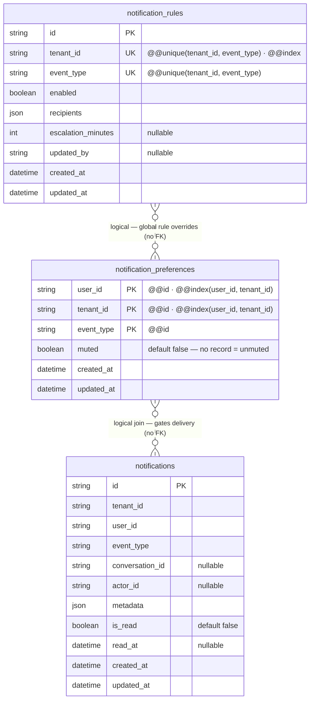

## ER Diagram — NOTIF-05: Personal Notification Preferences



| Table                      | สถานะ                | มาจาก                |
| -------------------------- | -------------------- | -------------------- |
| `notification_preferences` | 🆕 **สร้างใหม่**     | NOTIF-05 (story นี้) |
| `notification_rules`       | ♻️ มีอยู่แล้ว ไม่แก้ | NOTIF-04             |
| `notifications`            | ♻️ มีอยู่แล้ว ไม่แก้ | NOTIF-01             |

---

### Prisma model

```prisma
model NotificationPreference {
  user_id    String
  tenant_id  String
  event_type String
  muted      Boolean  @default(false)
  created_at DateTime @default(now())
  updated_at DateTime @updatedAt

  @@id([user_id, tenant_id, event_type])
  @@index([user_id, tenant_id])
  @@map("notification_preferences")
}
```

---

### Key design decisions

| Decision                                         | Rationale                                                                                                                                                                                      |
| ------------------------------------------------ | ---------------------------------------------------------------------------------------------------------------------------------------------------------------------------------------------- |
| Composite PK `(user_id, tenant_id, event_type)`  | Natural identity — no surrogate key needed; upsert by this key                                                                                                                                 |
| No record = unmuted                              | Default-open model: new users receive everything until they mute explicitly. Row ถูกสร้างเมื่อ user แตะ preference ครั้งแรก (muted หรือ unmuted) — ต่างจากไม่มี row เลยซึ่งหมายถึงยังไม่เคยแตะ |
| No FK to `notifications` or `notification_rules` | Both are in the same service DB but we prefer loose coupling; `event_type` is a string enum validated at the service layer                                                                     |
| `muted` boolean only                             | No frequency / quiet-hours / channel — those are R2 scope per story                                                                                                                            |

---

### Role-to-event visibility (what shows up in My Preferences UI)

| Event                     | Agent | Supervisor | Admin |
| ------------------------- | ----- | ---------- | ----- |
| `conversation_assigned`   | ✅    | ✅         | ✅    |
| `conversation_reassigned` | ✅    | ✅         | ✅    |
| `conversation_unassigned` | —     | ✅         | ✅    |
| `new_conversation`        | —     | ✅         | ✅    |
| `customer_replied`        | ✅    | ✅         | ✅    |
| `mention`                 | ✅    | ✅         | ✅    |
| `sla_due_soon`            | ✅    | ✅         | ✅    |
| `sla_breached`            | ✅    | ✅         | ✅    |
| `sla_breached_team`       | —     | ✅         | ✅    |
| `channel_error`           | —     | —          | ✅    |

`—` = role never receives this event per NOTIF-04 rules → not shown in the UI, preference row never written.

---

### Priority layering (delivery gate order)

```
Global rule (NOTIF-04)
  ↓ enabled = false → block all users — personal pref irrelevant
Personal preference (NOTIF-05)
  ↓ muted = true → block this user only
  ↓ no record / muted = false → deliver
INSERT notification → PUBLISH → WS bell badge
```
