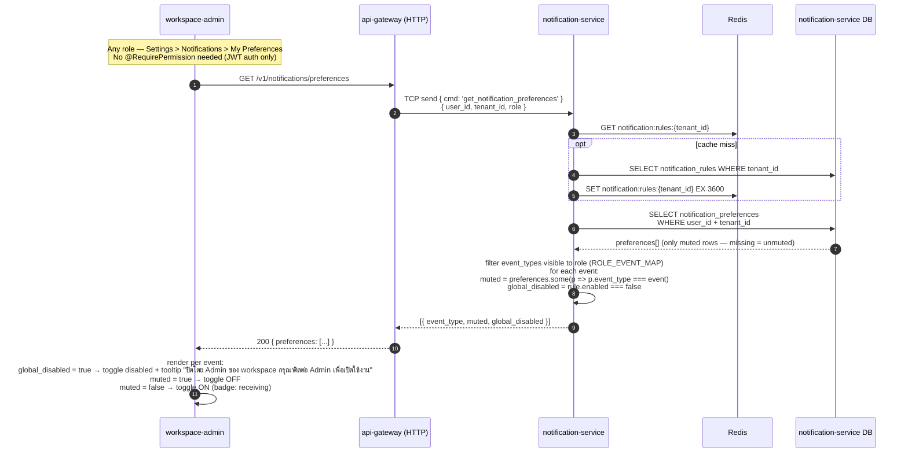
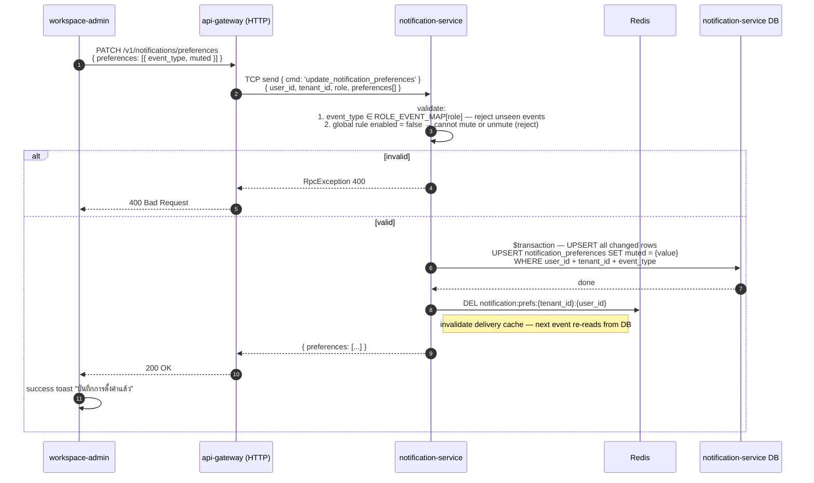
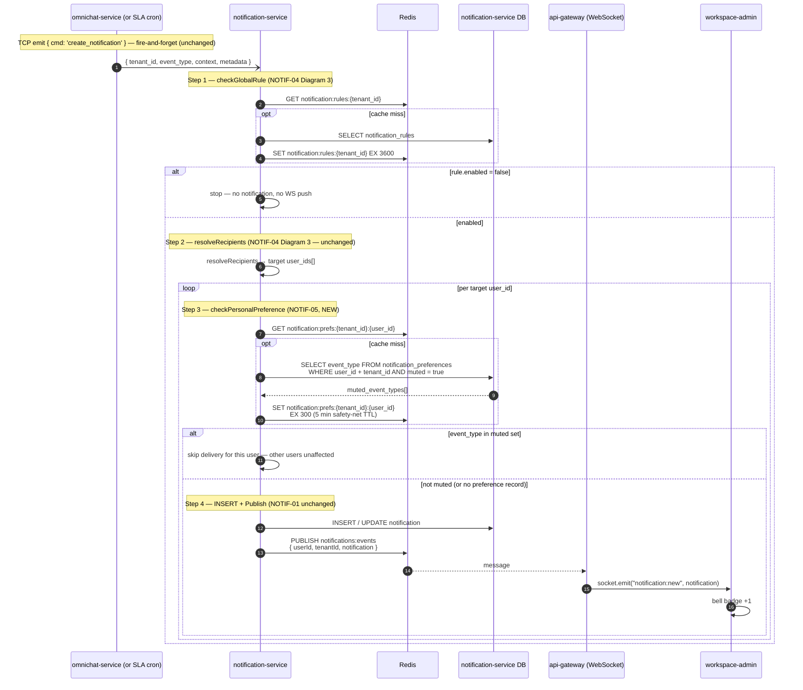

## Sequence Diagrams — NOTIF-05: Personal Notification Preferences

---

### 1 — Load My Preferences Page

ทุก role (Agent / Supervisor / Admin) เข้าถึงได้ — events ที่แสดงถูก filter ตาม role ที่ฝั่ง server

**Notes:**

- `role` ดึงจาก `req.user` JWT payload — เหมือนกับที่ดึง `tenant_id`
- `ROLE_EVENT_MAP` อยู่ใน `@monorepo/shared` ข้างๆ RBAC types เดิม — shape เดียวกับ Preference Matrix ใน story
- `global_disabled = true` ทำให้ personal preference ไม่มีผล (toggle greyed out) — DB row อาจยังมีอยู่แต่ไม่ถูกใช้จนกว่า Admin จะเปิด global rule คืน
- Response คือ list ครบทุก event ที่ role นั้นมองเห็น (ไม่ใช่แค่ row ที่ muted) เพื่อให้ FE render toggle ได้เลยโดยไม่ต้อง call เพิ่ม

---

### 2 — Save Preferences

**Notes:**

- ใช้ UPSERT ทุก row (รวม `muted = false`) เพื่อเก็บ history ว่า user เคยแตะ preference นั้น — ต่างจาก user ใหม่ที่ไม่มี row เลย
- Delivery check ยังคงเช็ค `muted = true` เหมือนเดิม — row ที่ `muted = false` ไม่มีผลต่อการส่ง notification
- `DEL notification:prefs:{tenant_id}:{user_id}` หลัง save เพื่อ invalidate cache ทันที — TTL 300s เป็นแค่ safety net ไม่ใช่ primary invalidation
- validation business rules (ข้อ 1–2) ทำที่ NotiSvc — gateway ทำแค่ validate shape ของ DTO

---

### 3 — Delivery Pipeline: Personal Preference Gate

เพิ่ม **Step 3** (personal preference check) เข้าไปใน pipeline ของ NOTIF-01 ระหว่าง global rule resolution กับ INSERT notification

**Notes:**

- cache key `notification:prefs:{tenant_id}:{user_id}` เก็บ **set ของ event_type ที่ muted** — payload เล็ก, lookup แบบ Set ต่อ delivery call
- TTL 300s เป็นแค่ safety net — primary invalidation คือ `DEL` ตอน save preference (Diagram 2)
- user ที่ไม่มี row ใน `notification_preferences` → cache miss → empty set → รับ notification ทุก event (correct default)
- การ skip delivery ของ user ที่ muted ไม่กระทบ user อื่นใน fan-out loop เดียวกัน — isolation เป็นแบบ per-user
- logic upsert ของ `customer_replied` (เช็ค unread notification เดิม) ยังอยู่ใน `createForUser()` — mute check เป็น guard ก่อนเข้าฟังก์ชันนั้น

---

## Transport Reference (NOTIF-05)

| From | To | Protocol | Key |
|---|---|---|---|
| workspace-admin | api-gateway (HTTP) | HTTP | `GET /v1/notifications/preferences` |
| workspace-admin | api-gateway (HTTP) | HTTP | `PATCH /v1/notifications/preferences` |
| api-gateway (HTTP) | notification-service | TCP send | `{ cmd: 'get_notification_preferences' }` |
| api-gateway (HTTP) | notification-service | TCP send | `{ cmd: 'update_notification_preferences' }` |
| notification-service | Redis | GET / SET / DEL | `notification:prefs:{tenant_id}:{user_id}` (EX 300) |
| notification-service | Redis | GET | `notification:rules:{tenant_id}` (existing — greyed-out check on load) |

---

## Changes to Existing Code (NOTIF-05)

| File / Layer | Change |
|---|---|
| `notification-service/prisma/schema.prisma` | Add `NotificationPreference` model |
| `notification-service/src/notifications/notifications.service.ts` | Add `checkPersonalPreference()` call inside `createForUser()` |
| `notification-service/src/notifications/notifications.controller.ts` | Add `@MessagePattern({ cmd: 'get_notification_preferences' })` and `update_notification_preferences` handlers |
| `notification-service/src/notifications/notifications.service.ts` | Add `getPreferences()` and `updatePreferences()` methods |
| `api-gateway` | Add `GET /v1/notifications/preferences` and `PATCH /v1/notifications/preferences` controllers |
| `workspace-admin` | New route `settings/my-preferences/` — page, `_api/`, `_hooks/`, `_components/` |
| `@monorepo/shared` | Add `ROLE_EVENT_MAP` constant (role → allowed event_types[]) |

---

## TODO Tracker

| ref | งาน | blocked by |
|---|---|---|
| NOTIF-05 | `notification_preferences` DB migration | NOTIF-01, NOTIF-04 done |
| NOTIF-05 | `checkPersonalPreference()` in delivery pipeline | migration done |
| NOTIF-05 | My Preferences UI page | API endpoints done |
