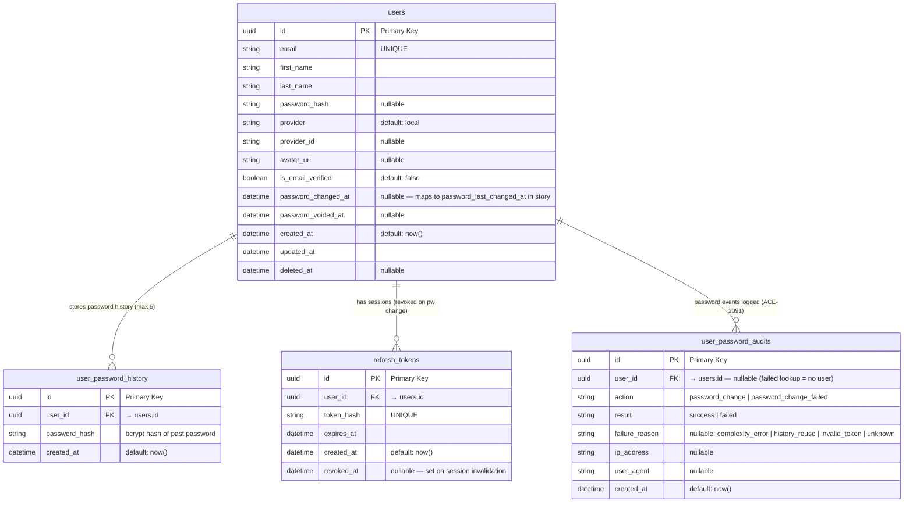

# ACE-2050 · ER Diagram: Force Change Password

**STORY-LOG-06** — DB schema changes required for forced password change & history enforcement

> **Legend**
> - `*` = Primary Key
> - `~` = Foreign Key  
> - 🟡 = New field (migration required)
> - 🟠 = New table (migration required)

---



---

## Schema Changes Summary

### `users` table — no migration required

> No new fields. `password_changed_at` already exists — story refers to it as `password_last_changed_at`.  
> `must_change_password` carried in **JWT claim** instead — see gate section below.

---

### `user_password_history` table — CREATE 🟠

| Field | Type | Constraint | Note |
|---|---|---|---|
| `id` | `UUID` | PK | |
| `user_id` | `UUID` | FK → `users.id` | CASCADE DELETE |
| `password_hash` | `VARCHAR` | NOT NULL | bcrypt hash |
| `created_at` | `TIMESTAMPTZ` | DEFAULT `now()` | |

**Retention rule:** max 5 rows per `user_id`. After insert, delete oldest rows exceeding 5.

---

### `user_password_audits` table — CREATE 🟠 (ACE-2091)

| Field | Type | Constraint | Note |
|---|---|---|---|
| `id` | `UUID` | PK | |
| `user_id` | `UUID` | FK → `users.id`, nullable | Nullable — failed attempts may have no resolved user |
| `action` | `VARCHAR` | NOT NULL | `password_change` \| `password_change_failed` |
| `result` | `VARCHAR` | NOT NULL | `success` \| `failed` |
| `failure_reason` | `VARCHAR` | NULL | `complexity_error` \| `history_reuse` \| `invalid_token` \| `unknown` |
| `ip_address` | `VARCHAR` | NULL | From request headers |
| `user_agent` | `VARCHAR` | NULL | From request headers |
| `created_at` | `TIMESTAMPTZ` | DEFAULT `now()` | |

**Pattern:** follows existing `CredentialAccessAudit` convention in omnichat-service.  
**Write:** fire-and-forget after transaction commits — audit failure must NOT roll back password change.

---

## Password Change — Atomic Operation

```
POST /auth/password/change  { new_password }

1. Validate complexity
   └─ min 8 / max 64 chars
   └─ ≥1 uppercase, ≥1 number, ≥1 special character

2. Load current hash
   └─ SELECT password_hash FROM users WHERE id = ?

3. Load history (last 4)
   └─ SELECT password_hash FROM user_password_history
      WHERE user_id = ? ORDER BY created_at DESC LIMIT 4

4. History check (total 5 = current + 4 history)
   └─ bcrypt.verify(newPwd, currentHash)       → reject if match
   └─ bcrypt.verify(newPwd, eachHistoryHash)   → reject if any match
   ⚠ NEVER compare hash strings directly

5. BEGIN TRANSACTION
   a. UPDATE users
         SET password_hash       = newHash,
             password_changed_at = NOW()
       WHERE id = ?

   b. INSERT INTO user_password_history (user_id, password_hash)
         VALUES (?, oldHash)

   c. DELETE oldest rows exceeding 5 per user
         DELETE FROM user_password_history
          WHERE id IN (
            SELECT id FROM user_password_history
             WHERE user_id = ?
             ORDER BY created_at DESC
             OFFSET 5
          )

   d. Invalidate all other sessions
         UPDATE refresh_tokens
            SET revoked_at = NOW()
          WHERE user_id = ?
            AND revoked_at IS NULL
            AND id != <currentSessionTokenId>

6. COMMIT
   ⚠ Must be atomic — no partial update allowed

7. INSERT INTO user_password_audits (user_id, action, result, ip_address, user_agent)
      VALUES (?, 'password_change', 'success', ?, ?)
   ⚠ Fire-and-forget AFTER commit — audit failure must NOT affect password change result

-- On any validation failure (before transaction):
INSERT INTO user_password_audits (user_id, action, result, failure_reason, ip_address, user_agent)
   VALUES (?, 'password_change_failed', 'failed', '<reason>', ?, ?)
```

---

## `must_change_password` Gate (JWT claim — no DB field)

`orches-auth-service` includes claim in access token when issuing after temp password login:

```json
{
  "sub": "<userId>",
  "tenantId": "<tenantId>",
  "must_change_password": true
}
```

Gate in `api-gateway` reads claim from JWT — no extra DB/TCP call needed:

```
JWT Valid?
    └─ YES → JWT claim must_change_password = true?
                 └─ YES → 403 { error: "PASSWORD_CHANGE_REQUIRED" }
                 └─ NO  → proceed normally
    └─ NO  → 401 Unauthorized
```

After successful password change → `orches-auth-service` issues new token **without** the claim.

Applies to **all routes** except `POST /auth/password/change` itself.
