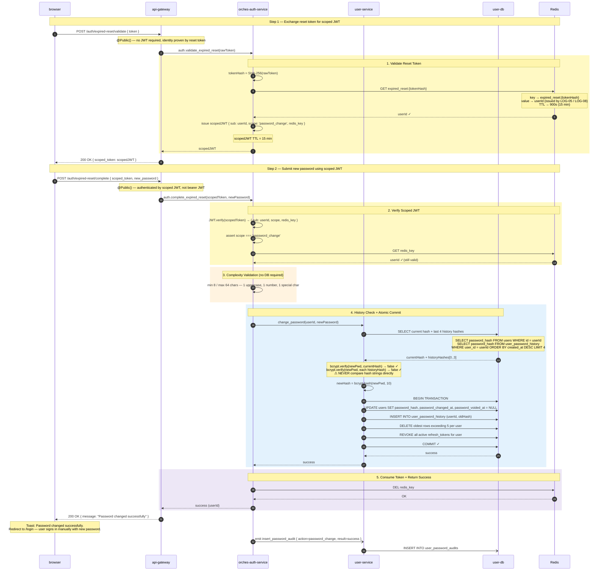
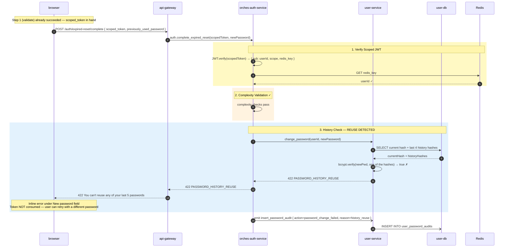
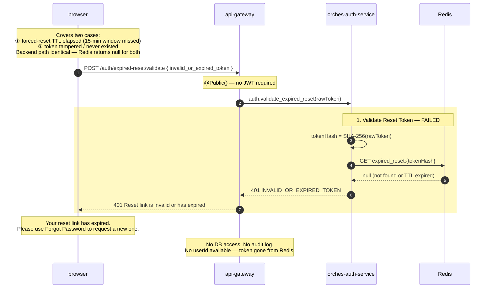

# ACE-2050 · Sequence Diagrams: Force Change Password

**STORY-LOG-06** — 3 scenarios

| Scenario | Description |
|---|---|
| [01](#scenario-01-successful-password-change) | Happy path — step 1 exchanges reset token for scoped JWT; step 2 new password passes all rules → 200 OK, redirect to /login |
| [02](#scenario-02-history-reuse-failure) | New password matches one of last 5 → 422 inline error |
| [03](#scenario-03-invalid-or-expired-token) | Token not found / TTL elapsed / tampered → 401 + show error with link to /forgot-password |

> **Auth mechanism:** Two-step flow —  
> 1. `POST /auth/expired-reset/validate { token }` validates reset token and returns short-lived **scoped JWT** (`scope: password_change`, TTL 15 min).  
> 2. `POST /auth/expired-reset/complete { scoped_token, new_password }` verifies scoped JWT and finalizes the change, returning 200 OK — no token issued; FE redirects to /login.  
> Reset token stored in Redis (`expired_reset:{tokenHash}`, issued by LOG-05 / LOG-08, TTL 900 s).  
> `confirm_password` = frontend-only, not sent to API.

---

## Scenario 01: Successful Password Change

---

## Scenario 02: History Reuse Failure

---

## Scenario 03: Invalid or Expired Token

---

## Service Responsibility Split

| Responsibility | Service | Note |
|---|---|---|
| Token validation (Redis lookup) | `orches-auth-service` | SHA256(rawToken) → GET Redis |
| Scoped JWT issuance | `orches-auth-service` | `{ sub: userId, scope: 'password_change', redis_key }`, TTL 15 min |
| Scoped JWT verification | `orches-auth-service` | assert scope === 'password_change', re-verify redis_key still in Redis |
| Complexity validation | `orches-auth-service` | no DB/bcrypt needed |
| bcrypt.verify (history check) | `user-service` | bcrypt lib lives here |
| bcrypt.hash (new password) | `user-service` | all crypto in one place |
| Atomic DB commit | `user-service` | owns DB access |
| Session invalidation (DB) | `user-service` | within same transaction |
| Reset `password_voided_at` | `user-service` | SET NULL within same transaction |
| Token consumption (Redis DEL) | `orches-auth-service` | after user-service confirms success |
| Post-change response | `api-gateway` | 200 OK { message } — no token issued; FE redirects user to /login |
| Audit log write | `user-service` → `user_password_audits` | fire-and-forget via TCP from orches-auth-service |
