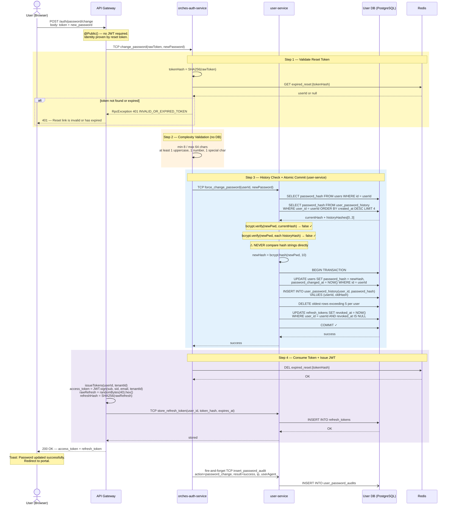
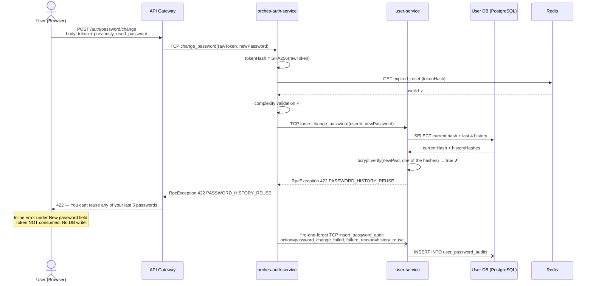
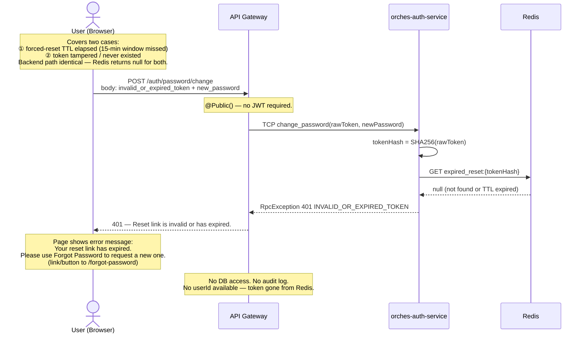

# ACE-2050 · Sequence Diagrams: Force Change Password

**STORY-LOG-06** — 3 scenarios

| Scenario | Description |
|---|---|
| [01](#scenario-01-successful-password-change) | Happy path — token valid, new password passes all rules → JWT issued |
| [02](#scenario-02-history-reuse-failure) | New password matches one of last 5 → 422 inline error |
| [03](#scenario-03-invalid-or-expired-token) | Token not found / TTL elapsed / tampered → 401 + show error with link to /forgot-password |

> **Auth mechanism:** `POST /auth/password/change` uses one-time **reset token** (Redis `expired_reset:{tokenHash}`, issued by LOG-05 / LOG-08) — not a bearer JWT.  
> `confirm_password` = frontend-only, not sent to API.

---

## Scenario 01: Successful Password Change

---

## Scenario 02: History Reuse Failure

---

## Scenario 03: Invalid or Expired Token

---

## Service Responsibility Split

| Responsibility | Service | Note |
|---|---|---|
| Token validation (Redis lookup) | `orches-auth-service` | SHA256(rawToken) → GET Redis |
| Complexity validation | `orches-auth-service` | no DB/bcrypt needed |
| bcrypt.verify (history check) | `user-service` | bcrypt lib lives here |
| bcrypt.hash (new password) | `user-service` | all crypto in one place |
| Atomic DB commit | `user-service` | owns DB access |
| Session invalidation (DB) | `user-service` | within same transaction |
| Token consumption (Redis DEL) | `orches-auth-service` | after user-service confirms success |
| JWT + refresh token issuance | `api-gateway` | matches existing `issueTokens()` pattern |
| Audit log write | `user-service` → `user_password_audits` | fire-and-forget via TCP from orches-auth-service |
