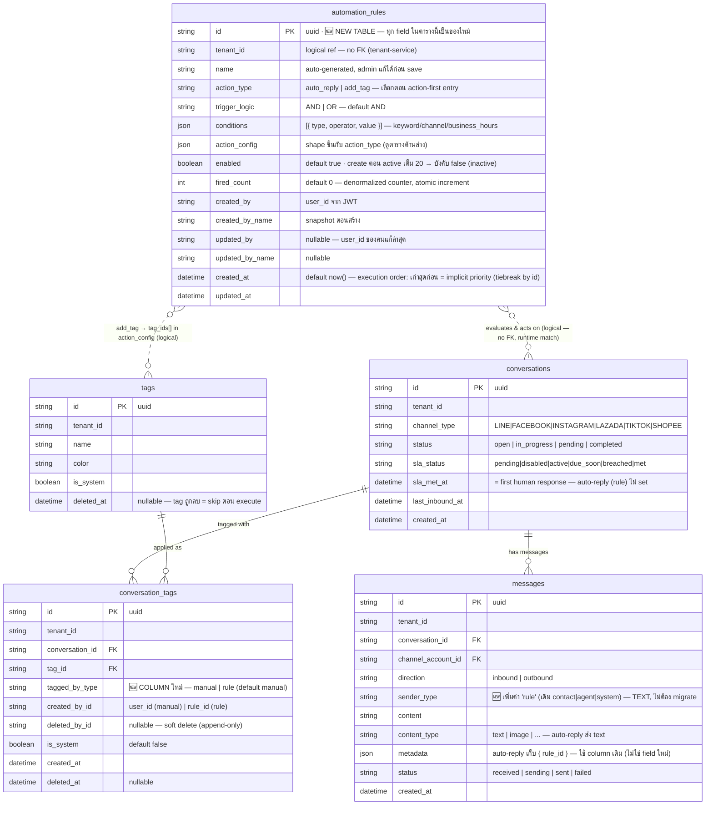

## ER Diagram — RA-01: Rule Automation / Rule Management (CRUD)

> EPIC: [ACE-2211 Rule Automation](../ACE-2211_EPIC-A4.1_Rule_Automation.md) · STORY: [ACE-2212 Rule Management CRUD](../ACE-2212_STORY-RA-01_Rule_Management_CRUD.md)
> Prisma model names = PascalCase / DB table names (`@@map`) = snake_case
> ทุกตารางอยู่ใน **omnichat-service DB** เดียวกัน — `tenant_id` เป็น logical ref ไป tenant-service (ไม่มี FK ข้าม service เหมือนทุกตารางใน omnichat)



**Prisma model → DB table mapping**

| Prisma model        | DB table (`@@map`)   | สถานะ                  | Service / DB        |
| ------------------- | -------------------- | ---------------------- | ------------------- |
| `AutomationRule`    | `automation_rules`   | 🆕 **สร้างใหม่** (RA-01) | omnichat-service DB |
| `Message`           | `messages`           | ♻️ modify `sender_type` | omnichat-service DB |
| `ConversationTag`   | `conversation_tags`  | ♻️ add `tagged_by_type` | omnichat-service DB |
| `Tag`               | `tags`               | ♻️ มีอยู่แล้ว ไม่แก้      | omnichat-service DB |
| `Conversation`      | `conversations`      | ♻️ มีอยู่แล้ว ไม่แก้      | omnichat-service DB |

> ✅ **ทุกตารางอยู่ DB เดียว (omnichat-service)** — JOIN ได้จริง, FK จริงสำหรับ `conversation_tags → conversations/tags` (มีอยู่แล้ว) — ต่างจาก NOTIF-04 ที่ข้าม 3 service
> `automation_rules` **ไม่มี FK** ไป `conversations` — เป็นตารางนิยาม, match ตอน runtime ผ่าน engine ไม่ใช่ relation
> `automation_rules.tenant_id` logical ref ไป tenant-service — ไม่มี cascade delete (เหมือนทุกตารางใน omnichat)

---

### Prisma model — `AutomationRule`

```prisma
model AutomationRule {
  id              String   @id @default(uuid())
  tenant_id       String
  name            String
  action_type     String   // auto_reply | add_tag
  trigger_logic   String   @default("AND") // AND | OR
  conditions      Json     @db.JsonB
  action_config   Json     @db.JsonB
  enabled         Boolean  @default(true)
  fired_count     Int      @default(0)
  created_by      String
  created_by_name String
  updated_by      String?
  updated_by_name String?
  created_at      DateTime @default(now())
  updated_at      DateTime @updatedAt

  @@index([tenant_id, enabled, created_at(sort: Asc)]) // engine: active rules ordered oldest-first
  @@index([tenant_id, created_at(sort: Desc)])         // list view
  @@map("automation_rules")
}
```

> **ไม่มี `@@unique`** — ชื่อ rule ซ้ำได้ (story: allow แต่ FE แสดง warning tooltip)
> **ไม่มี soft delete** (`deleted_at`) — story กำหนด **hard delete** ถาวร (ยังไม่มี history implementation) ต่างจากตารางอื่นใน omnichat ที่มี `deleted_at`

---

### `conditions` JSON shape — per `type`

อ่านเทียบ `trigger_logic` (AND = ทุก condition ต้องผ่าน / OR = ผ่านอย่างน้อย 1) — รายละเอียด evaluation อยู่ใน STORY-RA-02

```jsonc
[
  { "type": "keyword",        "operator": "contains | exact", "value": ["ยกเลิก", "refund"] },
  { "type": "channel",        "operator": "in",               "value": ["LINE", "SHOPEE"] },
  { "type": "business_hours", "operator": "within | outside",
    "value": {
      "use_workspace_hours": true,          // true = ดึง workspace timezone/hours ทุกครั้งที่ evaluate (ไม่ cache)
      "timezone": "Asia/Bangkok",           // บังคับเมื่อ use_workspace_hours = false
      "days": [1,2,3,4,5],                  // 0=Sun..6=Sat
      "ranges": [{ "start": "22:00", "end": "06:00" }] // ข้าม midnight ได้
    }
  }
]
```

| `type`           | operator           | value                         | หมายเหตุ                                                            |
| ---------------- | ------------------ | ----------------------------- | ------------------------------------------------------------------ |
| `keyword`        | `contains`/`exact` | `string[]`                    | case-insensitive ไทย-อังกฤษ — match กับ `message.content`           |
| `channel`        | `in`               | `ChannelType[]`               | multi-select — match กับ `conversation.channel_type`               |
| `business_hours` | `within`/`outside` | object (ดูบน)                  | `use_workspace_hours=true` → ดึงค่าจาก `workspace_sla_configs`/workspace ทุกครั้ง |

> validation (RA-01): ต้องมี **อย่างน้อย 1 condition** — save ว่าง = 400 `'ต้องมีอย่างน้อย 1 เงื่อนไข'`

---

### `action_config` JSON shape — per `action_type`

```jsonc
// action_type = "auto_reply"
{
  "message": "สวัสดีค่ะ {{contact_name}} ขณะนี้อยู่นอกเวลาทำการ",  // template variables
  "cooldown_minutes": 60                                          // required — กัน loop, นับ per-conversation-per-rule
}

// action_type = "add_tag"
{
  "tag_ids": ["uuid-tag-1", "uuid-tag-2"]   // append-only, dedup ก่อนติด, skip tag ที่ deleted_at != null
}
```

| `action_type` | required config              | execution notes                                                                                     |
| ------------- | ---------------------------- | --------------------------------------------------------------------------------------------------- |
| `auto_reply`  | `message`, `cooldown_minutes` | **only-first-wins** (ส่งจาก rule เก่าสุดที่ match), `sender_type='rule'`, **ไม่ advance SLA first-response**, ส่งได้เฉพาะ LINE/FACEBOOK/INSTAGRAM/LAZADA |
| `add_tag`     | `tag_ids[]`                  | ทุก rule ที่ match ติด tag ได้, `tagged_by_type='rule'`, dedup กับ tag ที่มีอยู่, skip tag ที่ถูกลบ (warn ไม่ error) · **cooldown** default ระบบ `RULE_TAG_COOLDOWN_MINUTES` (wizard ไม่ให้ตั้ง) กัน tag เด้งกลับหลัง agent ลบ |

> ⚠️ **Channel send capability (verify กับ repo `strategy.registry.ts` + `tiktok.strategy.ts`):**
> `pushMessage` รองรับ **LINE / FACEBOOK / INSTAGRAM / LAZADA** — **TIKTOK** คืน `'TikTok push message is not yet supported'`, **SHOPEE** ไม่มี strategy ใน registry เลย
> → บน TIKTOK/SHOPEE: `add_tag` ทำงานปกติ แต่ `auto_reply` **skip** (engine เช็ค channel capability ก่อนส่ง)

> ⚠️ **เปิดประเด็นกับ PO — single-action vs multi-action:** STORY-RA-01 (wizard action-first + auto-gen name `'Auto-reply · Outside hours'`) = **1 action ต่อ rule** → ใช้ `action_type` เดี่ยว ตามที่ออกแบบนี้ แต่ตัวอย่าง execution ใน EPIC (`Rule A: auto-reply + tag off-hours`) อ่านได้ว่า 1 rule มีหลาย action — **ถ้าต้องการหลาย action ต่อ rule** ให้เปลี่ยน `action_type`/`action_config` เป็น array `actions: [{ type, config }]` (นอก scope RA-01)

---

### Modified existing columns

| Table / column                  | change                                    | reason                                                                                       |
| ------------------------------- | ----------------------------------------- | -------------------------------------------------------------------------------------------- |
| `messages.sender_type`          | เพิ่มค่า `rule` (column เป็น TEXT — **ไม่มี migration**) | แยก auto-reply ของ rule ออกจาก agent → KPI/FRT ถูกต้อง, audit ได้ว่า message ไหน rule ตอบ |
| `messages.metadata`             | auto-reply เก็บ `{ rule_id }`             | trace ว่า auto-reply มาจาก rule ตัวไหน (ไม่มี FK — JSON payload)                              |
| `conversation_tags.tagged_by_type` | **column ใหม่** `String @default("manual")` // manual \| rule | report filter แยก tag ที่คนติด vs automation ติด                          |

> `messages.sender_type` ปัจจุบันใน repo = `contact | agent | system` (ดู `schema.prisma:262`) — RA-01 เพิ่ม `rule` เป็นค่าที่ 4 (TEXT column ไม่ต้อง migrate enum)
> **SLA first human response:** repo ไม่มี field `first_human_response_at` แยก — "first response" encode อยู่ใน `conversations.sla_met_at` + `conversation_sla_events(event_type='met')` ซึ่ง set ใน `conversations.service.ts sendMessage()` ตอน push success โดย**ไม่เช็ค sender_type** → RA-01 ต้องเพิ่ม guard: auto-reply (`sender_type='rule'`) **ข้าม** logic set `sla_met` (ดู sequence Diagram 6)

---

### Active rules limit & counters

```
COUNT(automation_rules WHERE tenant_id = ? AND enabled = true)  ≤ 20
  ← create เกิน 20: ไม่ block — บังคับ rule ใหม่เป็น inactive (enabled=false)
  ← enable (toggle false→true): block ที่ 20 → 409
```

- Counter `Active (X/20)` + `Inactive (n)` — inactive ไม่นับ limit, ไม่จำกัดจำนวน
- **create ไม่ block:** active เต็ม 20 ตอนสร้าง → rule ใหม่ถูก force `enabled=false` (inactive) เปิดเองไม่ได้จนกว่าจะ disable active ตัวอื่น (product decision 2026-06-24 — **supersede** STORY AC#1 Sc.2 / EPIC ที่เขียน "block create")
- **enable block:** toggle `false→true` ตอน active=20 → 409 (กันเกิน 20 active)
- enforce ที่ **omnichat-service** (business layer) — ไม่ใช่ DB constraint (limit เป็น business rule ที่อาจเปลี่ยน)

---

### Redis keys (no table — ephemeral state)

| key                                              | op           | TTL   | purpose                                                                 |
| ------------------------------------------------ | ------------ | ----- | ----------------------------------------------------------------------- |
| `automation:rules:{tenant_id}`                   | GET/SET/DEL  | 3600s | **engine cache** — active rules (ordered `created_at` ASC) — DEL ทุก CRUD write |
| `automation:rules:list:{tenant_id}`              | GET/SET/DEL  | 3600s | **list-page cache** — ทุก rule (defs + display + `fired_count` snapshot, active+inactive); DEL เฉพาะ CRUD write. ตอน load query สด `fired_count` **เฉพาะ active** (`WHERE enabled = true`) override บน cache — inactive fired_count นิ่ง (disabled rule ไม่ fire) ใช้จาก cache |
| `automation:dedup:{tenant_id}:{conv_id}:{hash}`  | SET NX       | 5s    | message dedup window (background) — message ซ้ำใน 5s evaluate ครั้งเดียว  |
| `automation:cooldown:{rule_id}:{conv_id}`        | GET/SET      | auto_reply: `cooldown_minutes`×60 · add_tag: `RULE_TAG_COOLDOWN_MINUTES`×60 | per-conversation-per-rule cooldown ครอบ **ทั้ง 2 action** — auto-reply กัน reply→trigger loop · add_tag กัน tag เด้งกลับหลัง agent ลบ (SET หลัง action ทำงาน) |

> **เหตุผลใช้ Redis ไม่ใช่ตาราง:** cooldown/dedup เป็น ephemeral state มี TTL ในตัว — pattern เดียวกับ webhook dedup เดิม (24h) และ NOTIF cache; ไม่ต้องมี cleanup job, ไม่ pollute DB
> **`fired_count`** เก็บเป็น counter บน `automation_rules` (atomic `increment`) — ไม่มีตาราง `rule_executions` ใน RA-01 (audit log ละเอียดต่อการ fire = future reporting scope)

---

### Permission additions — `packages/shared/src/types/rbac.types.ts`

เพิ่มใน `PERMISSION_ACTIONS` (มี `config_notification_rules` เป็น precedent):

```typescript
"view_automation_rules",    // ดู list — admin | supervisor | agent (ทุก role)
"manage_automation_rules",  // create / edit / enable / disable — admin | supervisor
"delete_automation_rules",  // hard delete — admin เท่านั้น
```

| การกระทำ                  | permission action          | Admin | Supervisor | Agent |
| ------------------------- | -------------------------- | :---: | :--------: | :---: |
| ดู rule list              | `view_automation_rules`    |  ✓   |     ✓     |  ✓   |
| สร้าง / แก้ไข rule        | `manage_automation_rules`  |  ✓   |     ✓     |  ✗   |
| Enable / Disable rule     | `manage_automation_rules`  |  ✓   |     ✓     |  ✗   |
| ลบ rule (hard delete)     | `delete_automation_rules`  |  ✓   |     ✗     |  ✗   |

> guard เป็น global `APP_GUARD` ที่ api-gateway — resolve role จาก user-service แล้วเช็ค matrix (role ไม่อยู่ใน JWT, เหมือน NOTIF) → permission ทำงานทั้ง UI และ API (Agent ยิง `DELETE` ตรง = 403)

---

### Key design decisions

| Decision                                          | Rationale                                                                                                          |
| ------------------------------------------------- | ------------------------------------------------------------------------------------------------------------------ |
| 1 ตาราง + `conditions`/`action_config` เป็น JSON  | repo ใช้ JSON เป็น norm (`metadata`, `recipients`, `snapshot`) — conditions/action variant สูง, child table จะ over-normalize สำหรับ payload ที่อ่านทั้งก้อนเสมอ |
| `action_type` เดี่ยว (ไม่ใช่ array)               | ตรง STORY-RA-01 wizard (action-first, 1 action) + auto-gen name — flag multi-action เป็น open question กับ PO       |
| Hard delete (ไม่มี `deleted_at`)                   | story กำหนดชัด — ยังไม่มี history; ลบจริงจาก DB (must-not-break: "ไม่มี soft flag หลงเหลือ")                          |
| cooldown/dedup ใน Redis                           | ephemeral + TTL ในตัว — ไม่มี cleanup job, ตาม pattern dedup/cache เดิม                                              |
| `sender_type='rule'` + `tagged_by_type='rule'`    | attribution แยก automation ออกจากคน → KPI/FRT/report ถูกต้อง (background, ไม่ expose ใน UI)                          |
| Rules อยู่ omnichat-service DB                     | engine + ปลายทาง (conversations/messages/tags) อยู่ service เดียว — ไม่มี cross-service hop ตอน evaluate (hot path) |
| execution order = `created_at` ASC (เก่าสุดก่อน)   | **implicit priority** — auto-reply only-first-wins: rule เก่าชนะ → เพิ่ม rule ใหม่ไม่แย่ง/override auto-reply ของเดิม (least surprise) + ไม่ต้องมี field `priority` ให้ admin จัดเอง · **tiebreak ด้วย `id`** ถ้า `created_at` ชนกัน → total order เสมอ · add_tag ลำดับไม่ critical (ทุก rule ที่ match ติดหมด) |
