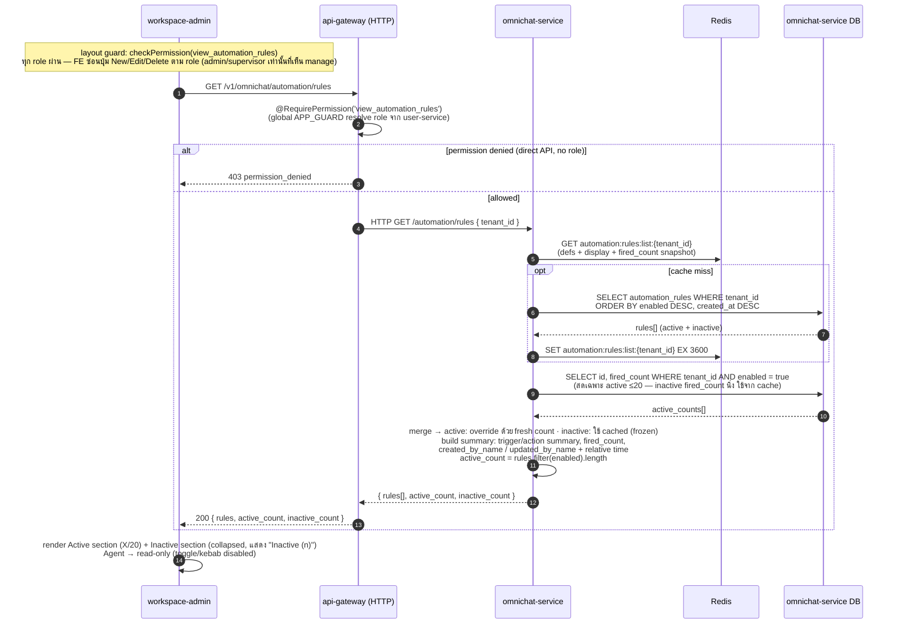
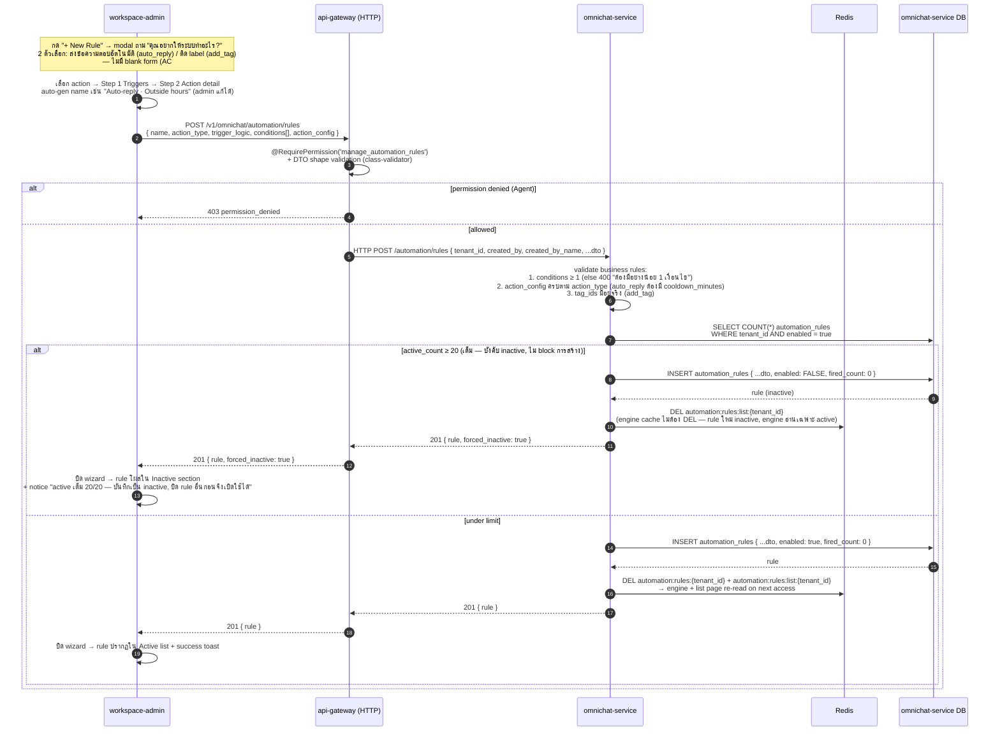
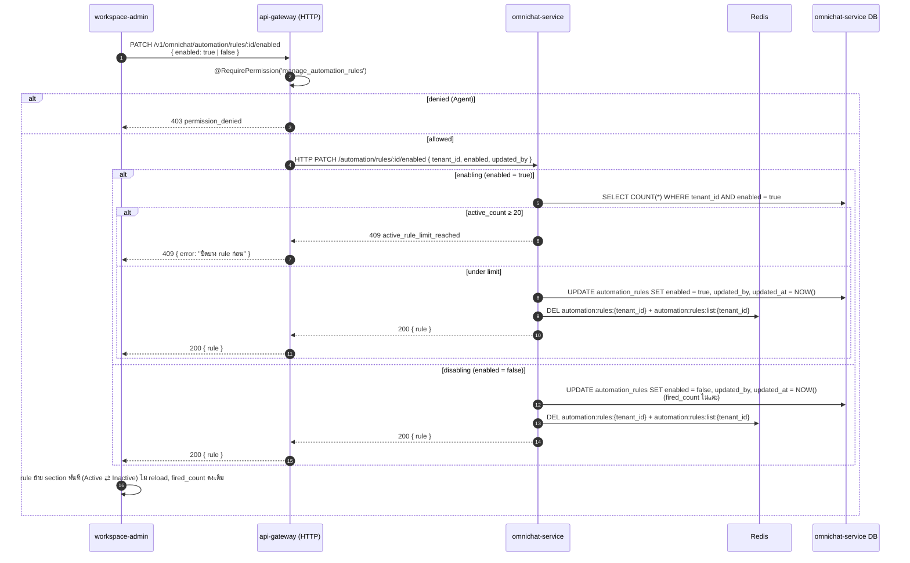
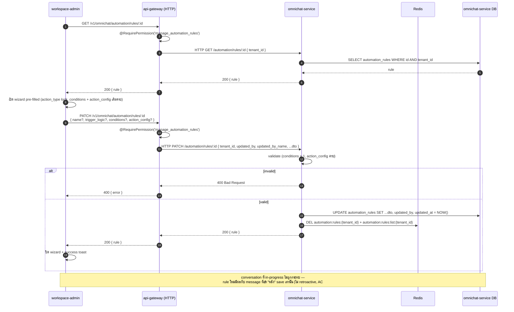
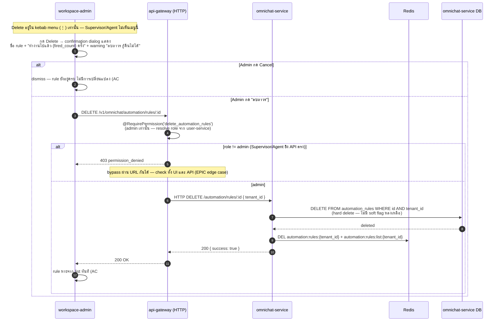

## Sequence Diagrams — RA-01: Rule Automation / Rule Management (CRUD)

> EPIC: [ACE-2211 Rule Automation](../ACE-2211_EPIC-A4.1_Rule_Automation.md) · STORY: [ACE-2212 Rule Management CRUD](../ACE-2212_STORY-RA-01_Rule_Management_CRUD.md) · ER: [RA-01_rule_automation_er.md](./RA-01_rule_automation_er.md)
> Transport: api-gateway → omnichat-service ใช้ **HTTP proxy** (`HttpService.axiosRef`) ตาม pattern config-CRUD เดิม (saved-views / credentials) — ไม่ใช่ TCP
> ไฟล์นี้ = **CRUD (STORY-RA-01)** เท่านั้น — Diagram 1–5 · **Rule Execution engine** (evaluate / auto-reply / auto-tag) ย้ายไป [RA-execution_overview.md](./RA-execution_overview.md) เพราะเป็น scope ของ RA-02/03/04

---

### 1 — Load Rules Page (list + counters)

ทุก role เข้าถึงได้ (`view_automation_rules`) — ปุ่ม/action ถูก gate ที่ FE ตาม role + บังคับซ้ำที่ API

**Notes:**
- counter `Active (X/20)` — `inactive` ไม่นับ limit; section Inactive collapsed by default (AC#7)
- FE guard ใช้ pattern เดียวกับ `settings/sla/layout.tsx` → `checkPermission` → `redirect('/unauthorized')` ถ้า role ไม่มีสิทธิ์เข้าหน้า (ที่นี่ทุก role เข้าได้)
- **list cache** `automation:rules:list:{tenant_id}` EX 3600 (NOTIF-04 style cache-miss) เก็บ **ทั้ง rule** (defs + display + `fired_count` snapshot) — DEL ทุก CRUD write
- **`fired_count` query สดเฉพาะ active rule** — engine fire ได้เฉพาะ `enabled = true` → **inactive fired_count นิ่ง (frozen)** ใช้ค่าจาก cache ได้เลย; query แค่ `SELECT id, fired_count WHERE tenant_id AND enabled = true` (≤20 แถว) แล้ว override เฉพาะ active → ค่า real-time + query เบาสุด (inactive ไม่จำกัดจำนวนแต่ไม่แตะ DB)
- re-enable rule = CRUD write = DEL cache → rule ที่กลับมา active จะถูก query สดรอบถัดไปเอง (ไม่มีเคส count ค้าง)
- แยก key จาก **engine cache** `automation:rules:{tenant_id}` (active-only, ASC) เพราะ list ถือทั้ง active+inactive + display order ต่างกัน — ทั้ง 2 key DEL พร้อมกันทุก CRUD write

> **Mock request/response ทุก endpoint** → [RA-01_api_table.md](./RA-01_api_table.md)

---

### 2 — Create Rule (action-first wizard → save)

**Notes:**
- **active limit 20 — create ไม่ block:** สร้างได้เสมอ; ถ้า active เต็ม 20 ตอน save → rule ใหม่ถูกบันทึกเป็น **inactive** (`enabled=false`), เปิดใช้ไม่ได้จนกว่าจะ disable rule active ตัวอื่นก่อน (การ enable เช็คซ้ำที่ Diagram 3 = 409) — เช็คที่ omnichat-service ครอบทุก caller
- ⚠️ **supersede STORY AC#1 Scenario 2 + EPIC** (เดิมเขียน "block create, ไม่เปิด wizard") → เปลี่ยนเป็น **create-as-inactive** ตาม product decision (2026-06-24) — ต้องอัปเดต AC ใน STORY/EPIC ให้ตรงด้วย
- auto-gen name ทำที่ **FE** (เห็น preview ใน wizard) แต่ส่ง `name` มากับ payload — server ไม่ regen (admin แก้ได้)
- network error ตอน save → FE เก็บ state wizard ไว้ครบ + retry prompt (QA edge case) — เป็น FE concern, ไม่มี server state
- หลัง insert DEL ทั้ง **engine cache** (`automation:rules:{tenant_id}`) และ **list cache** (`automation:rules:list:{tenant_id}`) — มีผลทันที (TTL 3600 เป็น safety net)

> **Mock request/response ทุก endpoint** → [RA-01_api_table.md](./RA-01_api_table.md)

---

### 3 — Enable / Disable toggle

**Notes:**
- **must-not-break:** disable แล้ว engine ต้องไม่ evaluate rule นั้นทันที — `DEL automation:rules:{tenant_id}` (engine cache) ทำให้ message ถัดไป re-read active rules (rule ที่ disable หลุดจาก `WHERE enabled = true`); list cache DEL คู่กัน
- disable ไม่ลด `fired_count` (ประวัติการ fire ต้องคงอยู่)
- enable เช็ค limit 20 ซ้ำ (เคส: active=20 → disable 1 → enable อีกตัว = ต้อง block ถ้ากลับไป 20)

---

### 4 — Edit Rule (pre-filled, ไม่ retroactive)

**Notes:**
- **ไม่ retroactive by design** — engine evaluate rules ณ เวลาที่ message เข้า (single-pass) เสมอ ไม่มี job ย้อนหลัง → message เก่าที่ process ไปแล้วไม่ re-run (must-not-break)
- `action_type` แก้ไม่ได้ตอน edit (ชนิด action fix ตั้งแต่ entry) — เปลี่ยน action = สร้าง rule ใหม่
- `updated_by` = คนกด save ล่าสุด (audit) — โชว์ "แก้ล่าสุดโดย" บน card

---

### 5 — Delete Rule (hard delete, Admin only)

**Notes:**
- **hard delete** ลบจริงจาก DB — ไม่มี undo (story: ยังไม่มี history) → confirmation dialog เป็น safety net ตัวเดียว แสดง `fired_count` ให้ admin เห็น impact ก่อนลบ
- cooldown keys (`automation:cooldown:{rule_id}:*`) ที่ค้างใน Redis = orphan, หมดอายุเองตาม TTL — ไม่ต้อง cleanup
- `conversation_tags` / `messages` ที่ rule นี้เคยติด/ส่ง **คงอยู่** (tagged_by_type='rule' / sender_type='rule' ไม่อ้าง FK ไป rule) — ลบ rule ไม่กระทบ data ที่ติดไปแล้ว

---

## Transport Reference (RA-01 — CRUD)

| From                    | To                      | Protocol       | Key                                                          |
| ----------------------- | ----------------------- | -------------- | ------------------------------------------------------------ |
| workspace-admin         | api-gateway (HTTP)      | HTTP           | `GET /v1/omnichat/automation/rules` (list)                   |
| workspace-admin         | api-gateway (HTTP)      | HTTP           | `GET /v1/omnichat/automation/rules/:id` (edit pre-fill)      |
| workspace-admin         | api-gateway (HTTP)      | HTTP           | `POST /v1/omnichat/automation/rules` (create)                |
| workspace-admin         | api-gateway (HTTP)      | HTTP           | `PATCH /v1/omnichat/automation/rules/:id` (edit)             |
| workspace-admin         | api-gateway (HTTP)      | HTTP           | `PATCH /v1/omnichat/automation/rules/:id/enabled` (toggle)   |
| workspace-admin         | api-gateway (HTTP)      | HTTP           | `DELETE /v1/omnichat/automation/rules/:id` (hard delete)     |
| api-gateway (HTTP)      | omnichat-service        | HTTP proxy     | `axiosRef` → `/automation/rules*` (pattern เดียวกับ saved-views) |
| api-gateway             | user-service            | TCP send       | `{ cmd: 'get_member_role' }` (PermissionGuard resolve role)  |
| omnichat-service        | Redis                   | GET/SET        | `automation:rules:list:{tenant_id}` (EX 3600 — list-page cache; fresh `fired_count` for **active only**) |
| omnichat-service        | Redis                   | DEL            | `automation:rules:{tenant_id}` + `automation:rules:list:{tenant_id}` — invalidate ทั้ง engine cache + list cache ทุก CRUD write |

> engine-side transport (inbound trigger, `pushMessage`, dedup, cooldown, `omnichat:events` publish → WS) ย้ายไป [RA-execution_overview.md](./RA-execution_overview.md)

---

## Changes to Existing Code (RA-01 — CRUD)

| File / Layer                                                  | Change                                                                                         |
| ------------------------------------------------------------- | ---------------------------------------------------------------------------------------------- |
| `omnichat-service/prisma/schema.prisma`                       | Add `AutomationRule` model; add `tagged_by_type` to `ConversationTag`; doc `rule` ใน `sender_type` |
| `omnichat-service/src/automation/` (new)                      | `automation.controller.ts` (HTTP CRUD) + `automation.service.ts` (CRUD + limit-20) — *(`rule-engine.service.ts` อยู่ [RA-execution_overview.md](./RA-execution_overview.md))* |
| `api-gateway/src/omnichat/`                                   | `automation.controller.ts` + `automation.service.ts` (HTTP proxy, `@RequirePermission`)        |
| `packages/shared/src/types/rbac.types.ts`                     | Add `view_automation_rules`, `manage_automation_rules`, `delete_automation_rules` + matrix     |
| `workspace-admin/src/app/(main)/.../automation/` (new)        | route + `_api/` (Server Actions) + `_hooks/` + `_store/` + `_components/` (wizard, list, dialogs) |

---

## TODO Tracker (RA-01 — CRUD)

| ref     | งาน                                                              | story    | blocked by         |
| ------- | ---------------------------------------------------------------- | -------- | ------------------ |
| RA-01   | `automation_rules` migration + `tagged_by_type` + `sender_type` 'rule' | RA-01    | —                  |
| RA-01   | CRUD API + limit-20 + permission matrix (Diagram 1–5)            | RA-01    | migration done     |
| RA-01   | Rule list UI + action-first wizard (2 steps) + delete dialog    | RA-01    | API done           |

> execution TODO (RA-02 conditions / RA-03 auto-reply / RA-04 auto-tag / SLA-met guard) → [RA-execution_overview.md](./RA-execution_overview.md)
