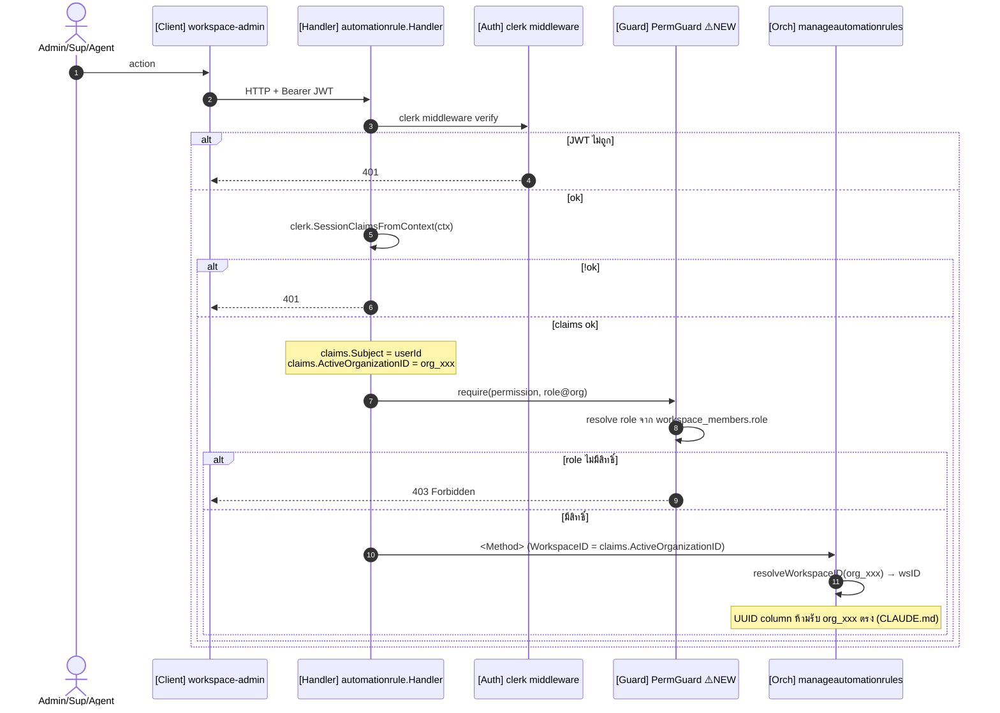
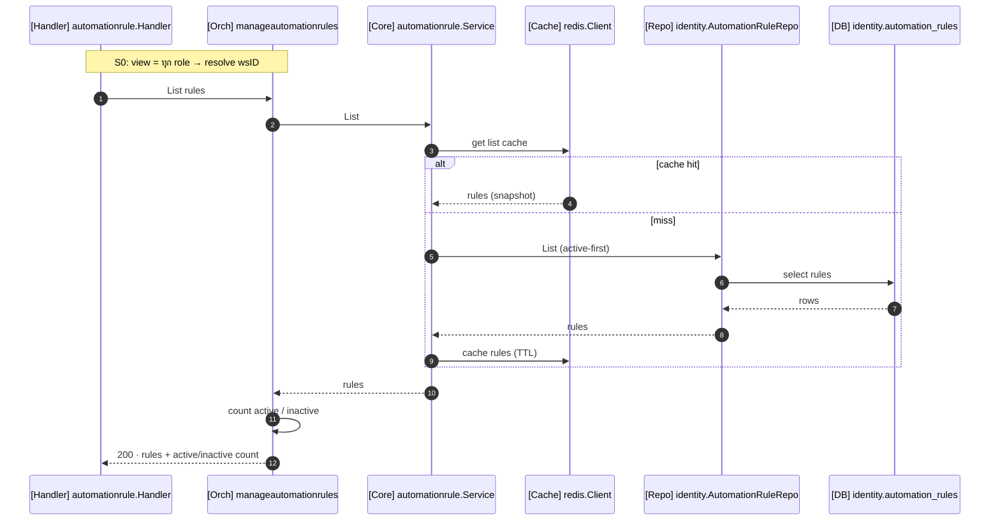
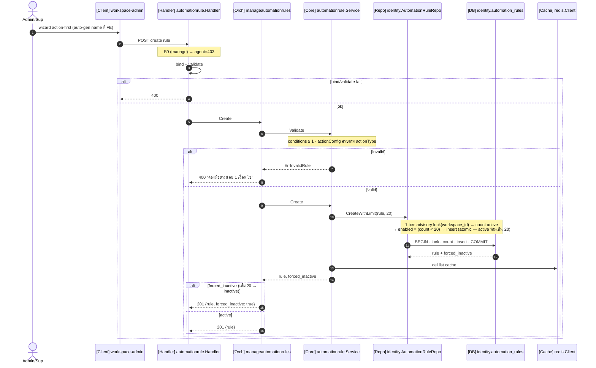
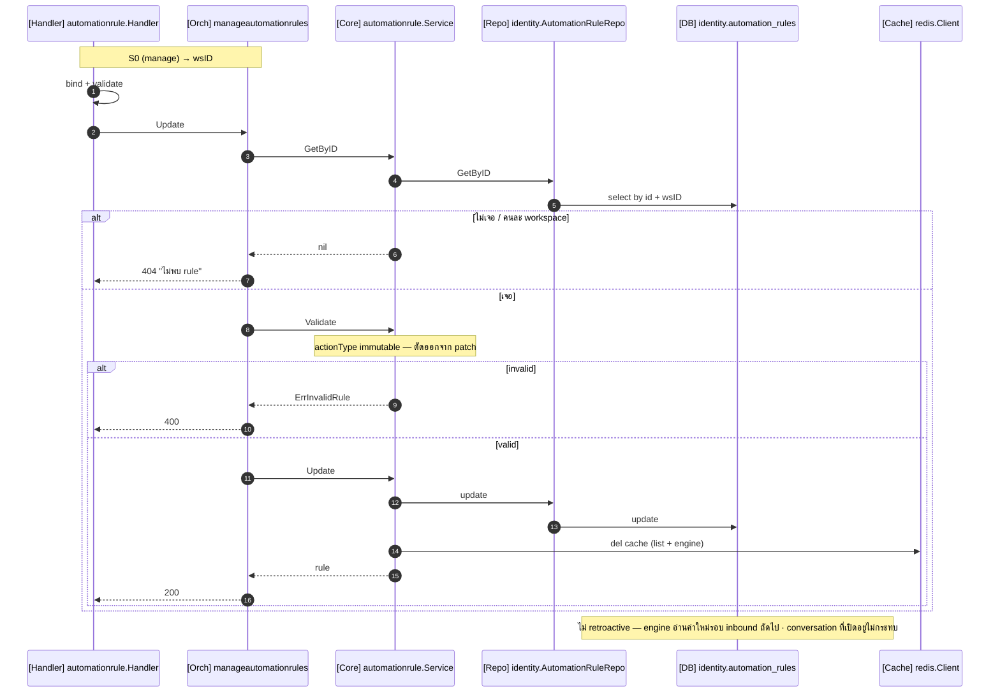
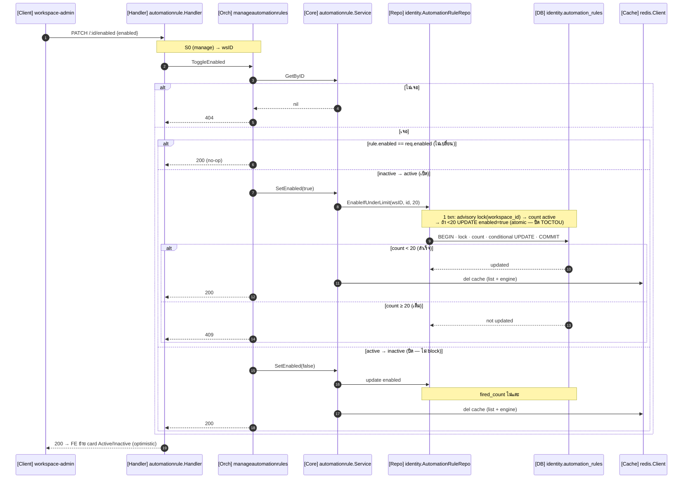
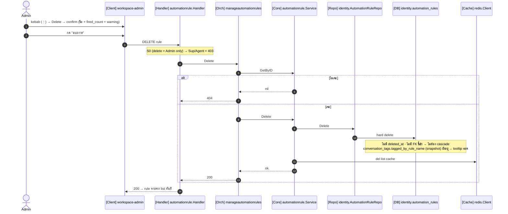
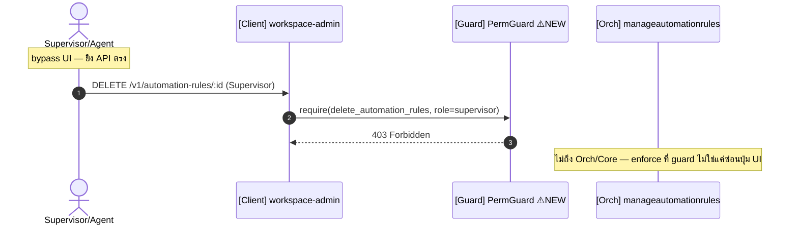

# RA-01 Rule Management (CRUD) — Sequence Diagram (Go / `ace-omnichat-go`)

> STORY: [ACE-2212](../ACE-2212_STORY-RA-01_Rule_Management_CRUD.md) · EPIC: [ACE-2211](../ACE-2211_EPIC-A4.1_Rule_Automation.md) · ER: [rule_automation_er_go.md](./rule_automation_er_go.md)
> Scope: **CRUD เท่านั้น** rule execution engine = RA-02/03/04 ไม่อยู่ในนี้
> Layering: `handler` → `orchestration` interface → **`core`** → `domain port` (repo) — ชื่อทุกตัว **verified กับ repo จริง** (ดู §Naming reference)

---

## Naming reference (verified จาก repo จริง)

| ใน diagram | สัญลักษณ์/ชื่อจริงใน repo | อ้างอิง |
|---|---|---|
| claims | `clerk.SessionClaimsFromContext(ctx)` → `claims.ActiveOrganizationID` (org_xxx), `claims.Subject` (userId) | `handler/conversation/handler.go:33` |
| resolve wsID | `o.resolveWorkspaceID(ctx, clerkOrgOrUUID)` — `len==36`→UUID else `WorkspaceRepository.GetIDByClerkOrgID` | `manageconversation/orchestrator.go:36` |
| response | `response.Success / Created / BadRequest / Unauthorized / NotFound / Conflict / UnprocessableEntity / InternalServerError` — body `{message, data}` | `delivery/http/response/response.go` |
| bind/validate | `c.Bind(&req)` แล้ว `c.Validate(&req)` (แยกกัน) | `handler/conversation/handler.go:39-43` |
| **Orch** | `manageautomationrules.Orchestrator` (interface ใน `port.go`) — method รับ `XxxInput` DTO | pattern: `manageconversation.Orchestrator` |
| **Core** | `core/automationrule.Service` (struct) | pattern: `core/notification.Service` |
| **Repo** | domain iface `domain/identity.AutomationRuleRepository` → impl `repository/postgres/identity/` — `List / GetByID / CountActive / Create / Update / SetEnabled / Delete` | pattern: `TagRepository`, `ConversationRepository` |
| **Redis** | `*redis.Client` (go-redis v9) — `Get / Set / Del(ctx, key, …)` | `infrastructure/cache/redis/redis.go` |
| logger | `logger.Component("automationrule_orch")` · `log.Error().Err(e).Str(k,v).Msg(…)` | `manageconversation/orchestrator.go:51` |

> **ทำไมมี Core (ไม่ใช่ pass-through):** `List/GetByID/Validate/CountActive/cache` ถูกใช้ทั้ง CRUD orchestrator (RA-01) และ execution engine `core/messaging` (RA-02+ ตอน eval โหลด active rules + validate) = capability shared ข้าม orchestrator จริง ตาม CLAUDE.md **Orch** = flow+policy (resolve, ตัดสิน limit-20) · **Core** = capability (repo+cache+validate)

---

## Participants

| diagram | ไฟล์จริง (ใหม่ ยกเว้นระบุ) |
|---|---|
| **FE** | `workspace-admin` settings/automation |
| **H** Handler | `delivery/http/handler/automationrule/handler.go` |
| **MW** AuthMW | `delivery/http/middleware/` (Clerk — มีอยู่แล้ว) |
| **PG** PermGuard ⚠️ | RBAC guard — **ยังไม่มีในrepo** (§หมายเหตุ) |
| **O** Orch | `usecase/orchestration/manageautomationrules/` |
| **C** Core | `usecase/core/automationrule/` (Service) |
| **Repo** | `repository/postgres/identity/automationrule_repository.go` |
| **R** Redis | `*redis.Client` — key `automation:rules:list:{wsID}` |
| **DB** | Postgres `identity.automation_rules` |

---

## S0 — Common preamble (auth + permission + resolve)

**Permission ต่อ endpoint** (enforce ที่ PermGuard):

| Method / Path | permission | role |
|---|---|---|
| `GET /v1/automation-rules` | `view_automation_rules` | Admin·Sup·Agent |
| `POST /v1/automation-rules` | `manage_automation_rules` | Admin·Sup |
| `PATCH /v1/automation-rules/:id` | `manage_automation_rules` | Admin·Sup |
| `PATCH /v1/automation-rules/:id/enabled` | `manage_automation_rules` | Admin·Sup |
| `DELETE /v1/automation-rules/:id` | `delete_automation_rules` | **Admin only** |

---

## S1 — List (GET) `counter X/20`

---

## S2 — Create (POST) `create-as-inactive · min 1 condition`

> ✅ **Decision: create-as-inactive** — create ที่ active=20 **ไม่ block**: insert `enabled=false` + return `forced_inactive:true` (wizard ทำงานจบ, FE แจ้ง toast) จุด enforce limit-20 ย้ายไปที่ **enable/toggle** (S4 → 409)
> ℹ️ STORY AC#1 Sc.2 + EPIC ยังเขียน "block create / ไม่เปิด wizard" — **superseded โดย diagram นี้** (เลือกไม่แก้ story) **dev ยึด create-as-inactive ตาม diagram** ไม่ใช่ AC เดิม

---

## S3 — Edit (PATCH /:id) `ไม่ retroactive`

---

## S4 — Toggle (PATCH /:id/enabled) `enforce limit-20`

> **no-op bailout:** enforce limit เฉพาะ transition `inactive→active` — re-enable ของที่ active อยู่แล้ว = no-op 200
> **atomic limit (ปิด TOCTOU):** count + write อยู่ใน **transaction เดียว** + `pg_advisory_xact_lock(workspace_id)` → op ที่เพิ่ม active (create S2 + enable S4) serialize ต่อ workspace → active **ห้ามเกิน 20 เด็ดขาด** ไม่ใช่ check-then-act repo ใช้ lock เดียวกันใน `CreateWithLimit` / `EnableIfUnderLimit` (คุมทั้ง 2 flow)

---

## S5 — Delete (DELETE /:id) `hard delete, Admin only`

---

## S6 — Permission enforced ที่ API (AC#4 Sc.3)

---

## หมายเหตุสำคัญ

**⚠️ PermGuard ยังไม่มีในrepo** — ค้น `internal/delivery/` ไม่เจอ role-gate สักจุด ต้องสร้าง: middleware map `(permission, role)→allow/deny` + resolve role จาก `identity.workspace_members.role` (cache ได้) role constant มีแล้ว: `ClerkRoleAdmin = "org:admin"` (`core/notification/service.go:40`) ควรแยกเป็น story — blast radius กว้างกว่า automation

**Repo interface placement (CLAUDE.md):** `AutomationRuleRepository` ควรนิยามใน `domain/identity/port.go` แล้ว `repository/postgres/identity` implement (หมายเหตุ: โค้ดจริงบางที่เช่น `manageconversation/port.go` นิยาม repo interface ใน orchestration — ขัด checklist ตามใหม่ควรวางใน domain)

**Error → response helper:**
| กรณี | helper | code |
|---|---|---|
| JWT/claims ไม่ถูก | `response.Unauthorized` | 401 |
| role ไม่มีสิทธิ์ | (PermGuard) | 403 |
| ไม่พบ rule / คนละ workspace | `response.NotFound` | 404 |
| bind/validate fail | `response.BadRequest` | 400 |
| **enable** ตอน active เต็ม 20 (create ไม่ block — inactive แทน) | `response.Conflict` | 409 |
| DB/infra error | `response.InternalServerError` (log ก่อน — CLAUDE.md) | 500 |

**Redis (Core เป็นเจ้าของ):** ทุก write → `C.Del(ctx,"automation:rules:list:{wsID}")` list = cache-aside (`Get`→miss→DB→`Set` 3600s) engine cache `automation:rules:{wsID}` (active-only) เป็นของ RA-02+ CRUD แค่ Del ให้
