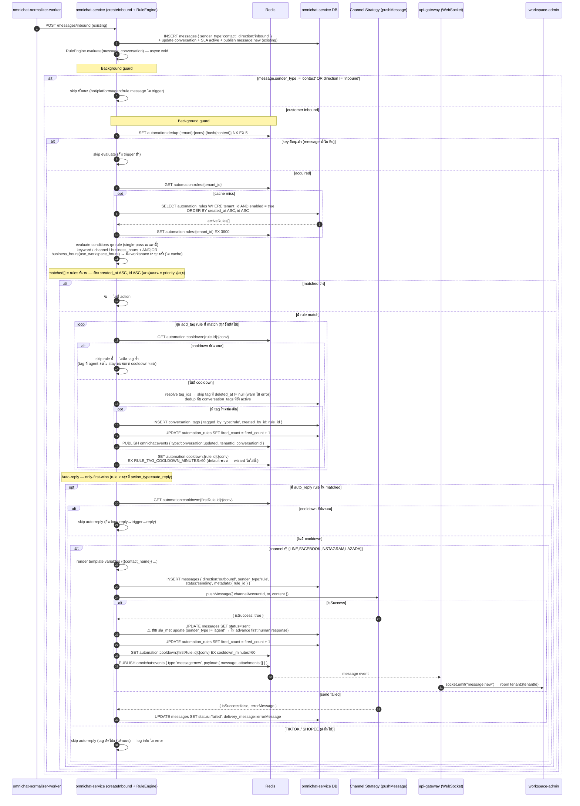

## Rule Execution Engine — Overview (EPIC ACE-2211)

> **Scope:** ภาพรวมการ "execute" rule ตอน message เข้า — **ไม่ใช่ STORY RA-01** (RA-01 = CRUD เท่านั้น)
> รายละเอียด design ลงในสตอรี่ย่อย: **RA-02** (conditions) · **RA-03** (auto-reply) · **RA-04** (auto-tag)
> EPIC: [ACE-2211](../ACE-2211_EPIC-A4.1_Rule_Automation.md) · ER: [RA-01_rule_automation_er.md](./RA-01_rule_automation_er.md) · CRUD: [RA-01_rule_automation_sequence.md](./RA-01_rule_automation_sequence.md)
> ไฟล์นี้ให้บริบทว่า field ที่ RA-01 สร้าง (`fired_count`, cooldown, `sender_type='rule'`, `tagged_by_type`) ถูกใช้ตอน execute อย่างไร

---

### Rule Execution Engine (inbound message → evaluate → execute)

ภาพรวม EPIC "Rule Execution Logic" — hook เพิ่มใน `createInbound()` ของ omnichat-service (ต่อจาก persist + SLA + publish `message:new` เดิม) แบบ **fire-and-forget** (void, ไม่ block inbound ingestion เหมือน AI auto-assign เดิม)

**Notes:**
- **hook point:** `RuleEngine.evaluate()` เรียกต่อท้าย `createInbound()` แบบ async void (fire-and-forget) เหมือน AI auto-assign เดิม (`messages.service.ts:307-317`) — ไม่ block การ ingest message
- **guard #1 (bot skip):** trigger เฉพาะ `sender_type='contact'` + `direction='inbound'` → bot/system/agent/rule message ไม่ fire (กันเคส Shopee notification มีคำว่า 'ยกเลิก')
- **guard #2 (dedup 5s):** `SET NX EX 5` keyed by content hash — ต่างจาก dedup 24h เดิมที่ webhook gateway (กันคนละชั้น)
- **only-first-wins:** auto-reply ส่งจาก rule เก่าสุด (created_at ASC) ที่ match — rule auto-reply อื่น skip แต่ **add_tag ของทุก rule ยังทำงาน** (ตาม EPIC: Rule B auto-reply skip แต่ tag shopee ติด)
- **SLA attribution (สำคัญ):** ปัจจุบัน `sendMessage()` set `sla_status='met'` ตอน push success โดยไม่เช็ค sender_type (`conversations.service.ts:765-795`) — auto-reply path ที่นี่ **ไม่เรียก** logic นั้น (sender_type='rule') → FRT/first-human-response ไม่ถูก advance โดย bot
- **cooldown per-conversation-per-rule (ครอบทั้ง 2 action):** key `automation:cooldown:{rule_id}:{conv}` SET หลัง action ทำงาน — **auto-reply** ใช้ `cooldown_minutes` ที่ตั้งใน wizard (กัน loop reply→trigger) · **add_tag** ใช้ default ระบบ `RULE_TAG_COOLDOWN_MINUTES` (wizard ไม่ให้ตั้ง — ค่าเริ่มต้นรอ PO เคาะ, เสนอ 60 นาที)
- **tag integrity (EPIC):** agent ลบ tag ที่ rule ติด → ในช่วง cooldown rule **ไม่ติดกลับ** (tag stay ลบ) จนกว่า cooldown หมด + มี message match ใหม่ — กันเคส "tag เด้งกลับทำให้ agent งง" ✅ · ปกติ (tag ยังอยู่) dedup-on-active กันซ้ำอยู่แล้ว, cooldown คุมเฉพาะเคส re-add หลังถูกลบ
- **channel capability:** เช็คก่อนส่งจาก `strategy.registry.ts` — TikTok `pushMessage` คืน not-supported, Shopee ไม่มี strategy → skip auto-reply เงียบ (tag ยังติด)
- **fired_count** เพิ่มเมื่อ action execute จริง (tag ติด / auto-reply ส่งสำเร็จ) — atomic `increment`
- **engine cache** `automation:rules:{tenant_id}` (active-only, created_at ASC) — อ่านที่นี่, **invalidate (DEL) โดย CRUD ทุกครั้งที่ save/toggle/delete** (ดู [RA-01 CRUD](./RA-01_rule_automation_sequence.md))

---

## Transport Reference (Execution)

| From                    | To                      | Protocol       | Key                                                          |
| ----------------------- | ----------------------- | -------------- | ------------------------------------------------------------ |
| omnichat-normalizer     | omnichat-service        | HTTP           | `POST /messages/inbound` (existing — trigger ของ engine)     |
| omnichat-service        | Channel Strategy        | in-process     | `StrategyRegistry.get(channel).pushMessage()` (auto-reply send) |
| omnichat-service        | Redis                   | GET/SET        | `automation:rules:{tenant_id}` (EX 3600 — engine active-rules cache; DEL โดย CRUD) |
| omnichat-service        | Redis                   | SET NX         | `automation:dedup:{tenant}:{conv}:{hash}` (EX 5)             |
| omnichat-service        | Redis                   | GET/SET        | `automation:cooldown:{rule_id}:{conv}` — auto_reply: `cooldown_minutes`×60 · add_tag: `RULE_TAG_COOLDOWN_MINUTES`×60 |
| omnichat-service        | Redis                   | PUBLISH        | `omnichat:events` (`message:new` / `conversation:updated`)   |
| Redis                   | api-gateway (WebSocket) | SUB message    | `omnichat:events`                                            |
| api-gateway (WebSocket) | workspace-admin         | Socket.io emit | `message:new` / `conversation:updated` → room `tenant:{tenantId}` |

---

## Changes to Existing Code (Execution)

| File / Layer                                                  | Change                                                                                         |
| ------------------------------------------------------------- | ---------------------------------------------------------------------------------------------- |
| `omnichat-service/src/automation/rule-engine.service.ts` (new) | `evaluate()` — guards (bot skip, dedup 5s), load active rules, evaluate conditions, execute actions (auto-reply + auto-tag) |
| `omnichat-service/src/messages/messages.service.ts`           | hook `RuleEngine.evaluate()` ต่อท้าย `createInbound()` (async void, fire-and-forget)            |
| `omnichat-service/src/conversations/conversations.service.ts` | `sendMessage()` SLA-met guard: skip เมื่อ `sender_type !== 'agent'` (auto-reply ของ rule ไม่ advance FRT) |
| `omnichat-service` channel strategies                          | ใช้ `StrategyRegistry.get(channel).pushMessage()` เดิม — เพิ่ม path ส่งจาก rule (sender_type='rule') |

> migration (`AutomationRule`, `tagged_by_type`, `sender_type` 'rule' value) ทำใน **RA-01** — execution แค่ "ใช้" field เหล่านั้น

---

## TODO Tracker (Execution — RA-02/03/04)

| ref     | งาน                                                              | story    | blocked by         |
| ------- | ---------------------------------------------------------------- | -------- | ------------------ |
| RA-02   | condition evaluation (keyword / channel / business_hours + AND/OR) | RA-02 | RA-01 engine skeleton |
| RA-02   | RuleEngine guards (bot skip, dedup 5s) + load/eval active rules  | RA-02    | RA-01              |
| RA-03   | auto-reply execute (template vars, cooldown, only-first-wins)    | RA-03    | RA-02              |
| RA-03   | SLA-met guard (skip `sender_type='rule'`) — ใน conversations.service | RA-03 | RA-03              |
| RA-04   | auto-tag execute (append-only, `tagged_by_type`, dedup, cooldown) | RA-04  | RA-02              |
