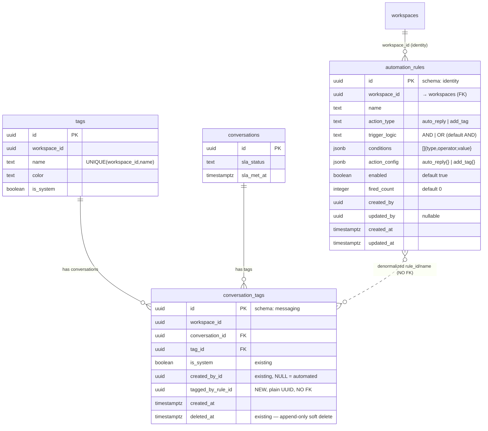

# Rule Automation — ER Diagram (Go / `ace-omnichat-go`)

> EPIC: [ACE-2211](./ACE-2211_EPIC-A4.1_Rule_Automation.md) · ครอบคลุม RA-01..RA-04
> Target: **Go repo** (`ace-omnichat-go`, GORM + raw SQL ใน `db/init/`). แผน NestJS/Prisma เดิม obsolete.
> Placement: **`identity` (config) — ตาม SLA pattern** rule definition = workspace config (อยู่ข้าง `SLAConfig`/`WorkspaceBusinessHour`); effect (tag/message) อยู่ `messaging` แบบ **denormalize ไม่มี FK ข้าม schema** เหมือน `conversation.sla_status` ที่ไม่ FK กลับ `SLAConfig`

---

## Domain placement: identity (SLA-style)

repo มี cluster ชัดเจน "**workspace config = `identity`**": `SLAConfig`, `SLAChannelConfig`, `WorkspaceBusinessHour`, `AgentWorkingHour` automation rule คือ config ตัวหนึ่งในนั้น → วางใน `domain/identity` + schema `identity`

precedent SLA: config อยู่ `identity` แต่ engine วิ่งใน message flow (`core/messaging`) อ่าน config ข้าม domain — **ทำแบบนี้อยู่แล้ว** เพราะงั้น automation ก็ทำตามได้

| layer                             | ที่                                                                             |
| --------------------------------- | ------------------------------------------------------------------------------- |
| Entity `AutomationRule` + ports   | `internal/domain/identity/` (ข้าง `SLAConfig`)                                  |
| Repository (GORM)                 | `internal/repository/postgres/identity/automationrule_repository.go`            |
| CRUD orchestrator (RA-01)         | `internal/usecase/orchestration/manageautomationrules/`                         |
| Engine eval+execute (RA-02/03/04) | `internal/usecase/core/messaging/core.go` `Process()` — อ่าน rules จาก identity |

**กฎเหล็กของ SLA-style ที่ต้องทำให้ครบ (ไม่ใช่ครึ่งๆ):**

1. `automation_rules` → schema `identity`
2. **ห้าม FK** `conversation_tags → automation_rules` — `tagged_by_rule_id` เป็น plain UUID
3. tooltip "tagged by rule: [ชื่อ]" → **snapshot ชื่อ rule ตอนติด tag** (`tagged_by_rule_name`) ข้อดี: hard-delete rule แล้ว tooltip ยังอยู่ — เหมือน SLA snapshot ค่า

---

## การตัดสินใจออกแบบ (อ่านก่อน)

| #   | เรื่อง                              | ตัดสิน                                                                       | เหตุผล                                                                                                                                                                                                                                                                 |
| --- | ----------------------------------- | ---------------------------------------------------------------------------- | ---------------------------------------------------------------------------------------------------------------------------------------------------------------------------------------------------------------------------------------------------------------------- |
| 1   | conditions + action เก็บแยกตาราง?   | **ไม่ — JSONB ใน `automation_rules` ตารางเดียว**                             | flat AND/OR (ไม่ nested) + 1 action/rule + max 20 rules/workspace → engine โหลดทุก active rule (≤20 แถว) เข้า memory แล้ว eval ไม่เคย query เนื้อใน condition ด้วย SQL การแตก 4 ตาราง (artifact เดิม) คือ over-normalize repo ใช้ JSONB อยู่แล้ว (`messages.metadata`) |
| 2   | 1 action หรือ multi-action ต่อ rule | **1 action/rule** (`action_type` เดี่ยว)                                     | ตรงกับ action-first wizard + STORY RA-01 ⚠️ EPIC execution example (Rule A มีทั้ง reply+tag) อ่านได้เป็น multi — **ต้องเคลียร์กับ PO** ถ้า multi จริง → `action_config` เปลี่ยนเป็น array                                                                              |
| 3   | tag → rule link ทำยังไง             | **`tagged_by_rule_id` (plain UUID, NO FK) + `tagged_by_rule_name` snapshot** | denormalize ตาม SLA pattern ไม่ FK ข้าม schema KPI "exclude auto-tagged" = `created_by_id IS NULL`; tooltip = `tagged_by_rule_name` (รอด hard-delete) ไม่ต้องมี `tagged_by_type` enum                                                                                  |
| 4   | cooldown เก็บที่ไหน                 | **Redis TTL key** (primary) — ER ไม่มีตาราง                                  | cooldown = ephemeral, TTL-shaped พอดี repo ใช้ Redis สำหรับ state แบบนี้แล้ว ถ้าต้องการ durable → ตาราง fallback ดู §ท้าย                                                                                                                                              |
| 5   | hard delete                         | `automation_rules` **ไม่มี `deleted_at`**                                    | STORY RA-01: hard delete ถาวร (FK ไม่มี → ลบได้เลย ไม่ต้องห่วง dependent rows)                                                                                                                                                                                         |
| 6   | `sender_type='rule'`                | ไม่แตะ schema                                                                | `messages.sender_type` เป็น TEXT อยู่แล้ว — แค่ allow ค่าใหม่ตอนเขียน (RA-03)                                                                                                                                                                                          |

---

## ER Diagram

> `}o..o{` (เส้นประ) = ความสัมพันธ์เชิง logic แบบ denormalize **ไม่มี FK constraint** ข้าม schema (เหมือน `conversation.sla_status` ↔ `SLAConfig`)
> **มีอยู่แล้ว**: `tags`, `conversation_tags`, `conversations`, `workspaces`
> **ใหม่**: `identity.automation_rules` (1 ตาราง) + ALTER `conversation_tags` (+2 column)
