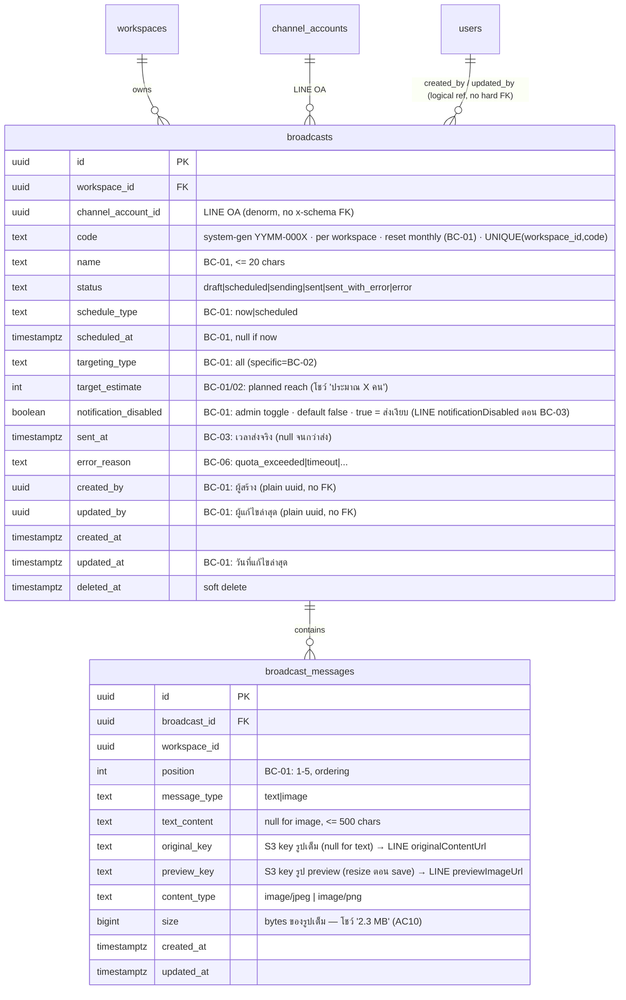

# STORY-BC-01: Create and Edit Broadcast — ER Diagram

**Source:** [ClickUp Doc — ER Diagram / EPIC-A5: Broadcast / STORY-BC-01](https://app.clickup.com/25605274/v/dc/rdd4u-133996/rdd4u-90236) | **Epic:** [ACE-2236](https://app.clickup.com/t/86d318wjb) | **Story:** [ACE-2294](https://app.clickup.com/t/86d32c7k4)

[View live diagram on mermaid.live](https://mermaid.live/edit#pako:eNqtVltrG0cU_iuHebEMkrySbNle6ofEScCkTluKISmCZbQ7Wm2zu7OdnY0sW4YklNYtfWoTStq-pKUECoE2tHT02l8y5Jd0ZrQrrW52A90HaXYu5_vOdy6z58ilHkE2IuxWgH2Go04M6hlQ9jBNsEtSyJ_RqFaj59BlFHsuTvl0wQY6iNPJMbeP45iEDnZdmsV6zxXHOuj9o3u34YMbHTQ5naWETdevA-0glxHMied0h7AFWeIVL5WQ-oGLQ2CkV4WYQh8zD-7c3Sxwls0t4jgRSVPsK-9tcGnMcaA9XDp9Ppkx3LPAK8Zq9OHd1UtTXZ3ZHChuq3cvyJmfmeoGFY_ElEXGydNa6vZJhMuO6oeTUz61p2INS08HpcOUk6jmkxgePDg-rlmWdR_--RsSwmaM9QQjKeEQKUX6oRL65mHNamzqhZN7Rx-d3K6U3atqtLVUYhytpGJMVuG9A2ha2n-WrrOQcsyzdNmCx3CPj7QYXhYSb5SS2AtiX_9z8-MMAt53CGOUjczvWoTchsOHCVnkaCvRBzOYORuBSh-Oo4SfTW14DuYr_IyzMISgp22tY8Ex8wlXHszRmLLAykAlTYgb9AL3QE8250QP4hnuxJSjyAWRqpZ5U1tW04Yk1BnnqUBjtw8VOX4qxddSvJLjb2BDih-l-EWK36V4KcUbKb6D-yDF51K82JjD7FIaEjx5jSnXzDAPaOx4QYq7SowSfS8KYuDU90OTYR7p4Szk0MNhaiY4ywgcKJjf5PhSii_l-LH-FX9J8bMUP0DFFEMZ5VYBIsVzKV4rdqDBWptrY6STohyekiwtGwziKyl-NT4XNMSl0eJPNYaKCaOZeiHFE6PXZXn32jIw-ecotVMaL0K3bfgsoxw75NQlxFOprEnTjI_q9XrZ4FzLmDXF5bpSvoifpBjL8VeamuKvB2-MCyryKhDalGknC12kDFFqtVdDjJ9oMfRApchTLeBUFSGkeHYdaDlGhV-Yr14vSM2HsURKBfAPE57vde4oItexW8fEIyFZhZTSHs8Xi6MXS3fG7GJ597tjZsTM3fkPV8zqNpDQNNCFsihSo7ZTBco8wlS3WZexuQNFM-ogvThS_cQnazuYGjv6GiWGRAeZculRBuaY6fY71jXtnrLAD2IcOg_J0Bj5uAV6aKpwrFuTLtPncqxK82VekRpC29iEt198C6ZRFGYOJ3ROWLgOMGHkUUAGOd4KwGIHVNS1GJyRUr9J8SNSAs03Hmlvr0DMJZpJa-TZ-jQhPowmWm0l85Hpam9yA4ZDOSO7Q64SzST3a9OyVin19vEzmG_zzXoLjm9uQOXGYcP6HwoyrwVURT4LPGTrjl5FEWER1q_IVILKI_X1olJIf9nll4CG1scSHH9CaVScZDTz-8g2N0QVTXDyj9fpLFOXPmGH-qsJ2ds7LWME2efoFNnNRru-be2099u7TWt_r9VqVNEQ2bWmtVu3Wu22SsVdq72_17yoojOD26g39xt7-3tta09t2rWa21VEvIBTdjz5ejYf0Rf_AsQO1sM)

## Migration constraints (ไม่ใช่ column · ใส่ตอน 15_broadcasts.sql)

- **broadcasts NOT NULL:** id, workspace_id, code, status · **nullable (draft เซฟไม่ครบได้ · soft validation):** channel_account_id, name, schedule_type, targeting_type, scheduled_at + send fields ทั้งหมด
- **broadcasts default:** status = 'draft' · notification_disabled = false · targeting_type = 'all'
- **UNIQUE (workspace_id, code)** + index: ix_broadcasts_workspace_status, ix_broadcasts_workspace_updated, ix_broadcasts_channel_account
- **broadcast_messages CHECK:** message_type='text' → text_content NOT NULL AND original_key/preview_key NULL · message_type='image' → original_key+preview_key NOT NULL AND text_content NULL
- **broadcast_messages UNIQUE (broadcast_id, position)** — กันลำดับซ้ำ · FK broadcast_id → broadcasts(id)

## Notes

- **ฟิลด์ที่ BC-01 เขียนค่าจริง:** code, name, status(=draft), schedule_type, scheduled_at, targeting_type(=all), target_estimate, notification_disabled, created_by, updated_by, created_at, updated_at, deleted_at + broadcast_messages ทั้งหมด (รวม original_key + preview_key)
- **รูปภาพ (image message):** ตอน save · put **รูปเต็ม → `original_key`** + **resize→ preview → `preview_key`** (ทั้งคู่ S3 private · key unique uuid ต่อ upload · ห้าม derive จาก position) · เก็บ content_type + size · preview ใช้ signed URL · ทั้ง 2 key ส่งเข้า LINE ตอน BC-03 (`originalContentUrl` + `previewImageUrl`)
- **size:** ขนาดไฟล์รูปเต็ม (bytes) · ไว้โชว์ "2.3 MB" (AC10) เท่านั้น
- **send fields (sent_at, error_reason):** BC-01 ปล่อย null
- **notification_disabled:** compose-time (admin toggle · default false) · BC-03 → LINE `notificationDisabled`
- **code:** gen ตอน create · YYMM-000X · per workspace · reset ทุกเดือน · `UNIQUE (workspace_id, code)` + NOT NULL · MAX(seq ของ workspace+เดือน รวม soft-deleted)+1 + retry · โชว์เป็น "Broadcast ID" · คนละตัวกับ UUID pk
- **created_by/updated_by:** plain uuid ไม่มี FK ข้าม schema · stamp = actorID (จาก resolveActor) · resolve ชื่อจาก identity.users ตอน GetById
- **ไม่อยู่ในตาราง broadcasts (story หลัง):** per-recipient → broadcast_recipients (BC-03), tag selection → broadcast_tags (BC-02 — ดู BC-02 ER Diagram)
