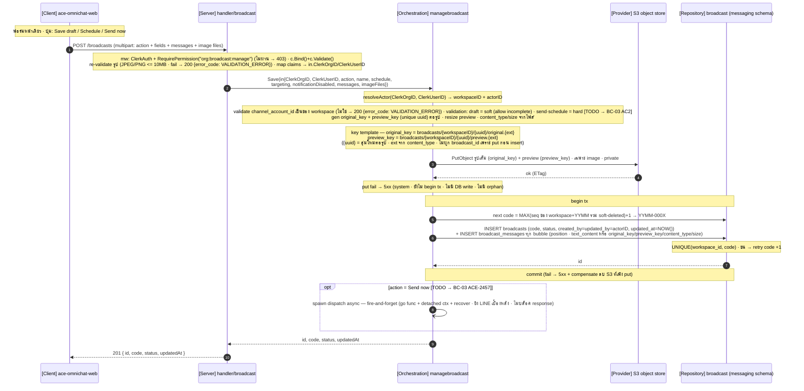
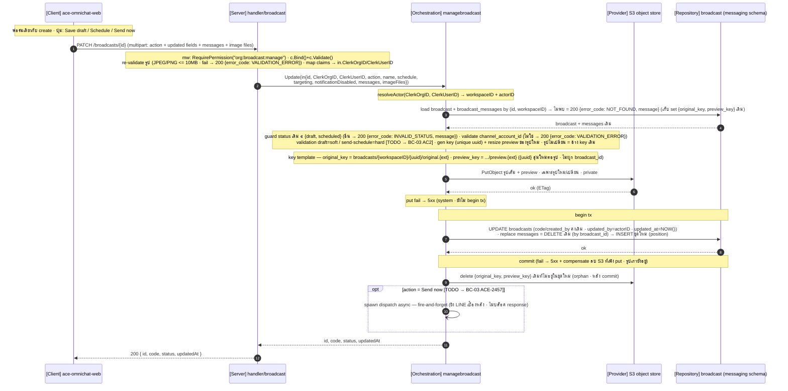
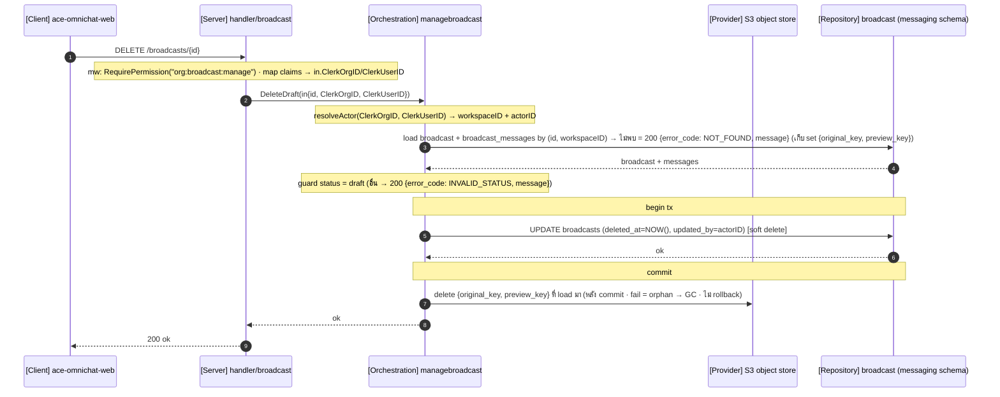
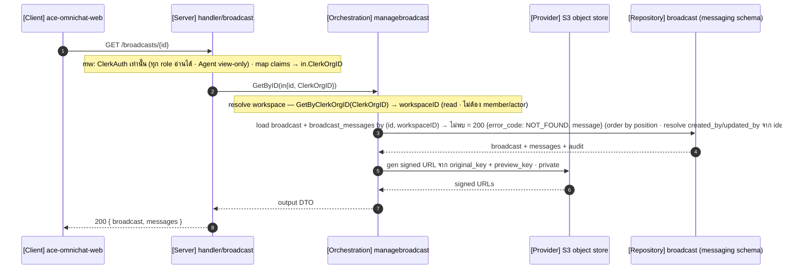
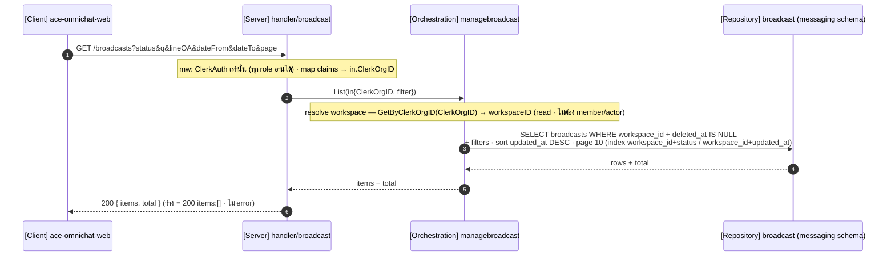
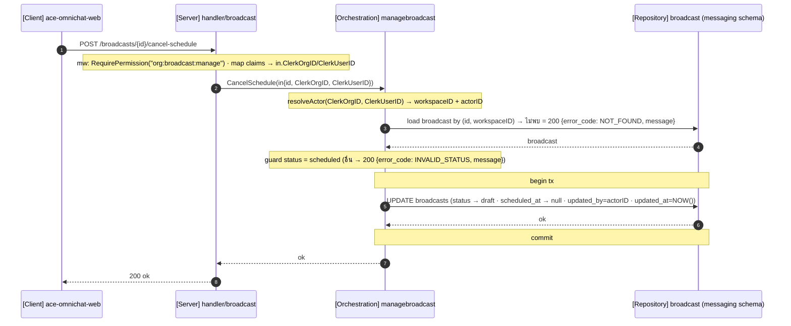

# STORY-BC-01: Create and Edit Broadcast — Sequence Diagrams

**Source:** [ClickUp Doc — Sequence Diagram / EPIC-A5: Broadcast / STORY-BC-01](https://app.clickup.com/25605274/v/dc/rdd4u-133996/rdd4u-90296) | **Epic:** [ACE-2236](https://app.clickup.com/t/86d318wjb) | **Story:** [ACE-2294](https://app.clickup.com/t/86d32c7k4)

Stack จริง = Go monolith ace-omnichat-go + Next.js ace-omnichat-web (base origin/dev)
Layering ตาม `_shared/ARCHITECTURE.md`: handler → orchestrator (interface) → repository port / provider port
orchestration package = `managebroadcast` · domain + repository package = `broadcast` (precedent automation) · DB schema = `messaging` · ไม่มี Core
ขอบเขต BC-01 = save + response · action draft = ทำครบในนี้ · send now = save แล้ว fire-and-forget dispatch (TODO → BC-03) · schedule = save status=scheduled แล้วจบ (worker ส่งทีหลัง = BC-03)

**Actor resolution:** handler map claims.ActiveOrganizationID/claims.Subject → in.ClerkOrgID/in.ClerkUserID (DTO) · orchestrator resolveActor(ClerkOrgID, ClerkUserID) → (workspaceID, actorID) ผ่าน GetByClerkOrgID + member lookup · ไม่ส่ง claims เข้า orchestrator

**Error convention:** business error → HTTP 200 + `{ error_code, message }` (NOT_FOUND · INVALID_STATUS · VALIDATION_ERROR) · success → 200/201 + data · system/infra (S3 put, DB) → 5xx · permission (mw RequirePermission) = 403 [ดูหมายเหตุ]

**Transaction:** mutation ห่อ DB write ด้วย tx (begin/commit) · S3 put อยู่นอก tx (ก่อน) · commit fail → compensate ลบ S3 ที่เพิ่ง put · ลบ S3 orphan/objects ทำหลัง commit

**รูปภาพ:** ตอน save · รูปเต็ม → original_key + resize preview → preview_key (S3 private · key unique uuid) · ส่ง LINE ตอน BC-03 (originalContentUrl + previewImageUrl)

**Broadcast code** = YYMM-000X · per workspace · reset ทุกเดือน · gen ตอน save · โชว์เป็น "Broadcast ID"
Delete / List / Cancel Schedule = AC ของ BC-05/BC-06 (implement จริงตอน BC-05/06)

**Permission (RBAC):** mutation ผูก `RequirePermission("org:broadcast:manage")` · read ไม่ gate · key ใหม่ ต้องสร้างใน Clerk Dashboard

## 1. Create — POST /broadcasts (multipart)

## 2. Edit — PATCH /broadcasts/{id} (multipart)

## 3. Delete — DELETE /broadcasts/{id}

## 4. Get by ID — GET /broadcasts/{id}

## 5. List — GET /broadcasts

## 6. Cancel Schedule — POST /broadcasts/{id}/cancel-schedule

## หมายเหตุ (จุดที่รวบเพื่อความกระชับ)

- **Error convention** — business error → HTTP 200 + `{ error_code, message }` (FE โชว์ message ได้เลย ไม่ต้อง handle HTTP error) · error_code: NOT_FOUND (by-id ไม่พบ/cross-workspace) · INVALID_STATUS (status guard) · VALIDATION_ERROR (รูป/channel/required) · system/infra (S3 put fail, DB error) → 5xx · success → 200/201 + data
- **Handler convention** — business error → response 200 + error_code (helper ใหม่ เช่น `BusinessError(c, code, msg)`) · ไม่ใช้ response.NotFound/Conflict (4xx) สำหรับ business · system → InternalServerError(500) · เหตุผล: HTTP status = signal ให้ monitoring/Grafana (อนาคต) — business error ไม่ควรปนใน error rate · CLAUDE.md ("wrong tenant → 404") = convention เดิม ยังไม่อัปเดต (ไม่ใช่เราผิด) · repo-wide + แก้ CLAUDE.md = doc task แยก (lead เคาะ)
- **Permission (403) คงเดิม** — RequirePermission เป็น shared mw (rbac.go return 403) · เป็น auth layer ไม่ใช่ business/domain error · ถ้าจะให้ 403 → 200+code ด้วย = ต้องแก้ mw กลาง (กระทบทั้ง repo) · แยก flag เป็น task ต่างหาก
- **Workspace scoping** — by-id op load WHERE id + workspace_id → ไม่พบ = 200 {error_code: NOT_FOUND} (มาสก์ cross-workspace ด้วย code เดียวกัน → ไม่ leak) · list scope workspace_id
- **status guard** — edit ∈ {draft, scheduled} · delete = draft · cancel = scheduled · ผิด → 200 {error_code: INVALID_STATUS}
- **Transaction** — mutation ห่อ DB write ด้วย begin tx ... commit · S3 put นอก tx (ก่อน) · commit fail → 5xx + compensate ลบ S3 ที่เพิ่ง put · ลบ S3 orphan/objects หลัง commit · read (get/list) ไม่มี tx
- **Common skeleton (6 เส้น pattern เดียวกัน)** — FE→API → Note(mw · bind/validate · map claims) → API→ORCH(in{...}) → Note(resolve) → [by-id: load →ไม่พบ 200 NOT_FOUND] → [Note guards] → [S3 put นอก tx] → begin tx → REPO write → commit → [S3 cleanup] → [opt Send now] → ORCH→API → API→FE
- **รูปภาพ (2 objects/image)** — original_key (รูปเต็ม → originalContentUrl) + preview_key (resize ตอน save → previewImageUrl) · S3 private · key unique uuid ต่อ upload (ห้าม derive จาก position) · preview ในหน้า = signed URL · size = โชว์ "2.3 MB" (AC10)
- **broadcast_messages handling** — Create: INSERT ทุก bubble (position) · Edit = full replace: load เดิม (เก็บ 2 key set) → put รูปใหม่ → tx DELETE เดิม → INSERT ชุดใหม่ → หลัง commit ลบ S3 orphan · full-replace เพราะ leaf + position จาก FE
- **Fire-and-forget (Send now)** — spawn goroutine ก่อน return (go func + detached ctx + recover) · ORCH-)ORCH มาก่อน ORCH-->>API · ส่งจริง = BC-03 (อาจใช้ asynq queue เพื่อ durability)
- **send fields (sent_at, error_reason)** — BC-01 ปล่อย null
- **Actor resolution** — resolveActor(ClerkOrgID[, ClerkUserID]) → (workspaceID[, actorID]) · read ใช้แค่ workspaceID · mutation ใช้ actorID (created_by/updated_by)
- **Save → response → action** — draft = BC-01 ทำครบ · schedule = status scheduled (worker BC-03) · send now = status sending · fire-and-forget (BC-03)
- **Response body** — create 201 { id, code, status, updatedAt } · edit 200 { id, code, status, updatedAt } · business error 200 { error_code, message } · UI = FE ตัดสินจาก action/status/error_code
- **notification_disabled** — compose-time (admin toggle · default false) · BC-03 → LINE notificationDisabled
- **Broadcast code** — MAX(seq ของ workspace+เดือน รวม soft-deleted)+1 → YYMM-000X · UNIQUE (workspace_id, code) · ชน → retry +1
- **Package / schema / layering** — package broadcast · orchestration managebroadcast · schema messaging · handler → orchestrator → repo/S3 · ไม่มี Core
- **targeting** = everyone อย่างเดียว · specific/tags = BC-02
