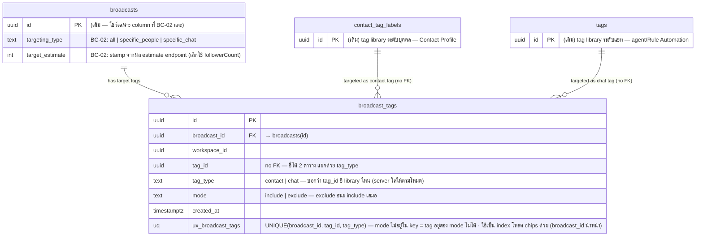

# STORY-BC-02: Audience Selection and Targeting — ER Diagram

**Epic:** [ACE-2236](https://app.clickup.com/t/86d318wjb) | **Story:** [ACE-2295](https://app.clickup.com/t/86d32c89v) | คู่กับ [Sequence Diagram](ACE-2236_ACE-2295_STORY-BC-02_Sequence_Diagram.md) · [API Reference](ACE-2236_ACE-2295_STORY-BC-02_API.md)

> **DECISION (ทีม, 2026-07-13): targeting แยก 3 โหมด — `all` | `specific_people` (tag คน) | `specific_chat` (tag แชท)** · เป็น radio · include เป็น tag ชนิดเดียวตามโหมดเสมอ · สอง library เป็นคนละตาราง → `tag_id` ใส่ FK ไม่ได้ ใช้ `tag_type` บอกว่าชี้ตารางไหน
> **(2026-07-14): โหมด `all` ไม่มี tag เลย** (เคยเคาะให้มี exclude — ทาง A — แล้วตัดออกวันเดียวกัน) — tag ทุกแถวชนิดเดียวตามโหมดเสมอ · server ใส่ tag_type ให้เองตามโหมด (payload ไม่ส่ง type)

**DDL ใหม่ของ BC-02 มีตารางเดียว:** `messaging.broadcast_tags` (ชื่อ confirm โดยทีม — ตาม convention join table `contact_tags`/`conversation_tags` · BC-01 ER เคยจองชื่อ "broadcast_targets" ไว้ · หมายเหตุ: แถวในตารางนี้คือ *tag ที่ใช้คัดกลุ่มเป้าหมาย* ไม่ใช่ label ที่ติดตัว broadcast · ผู้รับจริงรายคน = `broadcast_recipients` ของ BC-03)
`broadcasts` ไม่มี DDL ใหม่ — `targeting_type` เป็น TEXT อยู่แล้ว แค่เริ่มใช้ค่าใหม่ 2 ตัว · ตารางอื่นทั้งหมดเป็นของเดิม (read path ของ estimate)

[View live diagram on mermaid.live](https://mermaid.live/edit#pako:eNqdVd9rG0cQ_leGhYBEZVLyKOhD6yYQXELSkLcDsb4dW0vubpW7vcSuZbDSUP-gT8UhOCkFO5hAQsBxG7L32r9kyF9SdlZ3OkluCT2EOHZnvv125vvmdkRsFIq-wPx7LTdzmUYZAMC1a0DVHrlDcn-QuyR3Qe4puffk9qn6mdw7cqdUHcB3qytf34DPe8dA7jkHvub_fchRKhhJO4QmE7CwOpUWoROb7DHmhbTaZEUPYpNZGduBVphZbTUWvYZHvWflZohsEmdLPqDoBsqvqNond9Liu0fumNxfnrJ7Qe4DVYd-PVzCeerH5CqO2yf3iaoDzjyh6plH8fc9gTvGYgFfwf17P8B06T4-KjGLEeZKt54bqWJZ2ALqZzxeWTE7sx0mDn2IxFAWYGW-iRb8WiQCRuvOg0SuY1L8B0bIRwWyqBM9GHQyA7fWujUmx88_X4g5lEuAC1cNiTth1T9lqVX9rhXcXbt6awagFdxag0h8_uW3VgU7WjX8F3OfmPxhMZIxDrS6OsJXTyuIBPOeqvSI3EcvAN_bY6oO4caSdKmakDsjNwkR5N6QO2M0uz3CNh-LW7Z9mt-HSNRdGIfahYNfsqgmHs0L7LKm11CCRK_nMt8G5vbOK6xTYP4Y8yC4tz4vmM-TCpxPqXraKLn7b9xSozwvncVJqRDGgFvhzVOr35nICbkLqOPYEm8Z-_0ctE6xsDId2Z8gzlFaVANpW014NNNYuTVYkEkkHty5fe_BzU67-71pOXpNHbtMjplzQU5rX56xWQ-mJnyI2_ANy3Nu09PmmbMA0LT970-hqkcshtncAJ0p3IK6rOd-QMRDPSpgTg1z5IHr9mdoGsdcNq3YXTLLslHYIRCJTntWBdl4GkesmV8XBjLEJinTDHimfZwNY1bvc3IXy2oIrtZZI1TO6INMEhhDMcJYb-h4MEIzSrC94mXcRtOZhSnaoBnqDRxLA8gdMNEJud_Jnc-GP2ZqZDxCuO45X3fSNAM2TJKYJ5ivmjKzy3W8YjZ-UT27LJLGY97tF7z5gb35kpwj94x_51z71amL7-ZmQye4ROTKmfc_jvb9OiL3gg-Vm5jZ6z-WCcK3pTUpf-haR4ueSDFPpVaiL3YiYYeYYiT6kVC4IcvERmJX7P4DuBB5Yg)

## Migration constraints (ใส่ตอน implement — ทั้ง `db/init/` และ Jenkins liquibase `changes/dev/NNN.sql`)

- **broadcast_tags: ทุก column NOT NULL** (ไม่มี column ที่ nullable เพื่อ draft — draft ที่ยังไม่เลือก tag ก็แค่ไม่มีแถว)
- **UNIQUE (broadcast_id, tag_id, tag_type)** — กันเลือก tag ซ้ำ · tag_type อยู่ใน key เพราะ id ข้าม 2 library ทางทฤษฎีชนกันได้ · **mode จงใจไม่อยู่ใน key** → tag หนึ่งมีได้แถวเดียวต่อ broadcast = อยู่ทั้ง include และ exclude พร้อมกันไม่ได้ตั้งแต่ระดับ DB
- **mode NOT NULL** — ค่า include | exclude · ไม่ใส่ DEFAULT (app เขียนค่าชัดเจนทุกแถวจาก payload — DEFAULT ไม่มีวันถูกใช้)
- **FK broadcast_id → messaging.broadcasts(id)** · **tag_id ไม่มี FK** (ชี้ได้ทั้ง contact_tag_labels และ tags — dual library แยกด้วย tag_type · pattern เดียวกับ channel_account_id ที่ denorm ไม่มี cross-schema FK)
- **ไม่มี index แยก** — unique index ของ `UNIQUE(broadcast_id, tag_id, tag_type)` มี broadcast_id เป็น column แรก ครอบ query โหลด chips (`WHERE broadcast_id = ?`) อยู่แล้ว (ของ BC-01 `ix_broadcast_messages_broadcast` ที่ซ้ำกับ UNIQUE เป็น artifact ไม่ใช่ pattern ที่ตั้งใจ)
- **ไม่มี soft delete** — full-replace (delete + re-insert) ใน transaction เดียวกับ broadcasts/broadcast_messages ตาม precedent ของ broadcast_messages

## Notes

- **tag_type (contact|chat):** บอกว่า tag_id ชี้ library ไหน → โค้ดใช้เลือกทาง JOIN (contact → `contact_tags(contact_id)` ดูที่ตัวคน · chat → `conversation_tags(conversation_id)` ดูที่ห้องแชทของ OA ที่เลือก) และเลือกตารางที่ใช้ resolve ชื่อตอน GET · ทุกแถวชนิดเดียวตาม targeting_type เสมอ — **server ใส่ tag_type ให้เองตามโหมด (payload ไม่ส่ง type)** · ยังเก็บต่อแถวเพราะอยู่ใน UNIQUE key + แถว self-describing (BC-03 อ่านแล้วรู้ทาง JOIN ไม่ต้องย้อนดู targeting_type)
- **mode (include|exclude):** exclude ชนะ include — `recipients = (ผ่านเงื่อนไข include ของโหมด · everyone = ทุกคน) AND NOT (exclude-match)` · exclude เป็น optional เฉพาะโหมด specific — โหมด everyone ไม่มีแถวในตารางนี้เลย · validation บังคับ include ≥ 1 เฉพาะโหมด specific
- **ทำไมเป็นตารางลูก ไม่ใช่ JSONB บน broadcasts:** (1) GET ต้อง JOIN library ตาม tag_type เพื่อได้*ชื่อปัจจุบัน* — tag ถูก rename → chip โชว์ชื่อใหม่เอง · tag ถูก soft-delete → JOIN ไม่ติด = chip หายเอง ไม่ broadcast หา audience ของ tag ที่ถูกลบไปแล้ว (2) BC-03 dispatch ต้อง JOIN จาก tag_id ไปหา contact ตรงๆ
- **แถวที่ tag ต้นทางถูกลบไปแล้ว:** ปล่อยไว้ได้ (orphan ไม่มีพิษ) — ทุก read path JOIN + `deleted_at IS NULL` กรองออกเองทั้งตอนโชว์ chip, estimate และตอนส่ง · ไม่ต้อง cascade
- **Estimate ไม่เขียนอะไรลง DB** — pure read · `broadcasts.target_estimate` เป็นแค่ snapshot ตอนกด save (โชว์ในหน้า list/detail) · เลขจริงตอนส่ง = BC-03 resolve สดจาก broadcast_tags
- **เงื่อนไข "reach ได้บน OA นี้" ใน query:** `conversations.channel_account_id = OA` join กับ `contact_identities.channel_type='line'` — เพราะ contact_identities unique ที่ (workspace, channel_type, external_id) ไม่ผูก channel_account · conversations คือตัวผูก contact↔OA ตัวเดียวในระบบ · chat tag match เฉพาะห้องแชทของ OA ที่เลือก
- **Field ที่ BC-02 เขียนค่าจริง:** broadcast_tags ทั้งตาราง + broadcasts.targeting_type (ค่าใหม่ 2 ตัว) + broadcasts.target_estimate (เปลี่ยนแหล่งเลขเป็น estimate endpoint)
