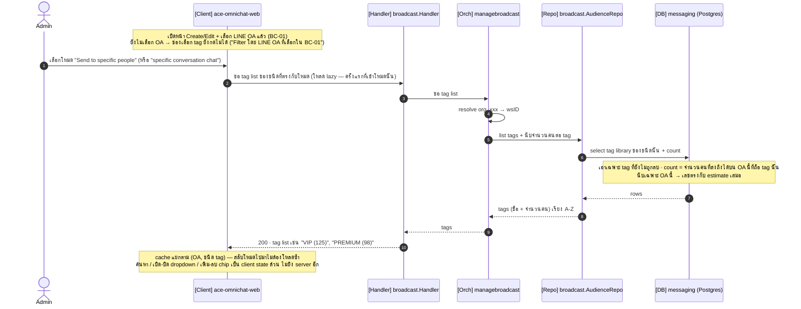
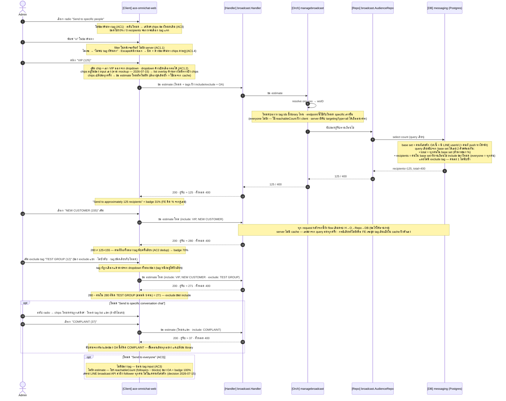
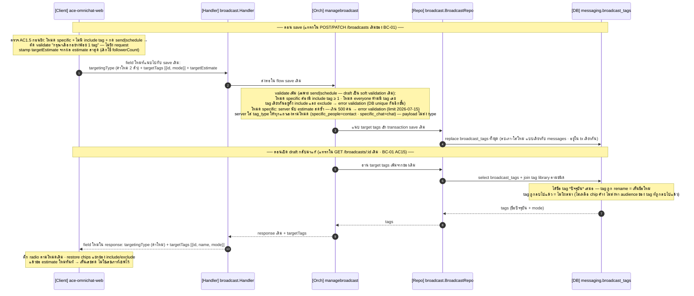

# STORY-BC-02: Audience Selection and Targeting — Sequence Diagrams

**Epic:** [ACE-2236](https://app.clickup.com/t/86d318wjb) | **Story:** [ACE-2295](https://app.clickup.com/t/86d32c89v) | คู่กับ [ER Diagram](ACE-2236_ACE-2295_STORY-BC-02_ER_Diagram.md) · [API Reference](ACE-2236_ACE-2295_STORY-BC-02_API.md) · [FAQ](ACE-2236_ACE-2295_STORY-BC-02_FAQ.md)

ออกแบบจาก user story + โค้ดจริง base origin/dev ของ ace-omnichat-go + ace-omnichat-web (BC-01 merge แล้ว)
Layering ตาม `_shared/ARCHITECTURE.md`: handler → orchestrator (interface) → repository port · ไม่มี Core (logic ใช้ที่เดียว) · orchestration package = `managebroadcast` (เพิ่ม method ใน package เดิม ไม่สร้างใหม่)

**ขอบเขต BC-02** = เลือก audience ด้วย tags + estimated reach แบบ real-time · การ resolve รายชื่อผู้รับจริงตอนส่ง = BC-03

> **DECISION (ทีม, 2026-07-13): targeting แยกเป็น 3 โหมด — ไม่รวม tag สองชนิดใน dropdown เดียว** · **(2026-07-14): โหมด everyone ไม่มีช่อง tag เลย** (เคยเคาะทาง A ให้มี exclude แล้วตัดออก — ดู [FAQ Q6](ACE-2236_ACE-2295_STORY-BC-02_FAQ.md))
> **(2026-07-15): โหมด everyone = follower ทั้งหมดของ OA ไม่ใช่แค่คนที่เคยทัก** — LINE broadcast API ส่งถึงเพื่อนทุกคนของ OA โดยไม่ต้องรู้ userId รายคน → estimate โหมด everyone ใช้ `reachableCount` (followers − blocks จาก ACE-2503) ฝั่ง client ไม่ยิง estimate endpoint · นิยาม "reach ได้บน OA นี้" ที่ผูกกับ conversations ใช้เฉพาะ**โหมด specific** (tag มีได้เฉพาะ contact ที่รู้จักใน DB — targeted push ต้องใช้ userId จาก webhook)
> **(2026-07-15): โหมด specific มี limit 500 คน** — estimate เกิน → **block** ที่ send|schedule (draft ยังเซฟได้ตาม soft validation) · const ในโค้ด (`MaxAudienceRecipients` ฝั่ง Go + `MAX_AUDIENCE_RECIPIENTS` ฝั่ง web) · โหมด everyone **ไม่จำกัด** · **คนละเรื่องกับเลข 500/batch ของ BC-03** (นั่นคือ chunk ตอนส่ง) · ยังไม่มี AC รองรับ — อยู่ในรายการแก้ AC ท้ายไฟล์
> 1. **Send to everyone** — ทุกคนใน LINE OA ที่เลือก (ไม่มีช่อง tag — ซ่อน tag input ตาม AC3)
> 2. **Send to specific people** — กรองด้วย **tag ระดับบุคคล** (`contact_tag_labels` จาก Contact Profile)
> 3. **Send to specific conversation chat** — กรองด้วย **tag ระดับแชท** (`tags` ที่ agent/Rule Automation ติดที่ห้องแชท)
>
> เป็น radio = เลือกได้ทีละโหมด · include ของ broadcast หนึ่งเป็น tag ชนิดเดียวเสมอ (ตามโหมด) — หมดปัญหาชื่อ tag ซ้ำข้าม library · dropdown ทุกช่องเป็นชนิดเดียวล้วน ไม่ merge
> **ต้องตามแก้:** story AC + mockup ยังเขียนตามดีไซน์เก่า — รายการเต็มรวมไว้ที่เดียวในหัวข้อ "หมายเหตุ / ส่งต่อ" ท้ายไฟล์

**Include/Exclude semantics (epic scope — confirm แล้วว่าทำใน BC-02):** include = union (มี include tag ตัวใดตัวหนึ่ง) · exclude = ตัดทิ้ง (มี exclude tag ตัวเดียวก็หลุด — **exclude ชนะ include เสมอ**) · exclude เป็น optional เฉพาะโหมด specific (ชนิดเดียวตามโหมด) · validation: โหมด specific บังคับ include ≥ 1 · โหมด everyone ห้ามมี tag เลย (ทั้ง include และ exclude)

**ของเดิมที่ reuse:** `WorkspaceCore` (org_xxx → workspace UUID) · pattern full-replace ของ `broadcast_messages` · error convention · zod + React Query ฝั่ง web

**นิยาม "reach ได้บน OA นี้":** contact ที่มี `conversations` row กับ channel_account นั้น + มี `contact_identities` channel_type='line' · เหตุผล: `contact_identities` unique ที่ (workspace, channel_type, external_id) ไม่ผูก channel_account — ตารางเดียวที่ผูก contact↔OA คือ conversations · และ LINE push ต้องใช้ userId จาก webhook เท่านั้น → contact ใน DB คือเซ็ตที่ส่งได้จริง (ไม่ใช่ followerCount)

**Error convention:** business error → HTTP 200 + `{ error_code, message }` · success → 200/201 + data · infra → 5xx (log ก่อนเสมอ) · ตาม precedent BC-01

---

## Naming reference (ชื่อจริง — ใน diagram ใช้คำ simple)

| ใน diagram | ชื่อจริง |
|---|---|
| ขอ tag list | `GET /v1/broadcasts/audience/tags?channelAccountId=&type=contact\|chat` → `Orchestrator.ListAudienceTags(in)` (ใหม่) |
| ขอ estimate | `GET /v1/broadcasts/audience/estimate?channelAccountId=&targetingType=&includeTagIds=&excludeTagIds=` → `Orchestrator.EstimateAudience(in)` (ใหม่) |
| save broadcast | `POST /v1/broadcasts` · `PATCH /v1/broadcasts/:id` (multipart เดิมของ BC-01 + field `targetTags` JSON `[{id,mode}]` + `targetingType` + `targetEstimate`) → `Create/Update` (ขยายของเดิม) |
| โหลด broadcast | `GET /v1/broadcasts/:id` → `GetByID` (ขยาย response เพิ่ม `targetTags [{id,name,mode}]`) |
| **Repo (audience)** | domain iface `domain/broadcast.AudienceRepository` (ใหม่) → impl `repository/postgres/broadcast` — `ListTags / Estimate` |
| **Repo (save)** | `domain/broadcast.BroadcastRepository` เดิม — `Create/Update/GetByID` ขยายให้รับ/คืน target tags |
| resolve wsID | `WorkspaceCore.GetByClerkOrgID(org_xxx)` → workspaceID (UUID column ห้ามรับ org_xxx — CLAUDE.md) |
| ตรวจสิทธิ์ | GET ใหม่ทั้งสองตัวไม่ gate (Agent read-only ตาม epic) · save ใช้ `RequirePermission("org:broadcast:manage")` เดิม |
| targeting_type | `all` \| `specific_people` \| `specific_chat` (ค่าใหม่ 2 ตัว · column เดิม) |

---

## 1. โหลด tag list ตามโหมดที่เลือก (GET)



## 2. เลือก/ลบ tag + estimate แบบ real-time (GET)



โครง query estimate — ตัวอย่างโหมด `specific_people` (**รันพิสูจน์กับ DB local แล้วทั้งสอง library** — dedup, exclude-wins, chat tag → นับเป็นคน, tag ไม่มีคนถือ = 0, ~6ms):

```sql
SELECT COUNT(DISTINCT cv.contact_id) FILTER (WHERE
         -- include: มี include tag อย่างน้อย 1
         EXISTS (SELECT 1 FROM messaging.contact_tags ct
                 WHERE ct.contact_id = cv.contact_id
                   AND ct.tag_id = ANY(@includeTagIds) AND ct.deleted_at IS NULL)
         -- exclude: มี exclude tag ตัวเดียวก็หลุด (exclude ชนะ include)
     AND NOT EXISTS (SELECT 1 FROM messaging.contact_tags ct
                 WHERE ct.contact_id = cv.contact_id
                   AND ct.tag_id = ANY(@excludeTagIds) AND ct.deleted_at IS NULL)
       ) AS recipients,
       COUNT(DISTINCT cv.contact_id) AS total
FROM messaging.conversations cv
JOIN messaging.contact_identities ci
  ON ci.contact_id = cv.contact_id AND ci.channel_type = 'line'
 AND ci.workspace_id = cv.workspace_id
WHERE cv.workspace_id = @ws AND cv.channel_account_id = @oa
```

โหมด `specific_chat` ใช้โครงเดียวกันทุกบรรทัด เปลี่ยนแค่สอง subquery เป็น `messaging.conversation_tags` โดย match ที่ `cvt.conversation_id = cv.id` — ดูเฉพาะห้องแชทของ **OA ที่เลือก** (แชทติด tag บน OA อื่นไม่นับ)
โหมด `everyone` ไม่ใช้ query นี้ — FE โชว์ `reachableCount` ของ OA ตรงๆ (decision 2026-07-15) · server ยังรองรับ `targetingType=all` (คืน `recipients = total` = base set) แต่ไม่มี caller

## 3. Save + เปิด draft กลับมาแก้ (POST/PATCH · GET) — ส่วนที่เพิ่มจาก BC-01

Diagram นี้โชว์**เฉพาะ step ที่ BC-02 เพิ่ม** — flow save เต็ม (auth, bind/validate, resolve actor, upsert broadcast, replace messages, รูปภาพ S3, gen code, response) เป็นของเดิมทั้งหมด ดู [BC-01 Sequence Diagram](ACE-2236_ACE-2294_STORY-BC-01_Sequence_Diagram.md)



## Schema ใหม่

ตาราง `messaging.broadcast_tags` — โครงสร้าง column และ migration constraints ทั้งหมดอยู่ใน [BC-02 ER Diagram](ACE-2236_ACE-2295_STORY-BC-02_ER_Diagram.md)

---

## เหตุผลการออกแบบ (design decisions)

**1. Targeting แยก 3 โหมด — dropdown ละชนิด ไม่ merge**
การรวมสอง library ใน dropdown เดียวสร้างปัญหาที่ต้องออกแรงแก้: ชื่อ tag ซ้ำข้าม library ได้ ("VIP" สองแถวหน้าตาเหมือนกันคนละ count), ต้องมี badge/section แยกชนิด, และ estimate ต้อง dedup ข้าม library — แยกเป็นคนละโหมด radio ตัดปัญหาทั้งสามทิ้งพร้อมกัน: หนึ่ง broadcast = tag ชนิดเดียว, dropdown สะอาด, dedup เหลือแค่ในชนิดเดียวกัน · ราคาที่จ่าย: user เลือกผสมสองชนิดพร้อมกันไม่ได้ ซึ่งตรงเจตนา business อยู่แล้ว (กลุ่มเป้าหมาย "คนประเภทนี้" กับ "แชทเรื่องนี้" เป็นคนละแคมเปญกัน)

**2. Endpoint tags ตัวเดียวรับ `type=contact|chat` — ไม่ reuse `GET /v1/contact-tags` / `GET /v1/tags` เดิม**
เหตุผลที่ไม่ reuse ของเดิมทั้งที่มีอยู่: (a) `GET /v1/tags` (chat) **ไม่มี count เลย** และ count ที่ AC1.1 ต้องการคือจำนวน**คน** (distinct contact ผ่านห้องแชทของ OA นี้) — เป็น query ใหม่อยู่ดี (b) `GET /v1/contact-tags` มี usageCount แต่นับทั้ง workspace ไม่ scope OA — เลขจะไม่ตรงกับ estimate (c) เขียนที่เดียวได้ semantics เดียวกันทั้งสองชนิด: "จำนวนคนที่ส่งถึงได้บน OA นี้" จักรวาลเดียวกับ estimate · FE โหลด lazy เฉพาะชนิดที่ user เข้าโหมด และ cache แยก (oaId, type)

**3. Estimate คำนวณใน DB ด้วย query เดียว ไม่บวกเลขฝั่ง FE**
AC2 มีตัวอย่างจงใจดัก: VIP(125) + New Customer(155) ต้องได้ **280 ไม่ใช่ 325** — คนที่ถือทั้งสอง tag นับครั้งเดียว `COUNT(DISTINCT contact_id)` ได้ dedup ฟรีตาม AC4 ส่วน "ภายใน 2 วินาที" การันตีด้วยการเป็น query เดียวที่มี index รองรับ (`ix_contact_tags_tag`, `ix_ctag_conv`) และคืน `recipients` + `total` พร้อมกันด้วย `FILTER` clause → FE คำนวณ badge `280/400 = 70%` ได้โดยไม่ยิงสองรอบ · **พิสูจน์กับ DB local แล้วทั้งสอง library**: contact tag dedup ถูก, chat tag นับเป็นคนถูก (include chat[Conv1] → 1), tag ไม่มีคนถือ = 0, ~6ms

**4. นิยาม "reach ได้บน OA นี้" (ผูกกับ conversations) ใช้เฉพาะโหมด specific — โหมด everyone ใช้ reachableCount** *(แก้ 2026-07-15 — เดิมเขียนให้ทุกโหมดใช้ estimate endpoint)*
สองโหมดส่งด้วยกลไก LINE คนละตัว เลยได้เลขคนละจักรวาลอย่างถูกต้อง:
- **everyone** → LINE **broadcast API** ส่งถึง*เพื่อนทุกคน*ของ OA โดยไม่ต้องรู้ userId รายคน → เลขที่ตรงคือ `reachableCount` (followers − blocks, ACE-2503) — client โชว์+stamp เลขนี้เลย ไม่ยิง estimate endpoint
- **specific (people/chat)** → targeted push (multicast) ต้องใช้ userId จาก webhook → เซ็ตที่ส่งได้จริงคือ contact ใน DB ที่มี `conversations` row กับ OA นั้น + LINE identity (`contact_identities` unique ที่ `(workspace, channel_type, external_id)` ไม่ผูก channel_account — conversations คือตัวผูก contact↔OA ตัวเดียว) และ tag ก็มีได้เฉพาะ contact/ห้องแชทที่รู้จักอยู่แล้ว → estimate จาก DB query
`targetEstimate` ที่เซฟ = เลขเดียวกับที่โชว์ในโหมดนั้น (everyone = reachableCount · specific = ผล estimate) — AC คุมแค่เลขที่*โชว์* แต่เซฟเลขเดียวกันเพื่อไม่ให้หน้า list ขัดกับที่ user เห็นตอน compose · ผลตามมา: % badge ของโหมด specific คิดจาก base set ใน DB (คนที่ push หาได้จริง) ไม่ใช่จาก follower ทั้งหมด

**5. Tag หลายตัวในโหมดเดียวกัน = OR (union)**
AC4: "Has **at least one** included tag" = union ไม่ใช่ intersection — `tag_id = ANY(@includeTagIds)` ใน EXISTS เดียวครอบทุก include tag ของโหมดนั้น · โหมด chat: match เฉพาะห้องแชทของ OA ที่เลือก (`cvt.conversation_id = cv.id`) — แชทติด tag บน OA อื่นไม่นับ · scope `workspace_id` ใน WHERE ทำให้ยิง channelAccountId ข้าม workspace ได้แค่ 0 — ไม่รั่วข้อมูล ไม่ต้อง verify แยกอีกรอบ

**6. เก็บ tag ที่เลือกเป็นตารางลูก `broadcast_tags` แบบ full-replace**
ต้อง persist เพราะ (a) draft reload ต้อง restore chips (BC-01 AC15) (b) **BC-03 ต้อง resolve audience ตอน dispatch จริง** — target_estimate เป็นแค่ snapshot ตัวเลข ใช้ส่งไม่ได้ · รูปแบบ delete + re-insert ใน transaction เดียว ลอกจาก broadcast_messages ที่มี precedent ในโค้ดแล้ว ("full-replaces the message set")
ทำไมไม่ใช้ JSONB บน broadcasts: ตอน GET ต้อง JOIN library เพื่อได้*ชื่อปัจจุบัน* (rename → chip ชื่อใหม่เอง, soft-delete → หายจาก chip เอง) และตอน BC-03 ต้อง JOIN หา contact — ตารางลูกทำทั้งคู่ตรงๆ
ตัวอย่าง: broadcast B โหมด specific_people include [VIP, NEW CUSTOMER] exclude [TEST GROUP] → 3 แถว `(B, vip_id, contact, include)`, `(B, newcust_id, contact, include)`, `(B, testgrp_id, contact, exclude)`

**7. Column `tag_type` เก็บต่อแถว โดย server ใส่ให้เองตามโหมด (payload ไม่ส่ง `type`)**
tag ทุกแถวของ broadcast เป็นชนิดเดียวตาม targeting_type เสมอ → server derive tag_type ได้เอง ไม่ต้องเชื่อค่าจาก client (ตัดเคส type ขัดโหมดทิ้งตั้งแต่ต้นทาง — ไม่มีแถวตายเงียบๆ) · แต่ยังเก็บ tag_type ลง DB ต่อแถวเพราะ (a) อยู่ใน UNIQUE key — id ข้าม 2 library ทางทฤษฎีชนกันได้ (b) แถว self-describing: BC-03/BC-06 อ่านแล้วรู้ทาง JOIN โดยไม่ต้องย้อนดู targeting_type (c) requirement เปลี่ยน (เช่น everyone กลับมามี exclude) ไม่ต้อง migrate

**8. Validation สองชั้น: FE ทันที + server เฉพาะ send/schedule**
AC1.5 (ขอบแดง "กรุณาเลือกอย่างน้อย 1 tag") เป็น UX — จบที่ zod refine ในฟอร์มเดิม แต่ server ต้อง mirror เพราะ FE โดน bypass ได้เสมอ โดยเช็คเฉพาะ `action=send|schedule` — draft เซฟโหมด specific + 0 tags ได้ตาม precedent BC-01 AC14 "Draft save does soft validation" · server ตรวจเพิ่ม: tag ซ้ำสอง mode → VALIDATION_ERROR · **limit 500 (2026-07-15):** โหมด specific — FE โชว์กล่อง estimate เป็นสีแดง real-time ทันทีที่เลขเกิน + กัน submit ส่วน server นับซ้ำด้วย estimate query เดียวกัน ณ ตอน save (เลขที่ user เห็น = เลขที่ถูกบังคับ) → เกิน = VALIDATION_ERROR · FE เช็คไม่ได้ตอน estimate ยังโหลดไม่เสร็จ → ปล่อยผ่านให้ server จับ (backstop) · error กลับตาม convention: HTTP 200 + error_code ซึ่งฝั่ง web มี `throwIfBusinessError` ดักอยู่แล้ว — ไม่ต้องแตะ error plumbing

**9. Search/chip เป็น client state ล้วน — network เฉพาะโหลด tags กับ estimate**
AC1.1–1.4 (filter real-time, dropdown ค้างเปิด, chip กลับเข้า list A-Z, Escape ปิด · chips อยู่ในช่อง input ตาม mockup — list overlay ไม่บัง chips, 2026-07-15) เป็น interaction ระดับ keystroke — tag ทั้ง workspace มีจำกัด (หลักสิบถึงร้อย) โหลดก้อนเดียวแล้ว filter ใน memory เร็วกว่าและไม่มี loading state กะพริบ · estimate ผูก React Query key `[oaId, targetingType, includeIds, excludeIds]` → เพิ่ม/ลบ chip = refetch เอง, เลือกชุดเดิมซ้ำ = cache hit · ไม่ต้อง debounce เพราะคลิก chip เป็น discrete event · `keepPreviousData` กันเลขกะพริบ

**10. เพิ่ม method ใน managebroadcast เดิม ไม่สร้าง orchestration package ใหม่ ไม่มี Core**
Audience selection เป็นส่วนหนึ่งของ use case broadcast · logic ใช้ที่เดียว ไม่แชร์กับ orchestrator อื่น → ตามกฎ architecture: orchestrator เรียก repository ผ่าน domain port ตรงๆ (แบบเดียวกับ BroadcastRepository เดิม) เพิ่ม interface `AudienceRepository` ใน `domain/broadcast/port.go` implement ใน `repository/postgres/broadcast` · ทุก method resolve org_xxx → workspace UUID ผ่าน WorkspaceCore ก่อนเสมอ (กฎเหล็ก: UUID column ห้ามรับ Clerk id)

**11. สอง endpoint ใหม่เป็น GET ไม่ gate permission**
Pure read ทั้งคู่ ตาม epic "Agent: read only permission for broadcast features" — GET เดิมอย่าง /v1/broadcasts ก็ไม่ gate · write มี org:broadcast:manage ครอบแล้ว · GET ทำให้ React Query cache ตาม params ตรงไปตรงมา

**12. Exclude tags: exclude ชนะ include เสมอ และกันความขัดแย้งที่ DB**
Semantics: `recipients = (ผ่านเงื่อนไข include ของโหมด) AND NOT (มี exclude tag ใดๆ)` — คนที่ถือทั้ง VIP (include) และ BLACKLIST (exclude) **ไม่ถูกส่ง** เพราะเจตนาของ exclude คือ "ห้ามส่งหาคนกลุ่มนี้เด็ดขาด" การส่ง broadcast เป็น irreversible → เลือกข้างที่พลาดแล้วเจ็บน้อยกว่า (ส่งขาดดีกว่าส่งเกิน) · `UNIQUE(broadcast_id, tag_id, tag_type)` จงใจ**ไม่รวม mode** → tag หนึ่งมีได้แถวเดียวต่อ broadcast = อยู่ทั้งสอง mode พร้อมกันไม่ได้ตั้งแต่ระดับ DB (UI สะท้อนด้วยการเอา tag ที่เลือกแล้วออกจาก dropdown ทั้งสองช่อง) · exclude เป็น optional เฉพาะโหมด specific (โหมด everyone ไม่มีช่อง tag เลย) ส่วน validation บังคับ include ≥ 1 เฉพาะโหมด specific · **พิสูจน์กับ DB local แล้ว**: include match + exclude match → 0 (exclude ชนะ)

**13. Count ใน dropdown scope ตาม OA ที่เลือก**
Feature list ของ story เขียนตรงๆ: "Filter โดย LINE OA ที่เลือกใน BC-01" และกันเลขชนกัน: ถ้า dropdown โชว์ VIP(125) ทั้ง workspace แต่เลือกแล้ว estimate ได้ 110 เฉพาะ OA ผู้ใช้จะงง — scope เดียวกันทำให้ dropdown, estimate, % badge เป็นเลขจักรวาลเดียวกันเสมอ · ผลตามมา: tag selector disabled จนกว่าจะเลือก OA (UI เดิมมีข้อความ "Select a LINE OA to see the estimated reach" รองรับแล้ว) · เปลี่ยน OA = tag list refetch (queryKey มี oaId)

---

## หมายเหตุ / ส่งต่อ

- **AC/mockup ต้องถูกแก้ให้ตรงดีไซน์ (รายการเต็ม — ที่เดียว):**
  - BC-01 AC3: radio 2 ตัว → 3 ตัว
  - BC-02 AC1.1: tag list ต่อโหมด (ไม่ใช่ list รวม)
  - เพิ่ม AC ฝั่ง exclude (ยังไม่มีสักข้อ): พฤติกรรมช่อง exclude โหมด specific · ตัวอย่างเลข estimate เมื่อมี exclude (เช่น include 280 − ติด exclude 9 = 271) · error เมื่อเลือก tag เดียวกันสอง mode
  - เพิ่ม AC limit 500 (requirement 2026-07-15 — ยังไม่มีสักข้อ): estimate เกิน 500 ในโหมด specific → กล่อง estimate แดง + block send/schedule · draft ยังเซฟได้ · โหมด everyone ไม่จำกัด
  - mockup: เพิ่ม radio "Send to specific conversation chat" + ช่อง exclude ในโหมด specific
- **Quota validation with plan-aware warnings** โผล่ใน feature list ของ BC-02 แต่**ไม่มี AC รองรับสักข้อ** — เลื่อนไป BC-03 (Send) ซึ่งเป็นจุดที่ quota ถูกใช้จริง · ควร confirm กับ PO ก่อนถือว่าอยู่ใน scope นี้
- **Exclusion tags อยู่ใน scope BC-02** (ตาม epic Scope/DoD) — ออกแบบรวมแล้ว (mode + NOT EXISTS + ช่อง exclude แยกใน UI)
- **"Send to everyone ยกเว้น tag X" — ตัดออกจากดีไซน์ (2026-07-14):** เคยเคาะทาง A (การ์ด everyone มีช่อง exclude 2 dropdown) แล้วทีมตัดทิ้งวันเดียวกัน — โหมด everyone ไม่มีช่อง tag เลย ตรงกับ AC3 เดิม ("ซ่อน tag input") · schema รองรับอยู่แล้วถ้าอนาคตกลับมาทำ (เก็บ `targeting_type=all` + แถว `mode=exclude` ได้เลย ไม่ต้อง migrate) · ประวัติ + ทางเลือกดูใน [FAQ Q6](ACE-2236_ACE-2295_STORY-BC-02_FAQ.md)
- **Audience freeze:** ไม่ freeze ตอน schedule — BC-01 AC2.1 ระบุ scheduled ทำ "flow เดียวกับ Send now ทุกขั้นตอน" = resolve audience สดตอน dispatch (นี่คือเหตุผลที่ persist *tag ที่เลือก* ไม่ใช่ persist *รายชื่อคน*)
- **BC-03 handoff:** โหมด specific — query resolve รายชื่อผู้รับจริงใช้ WHERE เดียวกับ estimate (ต่างแค่ `COUNT` vs `SELECT ci.external_id`) — นี่คือกลไกที่ทำให้ "estimate matches actual" ตาม AC4 เป็นจริงโดยโครงสร้าง ไม่ใช่โดยความพยายาม · **โหมด everyone — ส่งด้วย LINE broadcast API** (`POST /v2/bot/message/broadcast` ถึง follower ทุกคน) ไม่ resolve รายชื่อจาก DB (decision 2026-07-15) — เลข actual = ที่ LINE ส่งจริง สอดคล้องกับ reachableCount ที่โชว์ · **limit 500 ต้อง re-check ตอน dispatch** — audience ไม่ freeze scheduled broadcast ที่ผ่าน validation ตอนเซฟอาจโตเกิน 500 ก่อนถึงเวลาส่ง พฤติกรรมตอนเกิน ณ dispatch (fail ทั้งก้อน? error reason อะไร?) เป็น decision ของ BC-03
- ตาราง `broadcast_tags` ต้องมีทั้งใน `db/init/` (local docker) และ Jenkins `liquibase-np` (`changes/dev/NNN.sql`) ตอน implement จริง
