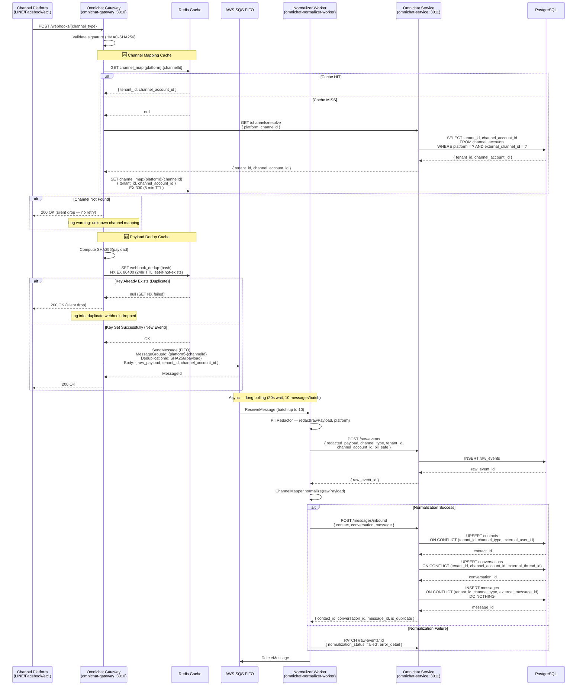
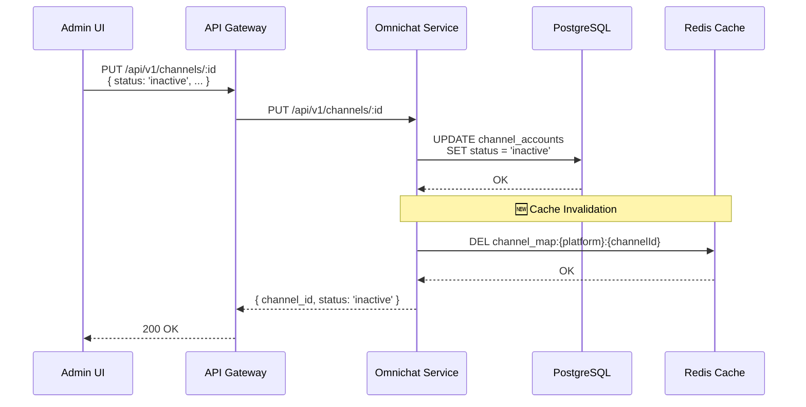
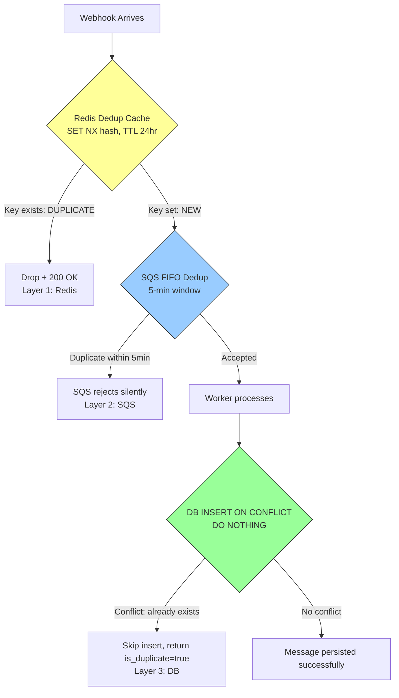

# ACE-972: Webhook Caching — Sequence Diagram

## Context

เพิ่ม caching layer ให้กับ inbound webhook flow เพื่อลด DB load และ duplicate processing โดยมี 2 ส่วนหลัก:

1. **Channel Mapping Cache** — cache `{channelId → tenant_id, channel_account_id}` ที่ Gateway เพื่อลด DB lookup ทุก request
2. **Payload Deduplication Cache** — เช็ค SHA256 hash ใน Redis ก่อนส่ง SQS เพื่อ reject duplicate webhook นอกเหนือจาก SQS FIFO 5-min dedup window

### Cache Strategy

| Cache | Storage | TTL | Invalidation |
|-------|---------|-----|-------------|
| Channel Mapping | Redis | 5 minutes | On channel config update (publish invalidation event) |
| Payload Dedup | Redis | 24 hours | Auto-expire (TTL only) |

---

## 1. Inbound Message Flow with Webhook Caching (Full)

แสดง flow เต็มตั้งแต่ webhook เข้ามาจนถึง persist โดยเน้น caching layer ที่เพิ่มเข้ามา



---

## 2. Channel Mapping Cache Invalidation

เมื่อ channel config ถูกแก้ไข (เช่น disable channel, เปลี่ยน tenant) ต้อง invalidate cache



---

## 3. Deduplication — Defense in Depth

แสดง 3 ชั้นของ deduplication ที่ทำงานร่วมกัน



---

## Cache Key Design

| Cache | Key Pattern | Value | TTL | Notes |
|-------|------------|-------|-----|-------|
| Channel Mapping | `channel_map:{platform}:{channelId}` | `{ tenant_id, channel_account_id, status }` | 5 min | Invalidate on channel config change |
| Payload Dedup | `webhook_dedup:{sha256_hash}` | `1` (flag) | 24 hr | `SET NX` — atomic check-and-set |

### Examples

```
# Channel Mapping
channel_map:line:U1234567890abcdef → { "tenant_id": "t_001", "channel_account_id": "ca_123" }

# Payload Dedup
webhook_dedup:a3f2b8c9d1e4... → 1
```

---

## Comparison: Before vs After

| Aspect | Before (No Cache) | After (With Cache) |
|--------|-------------------|-------------------|
| Channel resolve | DB query every request | Redis GET (sub-ms) → DB only on cache miss |
| Duplicate webhook | SQS 5-min dedup + DB ON CONFLICT | Redis 24hr dedup → SQS 5-min → DB ON CONFLICT |
| Gateway latency | ~50-100ms (DB lookup + SQS) | ~5-10ms (cache hit) / ~50-100ms (cache miss) |
| DB load (resolve) | O(n) queries per n webhooks | O(1) per TTL window per channel |
| Duplicate protection window | 5 min (SQS) | 24 hr (Redis) + 5 min (SQS) + forever (DB) |
