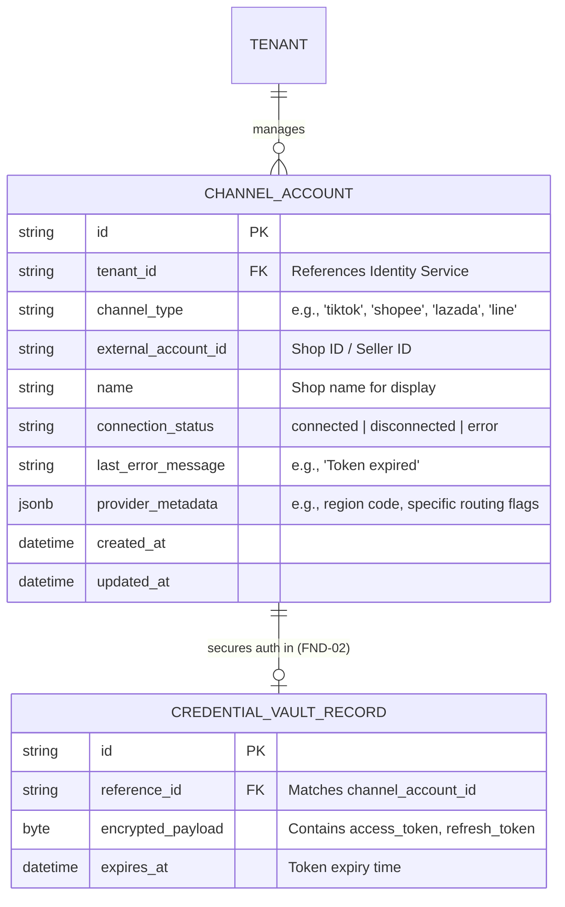

```mermaid
erDiagram
    TENANT ||--o{ CHANNEL_ACCOUNT : manages
    CHANNEL_ACCOUNT ||--o| CREDENTIAL_VAULT_RECORD : "secures auth in (FND-02)"
    CHANNEL_ACCOUNT {
        string id PK
        string tenant_id FK "References Identity Service"
        string channel_type "e.g., 'tiktok', 'shopee', 'lazada', 'line'"
        string external_account_id "Shop ID / Seller ID"
        string name "Shop name for display"
        string connection_status "connected | disconnected | error"
        string last_error_message "e.g., 'Token expired'"
        jsonb provider_metadata "e.g., region code, specific routing flags"
        datetime created_at
        datetime updated_at
    }

    CREDENTIAL_VAULT_RECORD {
        string id PK
        string reference_id FK "Matches channel_account_id"
        byte encrypted_payload "Contains access_token, refresh_token"
        datetime expires_at "Token expiry time"
    }

    %% Note: MARKETPLACE_POLLING_STATES is introduced in ACE-702, but associates to CHANNEL_ACCOUNT directly
```
