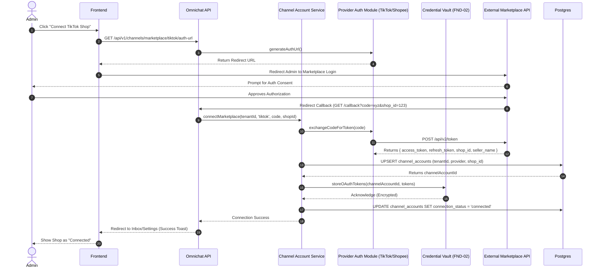

# Marketplace Connect & Callback Sequence

```mermaid
sequenceDiagram
    autonumber
    actor Admin
    participant Frontend
    participant API as Omnichat API
    participant ChannelService as Channel Account Service
    participant ProviderAuth as Provider Auth Module (TikTok/Shopee)
    participant CredVault as Credential Vault (FND-02)
    participant Platform as External Marketplace API
    participant DB as Postgres

    Admin->>Frontend: Click "Connect TikTok Shop"
    Frontend->>API: GET /api/v1/channels/marketplace/tiktok/auth-url
    API->>ProviderAuth: generateAuthUrl()
    ProviderAuth-->>Frontend: Return Redirect URL
    Frontend->>Platform: Redirect Admin to Marketplace Login
    
    Platform-->>Admin: Prompt for Auth Consent
    Admin->>Platform: Approves Authorization
    
    Platform->>API: Redirect Callback (GET /callback?code=xyz&shop_id=123)
    API->>ChannelService: connectMarketplace(tenantId, 'tiktok', code, shopId)
    
    ChannelService->>ProviderAuth: exchangeCodeForToken(code)
    ProviderAuth->>Platform: POST /api/v2/token
    Platform-->>ProviderAuth: Returns { access_token, refresh_token, shop_id, seller_name }
    
    ChannelService->>DB: UPSERT channel_accounts (tenantId, provider, shop_id)
    DB-->>ChannelService: Returns channelAccountId
    
    ChannelService->>CredVault: storeOAuthTokens(channelAccountId, tokens)
    CredVault-->>ChannelService: Acknowledge (Encrypted)
    
    ChannelService->>DB: UPDATE channel_accounts SET connection_status = 'connected'
    
    ChannelService-->>API: Connection Success
    API-->>Frontend: Redirect to Inbox/Settings (Success Toast)
    Frontend-->>Admin: Show Shop as "Connected"
```
