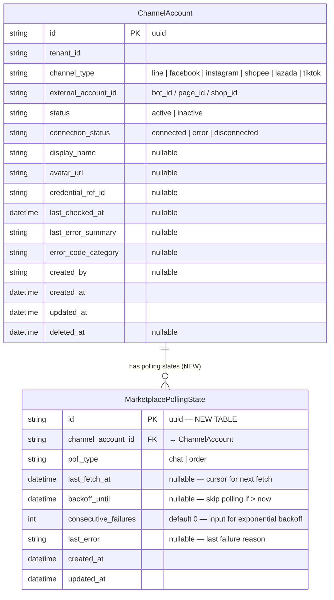

# ACE-702 — ER Diagram: Scheduled Polling Framework v1

**Story:** STORY-MKT-02: Scheduled Polling Framework v1 for Marketplace Ingest
**Epic:** EPIC-ACE-33
**Date:** 2026-03-10
**Source:** `apps/omnichat-service/prisma/schema.prisma`

---

## Schema Changes in This Story

### NEW Table: `MarketplacePollingState`

Stores the polling cursor (`last_fetch_at`) and backoff state per account per poll_type, to prevent duplicate data fetching and to skip accounts currently in backoff.

### UPDATED Model: `ChannelAccount`

Add relation `polling_states MarketplacePollingState[]`

---

## ER Diagram — New & Updated



---

## Constraints & Indexes — MarketplacePollingState (NEW)

| Type | Columns | Purpose |
|------|---------|---------|
| `@@unique` | `(channel_account_id, poll_type)` | 1 state record per account per poll type |
| `@@index` | `(backoff_until)` | Fast lookup to skip accounts still in backoff |
| `@relation` | `channel_account_id → ChannelAccount.id` | FK constraint |

---

## Prisma Schema Diff

```prisma
// ===== UPDATED: ChannelAccount — add relation =====
model ChannelAccount {
  // ... existing fields ...
+ polling_states MarketplacePollingState[]   // NEW relation
}

// ===== NEW: MarketplacePollingState =====
model MarketplacePollingState {
  id                   String    @id @default(uuid())
  channel_account_id   String
  poll_type            String    // chat | order
  last_fetch_at        DateTime?
  backoff_until        DateTime?
  consecutive_failures Int       @default(0)
  last_error           String?
  created_at           DateTime  @default(now())
  updated_at           DateTime  @updatedAt

  channel_account ChannelAccount @relation(fields: [channel_account_id], references: [id])

  @@unique([channel_account_id, poll_type])
  @@index([backoff_until])
  @@map("marketplace_polling_states")
}
```

---

## Field Descriptions

| Field | Description |
|-------|-------------|
| `channel_account_id` | FK to `ChannelAccount` — identifies which account this state belongs to |
| `poll_type` | Type of data being polled: `chat` (messages) or `order` (orders) |
| `last_fetch_at` | Timestamp of the last successful fetch — used as the `since` cursor for the next cycle to avoid duplicates |
| `backoff_until` | If set and > now, the orchestrator skips this account for the current cycle |
| `consecutive_failures` | Number of consecutive failures — used to calculate exponential backoff (1→2→4→8→16 min cap) |
| `last_error` | Most recent error message, e.g. `"rate_limited"`, `"API returned 500"` |
