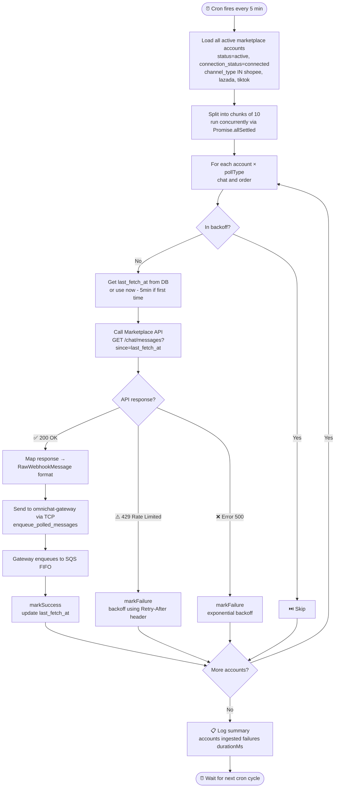
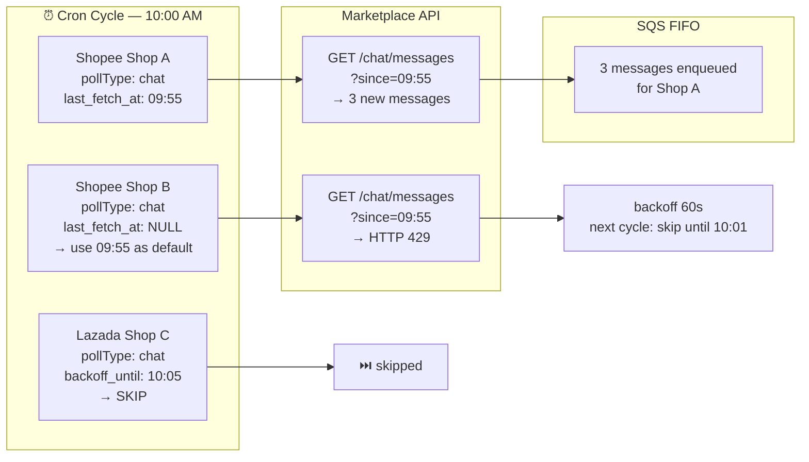

# ACE-702 — Polling Cycle Flow (Simple Overview)

```mermaid
flowchart TD
    A([⏰ Cron fires every 5 min]) --> B[Load all active marketplace accounts\nstatus=active, connection_status=connected\nchannel_type IN shopee, lazada, tiktok]

    B --> C[Split into chunks of 10\nrun concurrently via Promise.allSettled]

    C --> D[For each account × pollType\nchat and order]

    D --> E{In backoff?}
    E -- Yes --> F[⏭️ Skip]
    E -- No --> G[Get last_fetch_at from DB\nor use now - 5min if first time]

    G --> H[Call Marketplace API\nGET /chat/messages?since=last_fetch_at]

    H --> I{API response?}

    I -- ✅ 200 OK --> J[Map response →\nRawWebhookMessage format]
    J --> K[Send to omnichat-gateway via TCP\nenqueue_polled_messages]
    K --> L[Gateway enqueues to SQS FIFO]
    L --> M[markSuccess\nupdate last_fetch_at]

    I -- ⚠️ 429 Rate Limited --> N[markFailure\nbackoff using Retry-After header]
    I -- ❌ Error 500 --> O[markFailure\nexponential backoff]

    M --> P{More accounts?}
    N --> P
    O --> P
    F --> P

    P -- Yes --> D
    P -- No --> Q[📋 Log summary\naccounts ingested failures durationMs]

    Q --> R([⏰ Wait for next cron cycle])
```

---

## Example Run — 2 Shopee Accounts

```mermaid
flowchart LR
    subgraph Cycle ["⏰ Cron Cycle — 10:00 AM"]
        A1["Shopee Shop A\npollType: chat\nlast_fetch_at: 09:55"]
        A2["Shopee Shop B\npollType: chat\nlast_fetch_at: NULL\n→ use 09:55 as default"]
        A3["Lazada Shop C\npollType: chat\nbackoff_until: 10:05\n→ SKIP"]
    end

    subgraph API ["Marketplace API"]
        B1["GET /chat/messages\n?since=09:55\n→ 3 new messages"]
        B2["GET /chat/messages\n?since=09:55\n→ HTTP 429"]
    end

    subgraph Queue ["SQS FIFO"]
        C1["3 messages enqueued\nfor Shop A"]
    end

    A1 --> B1 --> C1
    A2 --> B2 --> D1["backoff 60s\nnext cycle: skip until 10:01"]
    A3 --> E1["⏭️ skipped"]
```
