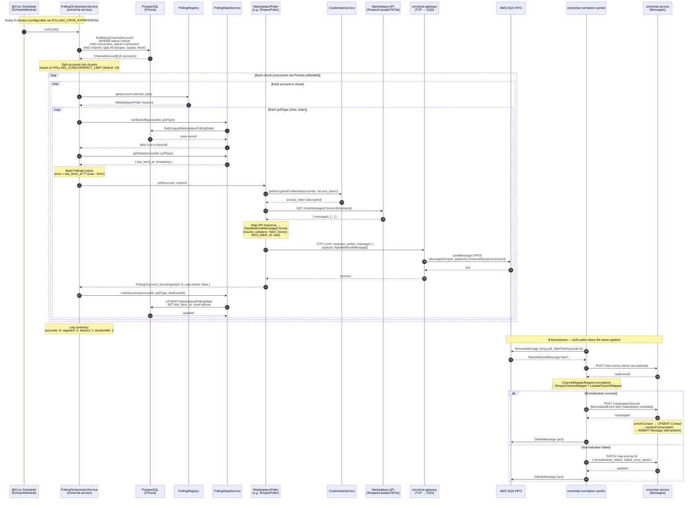
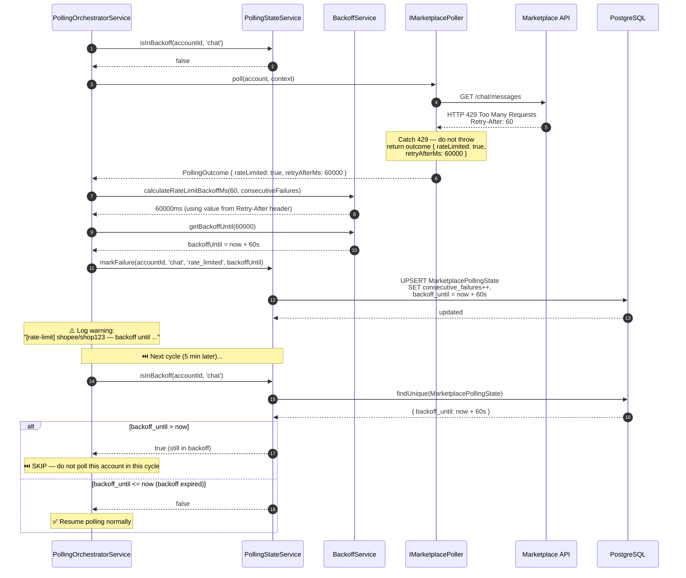
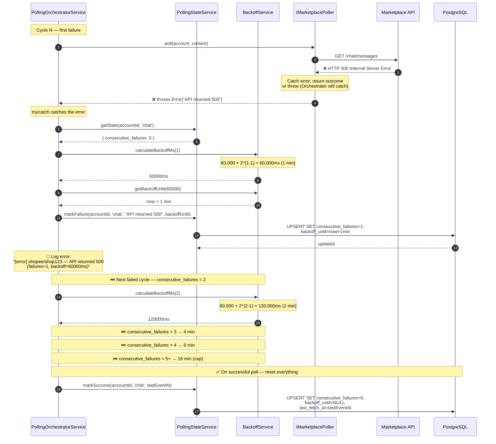
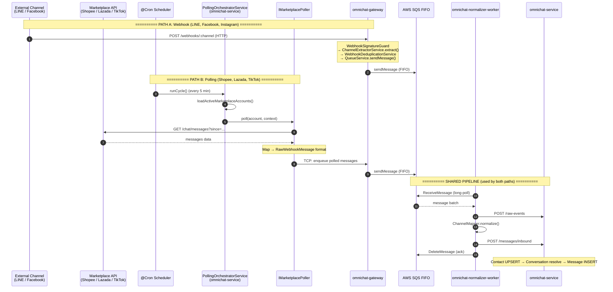
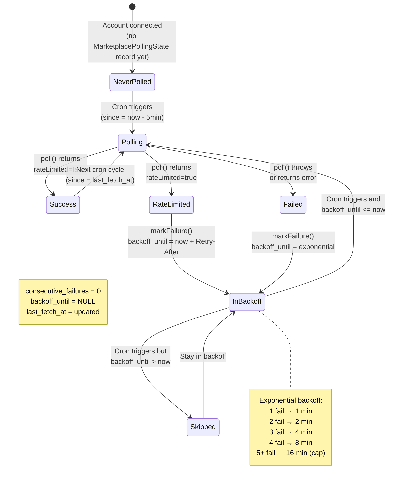
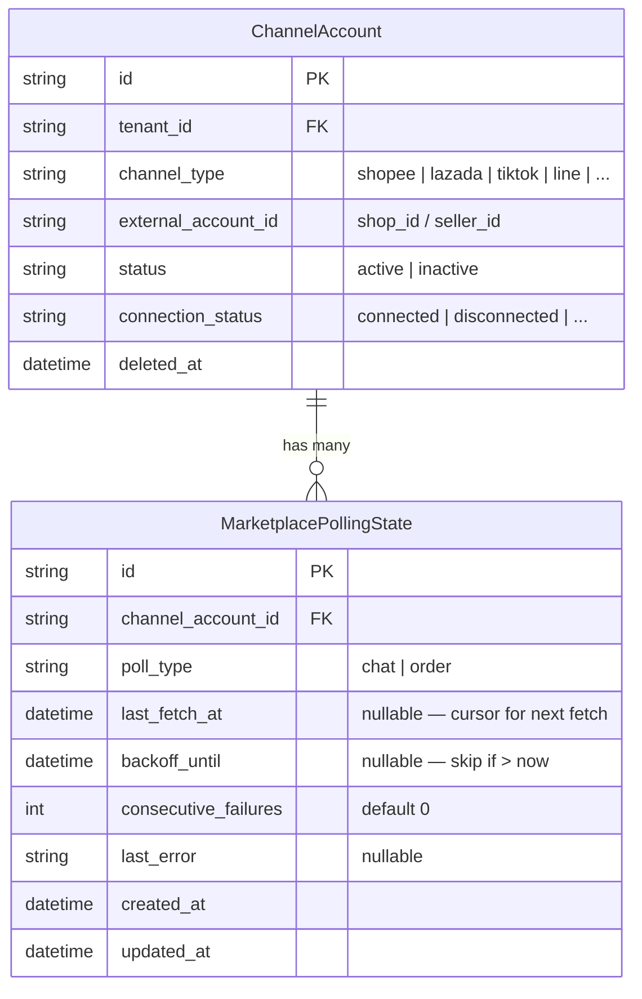

# ACE-702 — Sequence Diagrams: Scheduled Polling Framework v1

**Story:** STORY-MKT-02: Scheduled Polling Framework v1 for Marketplace Ingest
**Epic:** EPIC-ACE-33
**Date:** 2026-03-10

---

## 1. Main Polling Cycle — Happy Path

---

## 2. Rate Limit Handling Flow

---

## 3. Error Handling with Exponential Backoff

---

## 4. Full System Overview — Polling vs Webhook Paths

---

## 5. Polling State Machine — per (account × pollType)

> Each marketplace account runs **2 independent state machines** in parallel:
> one for `poll_type = chat` and one for `poll_type = order`.
> A backoff or failure on `chat` does **not** affect the `order` state, and vice versa.
>
> Example — Shopee Shop A:
> - `(ca-001, chat)` → InBackoff (rate limited)
> - `(ca-001, order)` → Polling normally ✓

---

## 6. Data Model — MarketplacePollingState

---

## Legend

| Symbol | Meaning |
|--------|---------|
| `→` (solid arrow) | Synchronous call / request |
| `-->>` (dashed arrow) | Response / return |
| `loop` | Iteration over collection |
| `alt` | Conditional branching |
| `Note` | Explanation or context |
